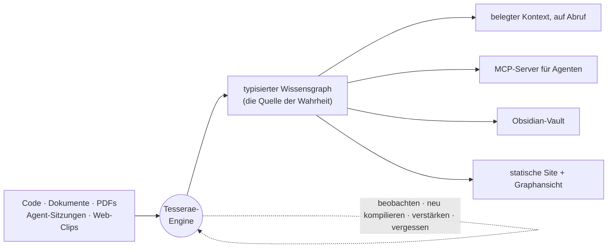

<div align="center">

# Tesserae

**Die Kontext-Engine für Coding-Agenten.**

Verwandelt Ihr Projekt — seinen Code, seine Dokumentation und Ihre
Agent-Sitzungen — in einen typisierten, sich selbst verbessernden
Wissensgraphen und kompiliert daraus genau den Kontext, den ein Agent braucht:
belegt, mit Quellenangaben, auf Abruf.

[](https://pypi.org/project/tesserae/)
[](https://www.npmjs.com/package/@jokerized/tesserae)
[](https://pypi.org/project/tesserae/)
[](https://github.com/ca1773130n/Tesserae/actions/workflows/tests.yml)
[](LICENSE)

[Live-Demo](https://ca1773130n.github.io/Tesserae) ·
[Schnellstart](#schnellstart) ·
[Dokumentation](docs/) ·
[Agent-Gedächtnis](docs/i18n/agent-memory.de.md) ·
[MCP-Einrichtung](docs/i18n/integrations/mcp.de.md) ·
[Tuning](docs/i18n/tuning.de.md) ·
[Release Notes](docs/release-notes/)

[English](./README.md) · [한국어](./README.ko.md) · [中文](./README.zh.md) · [日本語](./README.ja.md) · [Русский](./README.ru.md) · [Español](./README.es.md) · [Français](./README.fr.md)

</div>

---

## Das Problem

Ein Agent ist nur so gut wie der Kontext, den Sie ihm geben. Also fügen Sie
Dateien ein, erklären Entscheidungen noch einmal, die Sie letzte Woche schon
getroffen haben, und sehen zu, wie er dieselbe Stolperfalle zum dritten Mal neu
entdeckt — denn alles Gelernte verdampfte mit dem Ende des Gesprächs, und nichts
auf der Platte weiß, wie Ihr Projekt tatsächlich zusammenhängt.

Tesserae ist die fehlende Schicht. Es liest Ihre Quellen **und** beobachtet Ihre
Agent-Sitzungen, rekonstruiert einen typisierten Wissensgraphen, der aktuell
bleibt, und liefert einem Agenten genau den Ausschnitt, den er braucht — belegt
bis zur Datei oder zum Gespräch, aus dem er stammt. Alles läuft auf Ihrem
Rechner. Es ist ein Build-Schritt plus eine lebende Engine, kein gehosteter
Dienst, und der übliche Weg braucht **keine API-Schlüssel**.



Graph, Vault und Site sind allesamt **Projektionen** einer einzigen
Wissensbasis. Die Engine ist die Schleife, die sie wahr hält.

## Schnellstart

Erfordert **Python 3.10+**. Für den Standardweg ist kein API-Schlüssel nötig.

```bash
pipx install tesserae          # oder: pip install tesserae · npx @jokerized/tesserae

cd /path/to/my-project
tesserae init --yes            # Projekt erkennen, .tesserae/ anlegen
tesserae compile               # den Wissensgraphen aus Ihren Quellen bauen
```

Fragen Sie jetzt, was Sie wollen — verankert in Ihrem echten Code und Ihren
echten Dokumenten:

```bash
tesserae ask "Wo ist das Parsen von arXiv-IDs implementiert, und was hängt davon ab?"
```

Oder kompilieren Sie ein maßgeschneidertes, belegtes Kontextdokument für einen
beliebigen Agenten:

```bash
tesserae context "Wie behandelt der Parser fehlerhafte IDs?" --budget 32000 -o context.md
```

Graph und Wiki im Browser durchstöbern:

```bash
tesserae serve --port 8765
```

Das ist die ganze Schleife: **zeigen, kompilieren, fragen.** LLM-gestützte
Funktionen nutzen standardmäßig die `codex`- oder `claude`-CLI über OAuth —
Details, PATH-Korrekturen und Anbieteroptionen finden Sie unter
[Installation](docs/i18n/installation.de.md) und
[Schnellstart](docs/i18n/quickstart.de.md).

## Was es tut

**Kompiliert einen typisierten Graphen aus Ihren Quellen.** Zeigen Sie auf
Markdown, Quellcode und optional PDFs / Office-Dokumente / Bilder. Tesserae
extrahiert einen Graphen aus über 70 Knotenarten — Konzepte, Entscheidungen,
Codesymbole, Paper, Synthesen — mit typisierten Kanten, gegen ein Schema
validiert. Die Kompilierung ist **byteweise deterministisch**: gleiche Eingaben,
jedes Mal identische `graph.json`.

**Macht aus Agent-Gesprächen Gedächtnis.** Ihre Claude-Code- und
Codex-Sitzungen zum Projekt werden zu erstklassigen Knoten — Erkenntnisse,
Entscheidungen, Fragen, TODOs — verknüpft mit den Dateien, die sie berührt
haben. Das Wissen aus einer Sitzung überlebt die Sitzung.

**Merkt sich, was tatsächlich passiert ist, nicht nur, was gesagt wurde.** Ein
Werkzeugergebnis ist ein Zug: Exit-Codes und Fehler-Flags überleben die Aufnahme
und landen auf `Event`-Knoten, sodass der Graph weiß, dass ein Kommando
**fehlgeschlagen** ist — und nicht bloß, dass es ausgeführt wurde. Aus zwei
**beobachteten** Ergebnissen einer Sitzung — einem gescheiterten Aufruf und einem
späteren, der auf demselben Operanden erfolgreich war — leitet Tesserae eine
`recovers`-Kante ab. Sie ist die einzige kausale Kante im Vokabular, und sie
wird abgeleitet, nie von einem Modell behauptet: ein `caused_by`, das in
Wahrheit ein `happened_near` ist, wird als Beleg gelesen, und das ist schlimmer
als gar keine Kante.

**Liefert belegten Kontext auf Abruf.** Der Kontext-Compiler startet
Personalized PageRank von den Startknoten Ihrer Anfrage, packt den relevantesten
Teilgraphen in ein Zeichenbudget und gibt ein belegtes, einfügefertiges Dokument
zurück — oder streamt es einem Agenten über MCP.

**Hält sich selbst frisch.** Eine überwachte Engine beobachtet Quellen und
Sitzungen, dämpft Stoßlasten, kompiliert neu und führt einen
Selbstverbesserungslauf aus, der wiederkehrende Befunde verstärkt und veraltete
ablöst. Wie ein Gehirn, das im Ruhezustand Erinnerungen konsolidiert,
**konsolidiert sie auch das Agent-Gedächtnis von selbst**, sobald das Projekt
untätig wird — ein periodischer Schlafzyklus, ganz ohne Kommando: Sie verdichtet
und vergisst lautes jüngeres Wissen, **vergisst durch Nichtgebrauch** (was
niemand abruft, verblasst, nicht bloß Altes) und **entdeckt neue Verbindungen**
zwischen dem, was übrig bleibt. Ein Prozess kann all Ihre Projekte aktuell
halten.

**Gibt jedem Agenten sein eigenes, wachsendes Gedächtnis.** Destillieren Sie die
Erfahrung jedes Agenten in eine begrenzte, höhere Schicht; Vorgesetzte lesen nur
die destillierte Schicht ihrer Zuarbeitenden — rekursiv den Organisationsbaum
hinauf. Siehe [geschichtetes Agent-Gedächtnis](#geschichtetes-agent-gedächtnis)
weiter unten.

## Wie es nach `compile` aussieht

```text
.tesserae/
├── graph.json              # die typisierte Wissensbasis — Knoten + Kanten
├── sqlite.db               # abfragbarer Graph-Speicher
├── markdown_projection/    # menschenlesbare Wiki-Seiten
├── obsidian_vault/         # direkt in Obsidian einwerfen
├── site/                   # statische Site: Graphansicht + Wiki + Suche
├── harness_sessions/       # importiertes Claude-/Codex-Sitzungsgedächtnis
├── agents/                 # destillierte Gedächtnisschichten je Agent (optional)
└── config.json · manifest.json · report.md
```

## Geschichtetes Agent-Gedächtnis

Kein Mensch erinnert alles, und in kein Kontextfenster passt alles. Tesserae
antwortet mit einer **geschichteten Wissensbasis je Agent**: Jeder Agent lässt
sein Gedächtnis aus den eigenen Sitzungen wachsen, dieses Gedächtnis wird
regelmäßig in eine begrenzte höhere Schicht **destilliert**, und Vorgesetzte
sehen nur die destillierte Schicht ihrer Zuarbeitenden — rekursiv, wie in einer
echten Organisation.

```bash
export TESSERAE_AGENT_DISTILL=1
tesserae compile              # legt je Agent einen Agent-Knoten + Zuordnungskanten an
tesserae agents init          # leitet das Organigramm daraus ab, wer wen gestartet hat
tesserae agents tree          # prüfen: Hierarchie, Sitzungszahlen, Veraltung
tesserae distill              # verdichtet die Erfahrung jedes Agenten zu einer L1-Schicht
```

Danach nimmt jedes graphlesende Werkzeug — CLI wie MCP — einen `agent=`-Bereich
entgegen:

```bash
tesserae query "Release-Checkliste" --agent claude-code:me:reviewer   # das Gedächtnis eines Workers
tesserae ask   "Was weiß mein Team über Deployments?" --agent org      # das ganze Team, destilliert
```

Destillation **ordnet, verdichtet und vergisst — löscht aber nie**: Ein
abgeklungener Befund wird in das Destillat gefaltet, das ihn zitiert, und bleibt
über `agents drill` erreichbar, statt verworfen zu werden. Die Zeit ist die Uhr
des Korpus, die Identität eines Knotens hängt nie an der Formulierung eines LLM,
und die Artefakte bleiben deterministisch. Der vollständige Entwurf steht in
[docs/i18n/agent-memory.de.md](docs/i18n/agent-memory.de.md).

`distill` müssen Sie nicht selbst aufrufen: Lassen Sie `tesserae engine` laufen,
und es **konsolidiert von allein** während der Ruhephasen — ein Schlafzyklus um
denselben optionalen, durch Speicherdruck begrenzten Lauf. Siehe
[docs/i18n/engine-consolidation.de.md](docs/i18n/engine-consolidation.de.md).

## MCP-Server

`tesserae projects mcp-config` gibt einen fertigen Servereintrag für Claude
Code, Codex oder jeden MCP-Client aus. Jedes graphlesende Werkzeug akzeptiert
`graph_path` / `project` / `agent` ohne Zusatzaufwand. Die wichtigsten:

| Werkzeug | Zweck |
|---|---|
| `compile_context` | Maßgeschneidertes, belegtes Kontextdokument für eine Anfrage oder Startknoten (deterministisch; `preview=N` liefert ein Handle statt des vollen Textes) |
| `get_handle` | Eine große Nutzlast in Scheiben nachladen, damit der Agent sie nie ganz im Kontext hält |
| `ask` · `query` · `search_nodes` · `node_context` | Geplante Antworten, rohe Suche und Graphnavigation über der kompilierten Basis |
| `graph_map` | Budgeted Descent: den Graphen von oben nach unten nach Bereich durchlaufen, statt Suchbegriffe zu raten — der kanonische Einstieg |
| `graph_ppr` · `search_facts` · `timeline` | Personalized-PageRank-Expansion, temporale Fakten und Chronologie. Zwei Uhren, die sich **komponieren**: `as_of` (was damals WAHR war, aus den Zeitstempeln der Quellen selbst) und `observed_as_of` (was wir bis dahin GELERNT hatten, aus dem beim Kompilieren gestempelten Ledger). `current_only` und `as_of` zusammen werden abgelehnt — diese beiden sind wirklich Alternativen |
| `verify_claim` | Lässt der Graph dieses Tripel zu? Ein deterministisches Urteil, keine generierte Meinung |
| `find_session_findings` · `fresh_insights` · `activity_summary` · `query_decisions` | Aus Sitzungen abgeleitetes Gedächtnis, nach Zerfall sortiert und dedupliziert; Digests und das Entscheidungsprotokoll |
| `agent_view_explain` · `drill_down` · `read_audit` | Die bereichsbeschränkte Sicht eines Agenten auflösen; eine destillierte Notiz auf ihren Rohbeleg zurückführen (protokolliert); und, per `TESSERAE_READ_AUDIT` zuschaltbar, nachlesen, wer den Graphen gelesen hat |
| `ingest` · `graph_write` | Rohes Web/Text (z. B. einen Browser-Clip) in den Graphen einmischen; einen Agenten zugeordnete Knoten zurückschreiben lassen — einschließlich einer `retracts`-Kante, um „das ist falsch" zu sagen, ohne einen Ersatz zu erfinden |
| `doctor_run` · `doctor_report` · `lint_report` | Gesundheitsprüfungen und Graph-Lint aus der Agentenschleife heraus |

## Alltagsbefehle

`tesserae --help` für die gruppierte Liste, `tesserae <cmd> --help` für die
Optionen.

| Befehl | Was er tut |
|---|---|
| `tesserae init` | Onboarding in einem Schritt: Projekt erkennen, LLM-Anbieter wählen, `.tesserae/config.json` schreiben. `--yes` für nicht-interaktiv. |
| `tesserae compile` | Baut Graph und alle Projektionen neu. `compile <Pfade>` nimmt zusätzliche Dateien ad hoc auf. |
| `tesserae ask "<F>"` | LLM-geplante, belegte Antwort. Ein intelligenter Router wählt das Zielprojekt; `--scope federated` führt mehrere zu einer Antwort zusammen. |
| `tesserae query "<F>"` | Rohe Suche — BM25/semantisch, ohne LLM-Synthese. |
| `tesserae context "<F>"` | Belegtes Kontextdokument auf Abruf per PPR unter `--budget`. Reserviert einen Platz für **prozedurales** Gedächtnis — was tatsächlich ausgeführt wurde und was dabei herauskam — sofern der Graph die Provenienz dafür hat. |
| `tesserae graph-map` | Budgeted Descent: von oben nach unten nach Bereich statt nach Suchbegriff. `--scope org:root` für den Agenten-Organisationsbaum. |
| `tesserae verify-claim` | Deterministisches Urteil, ob der Graph ein Tripel zulässt. JSON-Ausgabe. |
| `tesserae engine [--all]` | Überwachter Refresh-Daemon — beobachten, entprellen, neu kompilieren und im Leerlauf das Agent-Gedächtnis konsolidieren (der Schlafzyklus; `--no-consolidate` schaltet ihn ab). `--all` hält jedes registrierte Projekt in einem Prozess aktuell. |
| `tesserae refresh` | Einmalig: neue Sitzungen importieren → kompilieren → Vault synchronisieren. |
| `tesserae agents …` | `init` (Organisation ableiten) · `tree` · `show` · `drill` — die Werkzeuge des geschichteten Gedächtnisses. |
| `tesserae distill` | Verdichtet die Sitzungen jedes Agenten in seine begrenzte L1-Gedächtnisschicht. |
| `tesserae doctor` | Gesundheitsprüfungen; `--fix` wendet sichere Reparaturen an. Exit-Codes `0/1/2` = gesund/Warnungen/Fehler. |
| `tesserae lint` | Graph-Lint — Waisen, veraltete Zitate, Drift zum Wiki, dünne Intervallabdeckung, nicht verdiente prozedurale Pools. `--fix-trivial` für die sicheren Fälle. |
| `tesserae domains status` | Gibt den Domänenbaum der Charta aus (Bereiche → Abteilungen → Teams). Siehe [Architektur](docs/i18n/architecture.de.md). |
| `tesserae federation status` | Prüft die projektübergreifende Föderation — was `--scope federated` tatsächlich erreicht. |
| `tesserae serve` | Bedient jedes registrierte Projekt — Startseite unter `/`, jedes unter `/<alias>/`, mit Live-Ask-Widget. |
| `tesserae export site \| okf` | Baut die statische Site oder exportiert ein portables [Google-OKF](https://github.com/GoogleCloudPlatform/knowledge-catalog)-Bundle. |
| `tesserae projects …` | Mehrprojekt-Registry: `register`, `list`, `mcp-config`. |

## Mehrere Projekte

Eine Registry unter `~/.tesserae/registry.json` löst Projektnamen überall auf —
CLI, MCP und Flotten-Engine. Es gibt kein „aktives" Projekt: Projektbezogene
Befehle lösen dasjenige auf, in dem Sie stehen, und `ask` routet über alle
hinweg.

```bash
tesserae projects register /path/to/my-project --name myproj
tesserae ask "vergleiche die Suche in research und notes"   # → föderiert, mit Querverweisen
tesserae ask "wie kompiliert myproj?"                       # → zu diesem Projekt geroutet
tesserae serve                                              # → alle Projekte unter einem Server
```

Markdown in einem Projekt kann per `wiki://<alias>/<kind>/<slug>` tief auf einen
Knoten in einem anderen verlinken; beim Kompilieren werden daraus Brückenknoten
in der Graphansicht.

## Integrationen (alle optional)

- **Claude-Code-Plugin** — Slash-Befehle, Sitzungs-Hooks, ein Skill und
  automatische MCP-Registrierung mit einem `/plugin install`.
  [→](docs/i18n/integrations/claude-code-plugin.de.md)
- **Sitzungsgraph** — Claude-Code-/Codex-Gespräche werden zu Insight- /
  Decision- / Question- / TODO-Knoten, verknüpft mit den berührten Dokumenten,
  ohne API-Schlüssel. [→](docs/i18n/integrations/sessions.de.md)
- **RAG-Anything** — multimodale Aufnahme (PDF / Office / Bilder über MinerU /
  Docling) plus ein LightRAG-Frage-Backend.
  [→](docs/i18n/integrations/rag-anything.de.md)
- **Obsidian** — bidirektionale Vault-Synchronisation mit einer Overlay-Schicht
  für Nutzerbearbeitungen. [→](docs/i18n/integrations/obsidian.de.md)
- **Web Clipper** — eine Seite oder Auswahl mit einem Klick ins Korpus clippen.
  [→](docs/i18n/integrations/chrome-extension.de.md)

## Im Vergleich

<details>
<summary><strong>Funktionsmatrix</strong> gegenüber Quartz, Logseq, Cognee, Foam</summary>

<br/>

| | Tesserae | Quartz | Logseq | Cognee | Foam |
|---|:---:|:---:|:---:|:---:|:---:|
| Statische Site + Graphansicht | ✅ | ✅ | ✅ | ➖ | ➖ |
| Typisiertes Knotenschema | ✅ 70+ | ❌ | ➖ | ✅ | ❌ |
| Konzeptextraktion aus Quellen | ✅ | ❌ | ❌ | ✅ | ❌ |
| Multimodale Aufnahme (PDF/Bild) | ✅ | ❌ | ➖ | ✅ | ❌ |
| Aufnahme des Code-Graphen | ✅ | ❌ | ❌ | ➖ | ❌ |
| MCP-Server | ✅ | ❌ | ❌ | ✅ | ❌ |
| Belegter Kontext-Compiler auf Abruf | ✅ | ❌ | ❌ | ❌ | ❌ |
| Live-Sitzungen → Graphgedächtnis | ✅ | ❌ | ❌ | ❌ | ❌ |
| Geschichtetes Gedächtnis je Agent | ✅ | ❌ | ❌ | ❌ | ❌ |
| Mehrprojekt-Daemon (Flotte) | ✅ | ❌ | ❌ | ❌ | ❌ |
| Funktioniert ohne API-Schlüssel | ✅ | — | — | ❌ | — |
| Byteweise deterministische Kompilierung | ✅ | ✅ | — | ❌ | — |
| Live-Bearbeitung in einer UI | ❌ | ➖ | ✅ | — | ✅ |

</details>

### Gemessen, nicht behauptet

Jede Zahl unten stammt von einem Prüfstand in diesem Repository, auf Daten, die auf der Platte
liegen, und sagt, wogegen sie gemessen wurde. Stand 2026-08-30.

| was | Tesserae | der Vergleich |
|---|---|---|
| Vergleichsfragen über 148 vollständige Aufsätze beantworten, Abdeckung der Pflichtpunkte, 57 Fragen × 8 Wiederholungen | **0.373** — der Graph wählt 3 Dokumente, das Bündel trägt ihre Originalprosa | BM25-Passagen bei gleichem Budget, Backbone und Richter: 0.290 — **+28.9%**, 8/8 Wiederholungen, p=0.0078; ein lokaler 7B-Richter sieht +7%, nicht signifikant |
| Dokument-Recall auf demselben Korpus, verschiedene Dokumente @10 / @50 | 0.791 / 0.962 mit einem trainierten Encoder (`TESSERAE_EMBEDDING_PREFER=st`); 0.754 / 0.914 wie ausgeliefert | Mem0-OSS-Rohabschnittsspeicher, gleicher Encoder: 0.775 / 0.944 — Gleichstand |
| erfundene Prüfurteile, 426 Negative | **0** | — (kein Wettbewerber liefert einen Verifizierer) |
| Prüfmarkierungen je Satz auf jeder Antwort | kostenlos; Kaskade **0.935** gegen ein Modell auf jedem Satz 0.928, bei 40 % der Aufrufe | — |
| API-Aufrufe zur Abfragezeit | **0** — lokales BM25 und statische Einbettungen | Mem0: ein Einbettungsaufruf je Suche |
| LoCoMo, Recall der Goldsitzungen recall@10, 9 Gespräche | **0.930** | BM25 0.923 |
| LoCoMo, Antworten, Mem0s eigener Richter, ein Gespräch | 90.5 | Mem0 92.5 über zehn — Gleichstand, innerhalb des Rauschens eines Gesprächs |

Die Retrieval-Zeilen — Dokument-Recall und beide LoCoMo-Zeilen — sind das ehrliche Wort,
ob Gespräch oder nicht: Gleichstand. Gib einem Vektorspeicher denselben Encoder, und er findet dieselben Dokumente.
Die erste Zeile ist, wo sich das Design unterscheidet — der Graph wählt, welche Dokumente ein
Agent liest, und übergibt ihre Prosa, keine Destillation — und die Prüfzeilen sind Antworten,
die man prüfen kann, ohne ihnen zu vertrauen. Die +28.9% wurden durch Durchprobieren von k auf
demselben Benchmark gefunden, der sie bewertet (k=5 gibt noch +12%), und sie hängen am
Richter: erneut ausgeführt mit einem lokalen qwen2.5:7b als Antwortgeber und Richter liegen
dieselben Arme +7% auseinander, innerhalb des Rauschens (57 Fragen, eine Wiederholung).

Tesserae entscheidet sich für **Kompilieren aus Quellen statt Live-Bearbeitung**.
Wenn Sie Notizen in einer Oberfläche bearbeiten wollen, nehmen Sie Logseq oder
Obsidian. Wenn Sie ein Build-Werkzeug *und eine lebende Engine* wollen, die
einen belegten Wissensgraphen pflegt — und ihn Ihren Agenten zuführt — dann ist
es dieses Projekt.

**Nehmen Sie es**, wenn Sie einen dauerhaften, prüfbaren Wissensgraphen über den
Quellen eines Projekts wollen, einen lokalen MCP-Server, der in Ihren eigenen
Dateien verankert ist, oder ein Gedächtnis je Agent, das sich aufbaut, statt zu
verdampfen.

**Lassen Sie es**, wenn Sie nur Vektorsuche über einen kleinen Ordner brauchen,
ein gehostetes Wiki mit Bearbeitungsoberfläche wollen oder einen
schlüsselfertigen „Frag mich alles"-Bot erwarten — Tesserae baut das Substrat,
die Verdrahtung zum Agenten Ihrer Wahl übernehmen Sie.

## Anbieter und Datenschutz

Alles läuft lokal, und der übliche Weg **verwendet keine API-Schlüssel**:

- **Codex CLI** (Standard) und **Claude Code CLI** über OAuth, mit Rotation über
  mehrere Konten.
- **Embeddings** über eine offline-fähige, torch-freie Spur (`pip install
  "tesserae[semantic]"`, `model2vec`). `ANTHROPIC_API_KEY` / `OPENAI_API_KEY`
  werden genutzt, wenn gesetzt, sind aber nie erforderlich.

## Stand und Grenzen

Die aktuelle Version steht in den [Release Notes](docs/release-notes/). Ehrlich
gesagt:

- Erstkompilierungen über Tausende Dateien dauern Minuten; die Zeit wächst
  ungefähr linear. Inkrementelles Kompilieren (`--changed-only`) gibt es, ist
  aber experimentell.
- Ohne das `semantic`-Extra fällt die hybride Suche auf einen nicht-semantischen
  Ersatz zurück (mit deutlicher Warnung).
- Seit 0.30.0 ist die **Code-Schicht optional** — in einem großen Repository
  verdrängten Codesymbole alles andere, deshalb nimmt `compile` sie nicht mehr
  ungefragt auf. `tesserae code ingest` bindet CodeGraph weiterhin bewusst ein.
- Die **Charta** (`tesserae domains status`) ist implementiert und getestet,
  wird von `compile` aber noch nicht erzeugt; bis dahin meldet der Befehl „no
  charter yet".
- Die Bildbeschreibung von RAG-Anything ist noch nicht durchgängig verdrahtet.
- Der MCP-Werkzeugsatz ist stabil; das Graphschema gewinnt weiter Knotentypen.
  Das kausale Vokabular ist bewusst nur eine Kante breit — `recovers` — und wird
  ausschließlich aus beobachteten Ergebnissen abgeleitet, nie von einem Modell
  behauptet. Die Retrieval-*View `causal`* ist absichtlich breiter (sie
  traversiert auch `resolved_by` und `attributes_improvement_to`, die derselben
  Frage „warum ist das kaputtgegangen“ dienen); eine einzige Kante, die sonst
  nichts behauptet, wäre eine View mit nichts darin.
- **Beförderung ist immer eine menschliche Änderung.** `tesserae schema-drift`
  schlägt Knoten-Subtypen vor und der `ask`-Planer kann ein `proposed_write`
  zurückgeben, aber keines von beiden schreibt: Ein Vorschlag wird nur
  übernommen, indem Sie `ResearchNodeType` selbst bearbeiten oder das Payload
  mit selbst gelieferter Provenienz an `graph_write` übergeben.

## Projektstruktur

```text
tesserae/     # das Paket — CLI, Compiler, Engine, MCP-Server, Adapter
docs/         # englische Doku + docs/i18n/ für sieben weitere Sprachen
ontology/     # Knoten-/Kantenschemata, gegen die der Compiler validiert
prompts/      # Extraktions- und Synthese-Prompts
tests/        # pytest-Suite (über 3.700 Tests)
evals/        # Prüfstände für die Graphqualität
```

## Mitwirken und Dokumentation

- **Doku**: [Schnellstart](docs/i18n/quickstart.de.md) · [Installation](docs/i18n/installation.de.md) · [Agent-Gedächtnis](docs/i18n/agent-memory.de.md) · [Architektur](docs/i18n/architecture.de.md)
- **Übersetzungen**: [English](./README.md) · [한국어](./README.ko.md) · [中文](./README.zh.md) · [日本語](./README.ja.md) · [Русский](./README.ru.md) · [Español](./README.es.md) · [Français](./README.fr.md) — die Langtexte sind unter `docs/i18n/` gespiegelt.

## Lizenz

[MIT](LICENSE).
