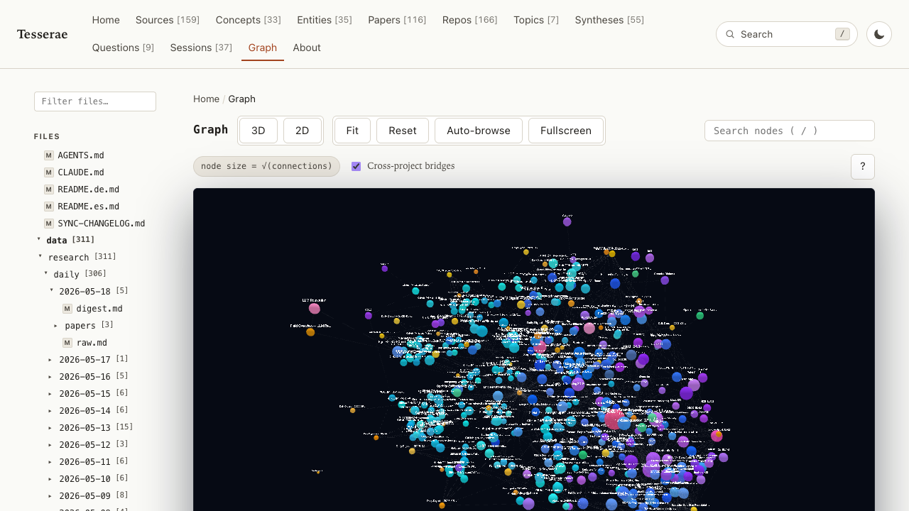
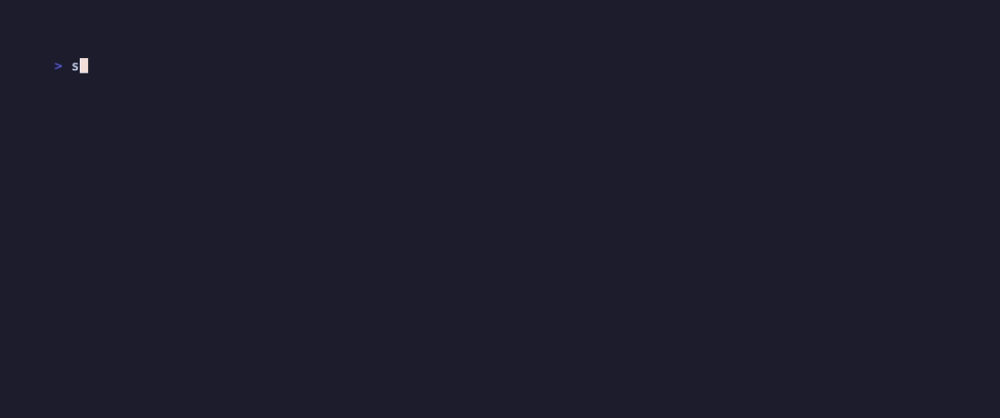
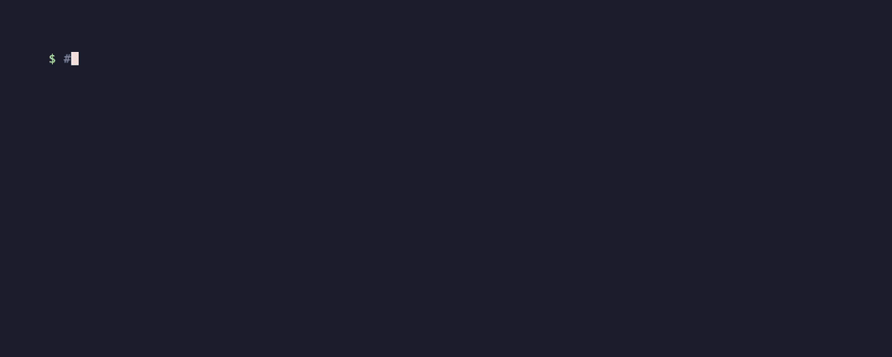
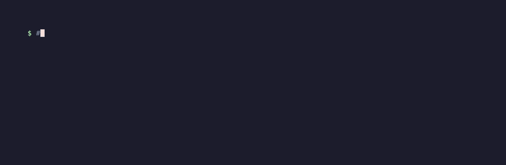

# Tesserae

<p align="center">
  
</p>

<p align="center">
  <a href="./README.md">English</a> ·
  <a href="./README.ko.md">한국어</a> ·
  <a href="./README.zh.md">中文</a> ·
  <a href="./README.ja.md">日本語</a> ·
  <a href="./README.ru.md">Русский</a> ·
  <a href="./README.es.md">Español</a> ·
  <a href="./README.fr.md">Français</a>
</p>

> Eine Kontext-Engine, die eine sich selbst verbessernde Wissensbasis Ihres Projekts pflegt und auf Anfrage agentenbereiten Kontext kompiliert.

<p align="center">
   compile -> ask, aufgezeichnet mit dem Demo-Korpus mit 135 Dokumenten" width="100%" />
</p>

<p align="center">
  <a href="https://ca1773130n.github.io/Tesserae">Live-Demo</a> ·
  <a href="docs/">Dokumentation</a> ·
  <a href="docs/release-notes/">Release-Notes</a> ·
  <a href="docs/integrations/mcp.md">MCP-Einrichtung</a> ·
  <a href="docs/tuning.md">Feinabstimmung</a> ·
  <a href="docs/integrations/obsidian.md">Obsidian-Export</a>
</p>

## Was es ist

Richten Sie Tesserae auf ein Verzeichnis mit Markdown, Quellcode und optional
PDFs/Office-Dokumenten/Bildern. Es rekonstruiert einen **typisierten Wissensgraphen**
des Projekts und hält ihn aktuell, damit Agenten immer fundierten, zitierten Kontext haben.
Drei Säulen:

1. **Sitzungsüberwachung** — Ihre Claude Code / Codex-Gespräche über das Projekt
   werden zu erstklassigen Graphknoten (Entscheidungen, Erkenntnisse, Fragen, TODOs),
   während sie entstehen.
2. **Autonome Aufnahme** — eine überwachte Engine beobachtet Quellen und Sitzungen,
   bündelt Änderungen, kompiliert neu, und ein Self-Improvement-Sidecar verstärkt
   wiederkehrende Erkenntnisse und ersetzt veraltete.
3. **Kontext auf Abruf** — der Kontextkompiler erstellt für jede Anfrage oder jeden
   Seed-Knoten ein maßgeschneidertes, zitiertes Kontextdokument (Personalized PageRank
   unter einem Zeichenbudget), das direkt in jeden Agenten eingefügt werden kann.

Der Graph, der Obsidian-Vault und die statische Website sind *Projektionen* einer
einzigen Wissensbasis. Alles läuft lokal; es ist ein Build-Schritt plus eine Live-Engine,
kein gehosteter Dienst.

## Schnellstart

Erfordert **Python 3.10+**.

```bash
pip install tesserae          # fügen Sie [semantic] für echte Embeddings hinzu
# oder: pipx install tesserae   # sicherste PATH-Installation
# oder: npx @jokerized/tesserae # Node-Wrapper um dasselbe CLI

cd /path/to/my-project
tesserae init --yes           # Assistent; --yes akzeptiert erkannte Standardwerte
tesserae compile              # Wissensgraphen erstellen
tesserae ask "Where is Mermaid rendering implemented?"

# Maßgeschneidertes, zitiertes Kontextdokument kompilieren:
tesserae context "How does the parser handle arXiv IDs?" --budget 32000 -o context.md

tesserae serve --port 8765    # Graph und Wiki lokal durchsuchen
```

LLM-gestützte Funktionen verwenden standardmäßig die `codex` / `claude` CLIs über OAuth —
**keine API-Schlüssel erforderlich** für den üblichen Pfad. Siehe
[docs/quickstart.md](docs/quickstart.md) und
[docs/installation.md](docs/installation.md).

<details>
<summary><strong><code>tesserae: command not found</code> nach der Installation? Linux-Probleme?</strong></summary>

Die zuverlässigste Lösung auf jeder Plattform ist [`pipx`](https://pipx.pypa.io/):

```bash
# macOS: brew install pipx · Ubuntu/Debian: sudo apt install pipx
pipx ensurepath          # fügt ~/.local/bin zum PATH hinzu; danach eine neue Shell öffnen
pipx install tesserae
```

Häufige Ubuntu-Probleme mit `pip install tesserae`:

| Fehler | Ursache | Lösung |
|---|---|---|
| `error: externally-managed-environment` | PEP 668 — System-Python gesperrt | `pipx` (oben) oder ein venv verwenden |
| `command not found` nach `pip install --user …` | `~/.local/bin` nicht im `PATH` | `echo 'export PATH=$HOME/.local/bin:$PATH' >> ~/.bashrc && source ~/.bashrc` |
| `ModuleNotFoundError` auf alten Distros | System-`python3` < 3.10 | `sudo apt install python3.11 python3.11-venv`, dann mit `python3.11 -m pip` installieren |

</details>

<details>
<summary><strong>Walkthrough-GIFs</strong> — jeder Schnellstart-Schritt mit dem mitgelieferten Demo-Korpus mit 135 Dokumenten</summary>

<details>
<summary>1. Einrichtung — auf ein Forschungsverzeichnis zeigen, ein Projekt-Wiki-Gerüst erhalten</summary>
<br/>

</details>

<details>
<summary>2. Kompilieren + Website erstellen — deterministisch, ohne LLM-Aufrufe</summary>
<br/>

</details>

<details>
<summary>3. Ask — das kompilierte Wiki vom CLI aus abfragen</summary>
<br/>

</details>

Jedes GIF neu erstellen mit `vhs docs/screencasts/<name>.tape`.

</details>

## Alltagsbefehle

Führen Sie `tesserae --help` für die vollständige gruppierte Liste aus, `tesserae <cmd> --help` für Flags.

| Befehl | Was er tut |
|---|---|
| `tesserae init` | Einrichtungsassistent → `.tesserae/config.json`. `--yes` nicht-interaktiv, `--bare` minimal. |
| `tesserae compile` | Wissensgraphen und alle Artefakte neu erstellen. `compile <paths>` nimmt zusätzliche Dateien punktuell auf. |
| `tesserae ingest <file\|url>` | Ein einzelnes Dokument oder eine Webseite in die Wissensbasis einbinden, ohne vollständig neu zu kompilieren (inkrementeller Schnellpfad). |
| `tesserae context "<query>"` | **Kontextkompiler auf Abruf**: zitiertes Kontextdokument via PPR-Erweiterung unter `--budget`; `--synthesize` fügt eine LLM-Zusammenfassung hinzu. |
| `tesserae ask "<question>"` | Die kompilierte Wissensbasis abfragen (`--scope all-registered` umfasst alle Projekte). |
| `tesserae engine` | Überwachter Aktualisierungs-Daemon für das aktuelle Projekt: beobachten, entprellen, neu kompilieren. |
| `tesserae engine --all` | **Flottenmodus**: ein Prozess hält *alle* registrierten Projekte aktuell — Hot-Reload der Registry, Drosselung mit `--compile-slots`. |
| `tesserae refresh` | Einmaliger Pipeline-Lauf: neue Sitzungen importieren → kompilieren → Vault synchronisieren. |
| `tesserae sessions discover --import` | Lokale Claude Code / Codex-Sitzungshistorie für dieses Projekt finden und importieren. |
| `tesserae export site` | Statische Website erstellen (`--deploy`, `--watch`). |
| `tesserae serve` | Website lokal mit dem eingebetteten Ask-Widget bereitstellen (`/api/ask`). |
| `tesserae projects …` | Multi-Projekt-Registry: `register`, `list`, `activate`, `mcp-config`. |
| `tesserae integrations refresh …` | Begleittools neu starten (Understand-Anything, RAG-Anything). |

## Automatisch aktuell halten

Die Engine ist das, was die Wissensbasis *selbstverbessernd* macht, statt sie als
einmaligen Build zu behandeln:

```bash
# Ein Projekt: Quellen + Live-Sitzungen beobachten, bei Änderungen neu kompilieren.
tesserae engine

# Alle registrierten Projekte, ein Prozess (v0.8.0):
tesserae engine --all --compile-slots 1
```

Der Flottenmodus gleicht alle 10 s mit `~/.tesserae/registry.json` ab —
das Registrieren oder Entfernen eines Projekts wirkt sich ohne Neustart aus — und
serialisiert Kompilierungen über Projekte hinweg, damit gleichzeitige LLM-Extraktion
nie gemeinsame Account-Ratenlimits überschreitet. Der erste Lauf durchsucht die
Sitzungshistorie einmalig (im Log vermerkt); Neustarts setzen von einem persistierten
Ausgangspunkt fort.

## Was Sie nach der Kompilierung erhalten

```text
.tesserae/
  graph.json              # typisierte Knoten/Kanten (die Wissensbasis)
  sqlite.db               # abfragbarer Graphspeicher
  markdown_projection/    # menschenlesbare Wiki-Seiten
  obsidian_vault/         # fertig zum Ablegen in Obsidian
  site/                   # statische Website (Graphansicht + Wiki + Suche)
  harness_sessions/       # importiertes Claude/Codex-Sitzungsgedächtnis
  agent_harness/          # Kontextkonfiguration pro Agent (Claude/Codex/Gemini/...)
  cognee_bundle/          # JSONL bereit für Cognee-Ingest
  config.json · manifest.json · report.md · …
```

## MCP-Server

`tesserae projects mcp-config` gibt einen Servereintrag für Claude Code, Codex oder
jeden MCP-Client aus. Wichtigste Tools:

- **`compile_context`** — maßgeschneidertes, zitiertes Kontextdokument für eine Anfrage oder Seed-Knoten
  (deterministisch, außer `synthesize=true`), gestützt auf `graph_ppr`.
- **Graph + Wiki**: `search_nodes`, `node_context`, `graph_summary`,
  `wiki_page`, `raw_source`, `timeline`, `search_facts`, `lint_report`, `ask`.
- **Sitzungsgedächtnis**: `list_sessions`, `find_session_findings`,
  `fresh_insights` (nach Aktualitätsabfall gerankt, dedupliziert).
- **Registry**: `list_projects`, `register_project`, `activate_project`.

## Multi-Projekt

Eine Registry unter `~/.tesserae/registry.json` löst Projektnamen überall auf —
CLI, MCP und Fleet-Engine:

```bash
tesserae projects register /path/to/my-project --name myproj
tesserae projects activate myproj
tesserae ask "..." --scope all-registered        # alle Projekte umfassen
```

Markdown in einem Projekt kann einen Knoten in einem anderen über
`wiki://<alias>/<kind>/<slug>` verlinken; bei der Kompilierung werden daraus
Brückenknoten in der Graphansicht. Einzelheiten in der [Dokumentation](docs/).

## Integrationen (alle optional)

- **Claude Code-Plugin** — Slash-Befehle, Sitzungs-Hooks, Skill und MCP-Auto-Registrierung
  per `/plugin install`.
  [docs/integrations/claude-code-plugin.md](docs/integrations/claude-code-plugin.md)
- **Sitzungsgraph** — Claude Code / Codex-Gespräche → Insight / Decision /
  Question / TODO-Knoten, verknüpft mit den berührten Dokumenten. Kein API-Schlüssel erforderlich.
  [docs/integrations/sessions.md](docs/integrations/sessions.md)
- **Understand-Anything** — Code-Wissensgraph-Ingest.
  [docs/integrations/understand-anything.md](docs/integrations/understand-anything.md)
- **RAG-Anything** — multimodaler Ingest (PDF/Office/Bilder via
  MinerU/Docling) und ein LightRAG-Fragen-Backend.
  [docs/integrations/rag-anything.md](docs/integrations/rag-anything.md)
- **Cognee** — Graphen+Vektor-Speicher-Backend; die Kompilierung schreibt immer ein
  Cognee-bereites Bundle; Runtime-Cognify ist Best-Effort.
- **Obsidian** — bidirektionale Vault-Synchronisation mit Nutzerbearbeitungs-Overlay.
  [docs/integrations/obsidian.md](docs/integrations/obsidian.md)

## Vergleich

<details>
<summary>Feature-Matrix gegenüber Quartz, Logseq, Cognee, Foam</summary>

| Feature | Tesserae | Quartz | Logseq | Cognee | Foam |
|---|---|---|---|---|---|
| Statische HTML-Ausgabe | ja | ja | teilweise (Export) | nein | teilweise (Publish) |
| Eingebaute Graphansicht | ja | ja | ja | ja (separate UI) | ja (VSCode) |
| Typisiertes Knotenschema | ja (41 Typen) | nein | teilweise (Tags) | ja | nein |
| Konzeptextraktion aus Quellen | ja (LLM) | nein | nein | ja | nein |
| Multimodaler Ingest (PDF/Bild) | ja (via RAG-Anything) | nein | teilweise (Embeds) | ja | nein |
| Code-Graph-Ingest | ja | nein | nein | teilweise | nein |
| MCP-Server | ja | nein | nein | ja | nein |
| Zitierter Kontextkompiler auf Abruf | ja (PPR + Budget) | nein | nein | nein | nein |
| Live-Sitzungsüberwachung → Graph | ja | nein | nein | nein | nein |
| Multi-Projekt-Registry | ja | nein | ja (Graphen) | teilweise | nein |
| Multi-Projekt-Daemon (Flotte) | ja | nein | nein | nein | nein |
| Ohne API-Schlüssel (OAuth) | ja | n/a | n/a | nein | n/a |
| Deterministisch byte-identische Kompilierung | ja | ja | n/a | nein | n/a |
| Live-Bearbeitung | nein | teilweise | ja | n/a | ja |
| Echtzeit-Zusammenarbeit | nein | nein | ja (DB beta) | nein | nein |

</details>

Tesserae setzt auf das Kompilieren aus Quellen statt Live-Bearbeitung. Wenn Sie Notizen
in einer UI bearbeiten möchten, nutzen Sie Logseq oder Obsidian. Wenn Sie ein Build-Tool
*und eine Live-Engine* für Ihren Wissensgraphen möchten, ist das hier das richtige Projekt.

**Verwenden Sie es, wenn** Sie einen dauerhaften, prüfbaren Wissensgraphen über die
textlastigen Quellen eines Projekts möchten, einen lokalen MCP-Server, der in Ihren
eigenen Dateien verankert ist, oder saubere Bundles für Cognee/Obsidian, ohne Klebe-Code
schreiben zu müssen.

**Überspringen Sie es, wenn** Sie nur Vektorsuche über ein kleines Verzeichnis benötigen,
ein gehostetes Wiki mit Bearbeitungs-UI möchten oder einen schlüsselfertigen
«Frag-alles»-Agenten erwarten — Tesserae baut das Substrat; Sie verbinden es mit dem
Agenten Ihrer Wahl.

## Authentifizierung und LLM-Anbieter

Der übliche Pfad verwendet **keine API-Schlüssel**:

- **Codex CLI** (Standard) und **Claude Code CLI** über OAuth mit
  Multi-Account-Rotation.
- **Embeddings**: natives hybrides Retrieval nutzt eine Offline-Semantik-Spur ohne torch
  via `pip install "tesserae[semantic]"` (`model2vec`). Cognee/RAG-Anything-Backends
  verwenden standardmäßig einen deterministischen Anbieter; wechseln Sie zu Ollama oder
  einem beliebigen OpenAI-kompatiblen Endpunkt für besseren Recall.

`ANTHROPIC_API_KEY` / `OPENAI_API_KEY` werden verwendet, wenn vorhanden, sind aber nie erforderlich.

## Status und Einschränkungen

Aktuelle Version: siehe [Release-Notes](docs/release-notes/). Bekannte Einschränkungen:

- Erstkompilierungen über große Korpora (Tausende von Dateien) dauern Minuten;
  die Kompilierzeit skaliert annähernd linear. Inkrementelle Kompilierung (`--changed-only`)
  ist vorhanden, aber experimentell und standardmäßig deaktiviert.
- Ohne das `semantic`-Extra degradiert hybrides Retrieval auf einen nicht-semantischen
  Stub (mit deutlicher Warnung).
- RAG-Anything Vision (Bildbeschreibung) ist noch nicht vollständig End-to-End verdrahtet.
- Cognee Runtime-Cognify ist Best-Effort: fehlende Anbieter werden protokolliert und
  übersprungen, nie fatal.
- Das MCP-Tool-Set ist stabil; das Graphschema kann noch weitere Knotentypen hinzugewinnen.

## Projektstruktur

```text
tesserae/        # das Paket (CLI, Kompiler, Engine, MCP-Server, Adapter)
docs/            # englische Dokumentation + docs/i18n/ für die sieben anderen Sprachen
ontology/        # Knoten-/Kantenschemata, gegen die der Kompiler validiert
prompts/         # Extraktions- und Synthese-Prompts
tests/           # pytest-Suite
evals/           # Qualitätsbewertungs-Harnesses für den Graphen
examples/        # Demo-Korpus für die Screencasts
```

## Lokalisierte Dokumentation

[한국어](./README.ko.md) ·
[中文](./README.zh.md) ·
[日本語](./README.ja.md) ·
[Русский](./README.ru.md) ·
[Español](./README.es.md) ·
[Français](./README.fr.md) ·
[Deutsch](./README.de.md)

Ausführliche Dokumentation ist unter `docs/i18n/` verfügbar.

## Lizenz

MIT. Siehe [LICENSE](LICENSE).
