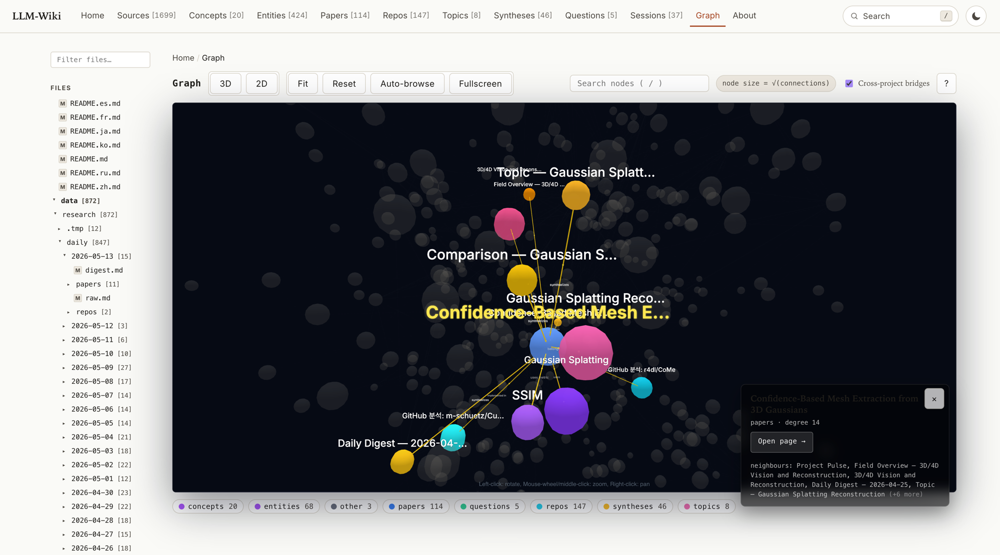

# LLM-Wiki

<p align="center">
  
</p>

<p align="center">
  <a href="./README.md">English</a> ·
  <a href="./README.ko.md">한국어</a> ·
  <a href="./README.zh.md">中文</a> ·
  <a href="./README.ja.md">日本語</a> ·
  <a href="./README.ru.md">Русский</a> ·
  <a href="./README.fr.md">Français</a>
</p>

LLM-Wiki es un compilador de memoria de proyecto. Apúntalo a un directorio que contenga Markdown, archivos fuente y, opcionalmente, PDFs/documentos de Office/imágenes, y extraerá un grafo de conocimiento tipado, escribirá un wiki consultable y emitirá artefactos portátiles: una proyección Markdown, un bundle listo para Cognee, un agent harness y un servidor MCP que puedes conectar a Claude Code, Codex o cualquier cliente MCP. Es un paso de build para contexto de proyecto, no un servicio alojado.

## Cuándo usarlo (y cuándo no)

Úsalo si:

- Quieres un grafo de conocimiento duradero e inspeccionable sobre las fuentes mayoritariamente de texto de un único proyecto (documentación, código, notas de investigación).
- Quieres un servidor MCP local que responda preguntas basándose en tus propios archivos.
- Quieres alimentar a Cognee con un bundle limpio, o meter una proyección Markdown en Obsidian, sin tener que escribir el código de pegamento tú mismo.

Sáltalo si:

- Solo necesitas una búsqueda vectorial sobre un directorio pequeño — `ripgrep` más una biblioteca de embeddings es más simple.
- Quieres un wiki alojado con UI de edición. El sitio estático que aquí se genera es de solo lectura.
- Esperas embeddings semánticos precisos listos para usar. El embedding por defecto de RAG-Anything es determinista (ver [Estado](#estado)).
- Esperas un agente «pregunta lo que sea» llave en mano. Esto construye el sustrato; conectarlo al agente que elijas sigue siendo tarea tuya.

## Estado

Este es un proyecto de investigación / herramientas para agentes en evolución. Limitaciones conocidas:

- El tiempo de compilación escala aproximadamente de forma lineal con el tamaño del corpus. La primera compilación sobre árboles grandes de Markdown (miles de archivos) puede tardar minutos.
- El proveedor por defecto de embeddings de RAG-Anything es `deterministic`. Es reproducible y sin dependencias, pero el recall semántico es limitado. Cambia a `ollama` (por ejemplo, `qwen3-embedding:0.6b`) o a un endpoint compatible con OpenAI para mejor recuperación — consulta [docs/integrations/rag-anything.md](docs/integrations/rag-anything.md).
- El soporte de visión para RAG-Anything (extracción de contenido de imágenes) todavía no está conectado de extremo a extremo. Los archivos de imagen se parsean de forma estructural pero no se describen.
- Cognee runtime cognify es best-effort: providers que faltan, claves API de pago o fallos de red se registran y se omiten en lugar de abortar el build.
- El servidor MCP expone un conjunto estable de herramientas, pero el esquema del grafo subyacente todavía puede ampliarse.

## Inicio rápido

Requiere Python 3.9 o superior. RAG-Anything necesita Python 3.10 o superior si lo habilitas.

```bash
pip install llm-wiki

cd /path/to/my-project
llm_wiki project setup
llm_wiki project compile
llm_wiki project ask "Where is Mermaid rendering implemented?"
llm_wiki project build-site && llm_wiki project serve --port 8765
```

El asistente de setup detecta fuentes habituales (`README.md`, `docs/`, `src/`, `data/`) y escribe `.llm-wiki/config.json`. Las funciones que llaman a un LLM usan por defecto la CLI `codex` sobre OAuth, así que no se requieren claves API en el camino habitual. Las versiones más largas están en [docs/quickstart.md](docs/quickstart.md) y [docs/installation.md](docs/installation.md).

## Lo que obtienes tras compilar

```text
.llm-wiki/
  config.json
  graph.json              # nodos/aristas tipados
  manifest.json           # huellas de fuente (usado por --changed-only)
  sqlite.db               # almacén de grafo consultable
  temporal_facts.jsonl
  graphiti_episodes.jsonl
  report.md
  markdown_projection/    # páginas wiki legibles para humanos
  obsidian_vault/         # listo para soltar en Obsidian
  agent_harness/          # configuración por agente (Claude/Codex/Gemini/Cursor/...)
  harness_sessions/       # memoria de sesiones Claude/Codex importada
  cognee_bundle/          # JSONL listo para ingest en Cognee
  site/                   # sitio estático construido por build-site
  external/               # salidas de herramientas complementarias (UA, RAG-Anything)
```

Tras `project compile`, ejecuta `ls .llm-wiki/` para verificar lo que se ha generado.

## Visión general de la CLI

Comandos de uso diario. Ejecuta `llm_wiki <subcommand> --help` para ver los flags completos.

| Comando | Qué hace |
|---|---|
| `llm_wiki project setup` | Asistente interactivo. Escribe `.llm-wiki/config.json`. Acepta `--with-understand-anything`, `--with-raganything`, `--run-cognee`, etc. |
| `llm_wiki project compile` | Lee las fuentes configuradas, ejecuta refresh de las herramientas complementarias y escribe todos los artefactos bajo `.llm-wiki/`. Usa `--changed-only` para rebuilds incrementales. |
| `llm_wiki project build-site` | Construye el frontend estático en `.llm-wiki/site/`. |
| `llm_wiki project serve --port 8765` | Sirve el sitio estático localmente. |
| `llm_wiki project refresh-understand-anything` | Ejecuta el wrapper de refresh gestionado por LLM-Wiki para Understand Anything. |
| `llm_wiki project refresh-raganything --parser mineru` | Re-parsea fuentes no-código (PDFs, Office, imágenes) vía RAG-Anything. |
| `llm_wiki project ask "<question>"` | Pregunta al backend configurado (`auto`/`raganything`/`cognee`/`wiki`). |
| `llm_wiki project mcp-config` | Imprime un fragmento de configuración de servidor MCP que puedes pegar en Claude Code, Codex o Hermes. |
| `llm_wiki wiki register <path> --name <alias>` | Registra un proyecto en el registry compartido. |
| `llm_wiki wiki list` / `llm_wiki wiki activate <name>` | Lista los proyectos registrados; fija el activo. |
| `llm_wiki ask "<question>" [--wiki <name>]` | Comando ask de nivel superior, que resuelve a través del registry. |

## Integraciones

Todas las integraciones son opt-in. Ninguna es necesaria para usar LLM-Wiki sobre un proyecto sencillo de Markdown/código.

- **Understand Anything** — un proyecto independiente ([Lum1104/Understand-Anything](https://github.com/Lum1104/Understand-Anything)) que produce un grafo de conocimiento de código en `.understand-anything/knowledge-graph.json`. Se habilita con `--with-understand-anything`. LLM-Wiki guarda un wrapper de refresh gestionado, así que `project compile` mantiene el grafo al día. Consulta [docs/integrations/understand-anything.md](docs/integrations/understand-anything.md).
- **RAG-Anything** — ingestión multimodal ([HKUDS/RAG-Anything](https://github.com/HKUDS/RAG-Anything)) para PDFs, documentos de Office e imágenes vía MinerU/Docling/PaddleOCR. Se habilita con `--with-raganything`. También funciona como backend de preguntas en runtime (LightRAG). Requiere Python 3.10+. Consulta [docs/integrations/rag-anything.md](docs/integrations/rag-anything.md).
- **Cognee** — backend de memoria graph+vector. Se habilita con `--run-cognee --install-cognee`. El compile normal siempre escribe `.llm-wiki/cognee_bundle/`; la pasada `cognify` en runtime es best-effort y solo se ejecuta cuando se habilita explícitamente.

## Registry multi-proyecto

Un registry persistente en `~/.llm-wiki/registry.json` permite que la CLI `ask` de nivel superior y el servidor MCP resuelvan nombres de proyecto a rutas raíz sin tener que pasar `--project` en cada llamada.

```bash
llm_wiki wiki register /path/to/my-project --name myproj
llm_wiki wiki activate myproj
llm_wiki ask "Where is the parser entry point?"
```

El servidor MCP lee el mismo registry, así que los clientes MCP pueden llamar a `list_projects`, `activate_project` y `ask` sobre cualquier wiki registrado.

## MCP

`llm_wiki project mcp-config` imprime una entrada de servidor que puedes pegar en Claude Code, Codex o cualquier cliente compatible con MCP. El servidor expone herramientas como `schema`, `graph_summary`, `search_nodes`, `node_context`, `search_facts`, `timeline`, `wiki_page`, `raw_source`, `lint_report`, `ask`, y las del registry `list_projects` / `register_project` / `activate_project` / `unregister_project`. Las herramientas que requieren un proyecto concreto resuelven a través del mismo registry que la CLI.

## Autenticación y proveedores de LLM

El camino habitual no requiere claves API:

- **Codex CLI** (por defecto) sobre OAuth. `--raganything-llm-provider codex` es el valor por defecto; el modo `codex_cognify` de Cognee parchea el cliente LLM de Cognee a la CLI de Codex.
- **Claude Code CLI** sobre OAuth. Para consultas en runtime de RAG-Anything, ajusta `--raganything-llm-provider claude`. Las configuraciones multi-cuenta usan `--raganything-claude-config-dir ~/.claude-personal2` (LLM-Wiki exporta `CLAUDE_CONFIG_DIR` antes de cada llamada).
- **Embeddings** por defecto usan un provider determinista en proceso. Cambia a Ollama con `--cognee-embedding-provider ollama --cognee-ollama-embedding-model qwen3-embedding:0.6b`, o conecta endpoints compatibles con OpenAI — ambos caminos están documentados en las páginas de integración.

Si defines `ANTHROPIC_API_KEY` o `OPENAI_API_KEY`, los paths correspondientes las recogerán, pero no son necesarias.

## Estructura del proyecto

```text
llm_wiki/        # el paquete (CLI, compilador, servidor MCP, adapters)
docs/            # documentación en inglés + docs/i18n/ para los otros seis idiomas
ontology/        # esquemas de nodo/arista que el compilador valida
prompts/         # prompts de extracción y síntesis
scripts/         # scripts de mantenimiento
tests/           # suite pytest
evals/           # harnesses de evaluación de calidad del grafo
data/            # notas de investigación de ejemplo usadas para self-dogfooding
```

## Documentación localizada

[English](./README.md) ·
[한국어](./README.ko.md) ·
[中文](./README.zh.md) ·
[日本語](./README.ja.md) ·
[Русский](./README.ru.md) ·
[Français](./README.fr.md)

La documentación larga se replica bajo `docs/i18n/` y `docs/i18n/integrations/`.

## Licencia

MIT. Consulta [LICENSE](LICENSE).
