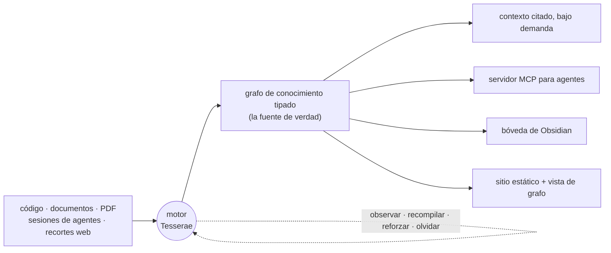

<div align="center">

# Tesserae

**El motor de contexto para agentes de programación.**

Convierte tu proyecto —su código, su documentación y tus sesiones con agentes—
en un grafo de conocimiento tipado y autoperfeccionable, y luego compila
exactamente el contexto que un agente necesita: fundamentado, citado y bajo
demanda.

[](https://pypi.org/project/tesserae/)
[](https://www.npmjs.com/package/@jokerized/tesserae)
[](https://pypi.org/project/tesserae/)
[](https://github.com/ca1773130n/Tesserae/actions/workflows/tests.yml)
[](LICENSE)

[Demo en vivo](https://ca1773130n.github.io/Tesserae) ·
[Inicio rápido](#inicio-rápido) ·
[Documentación](docs/) ·
[Memoria de agentes](docs/i18n/agent-memory.es.md) ·
[Configuración MCP](docs/i18n/integrations/mcp.es.md) ·
[Ajustes](docs/i18n/tuning.es.md) ·
[Notas de versión](docs/release-notes/)

[English](./README.md) · [한국어](./README.ko.md) · [中文](./README.zh.md) · [日本語](./README.ja.md) · [Русский](./README.ru.md) · [Français](./README.fr.md) · [Deutsch](./README.de.md)

</div>

---

## El problema

Un agente vale lo que vale el contexto que le entregas. Así que pegas archivos,
vuelves a explicar decisiones que ya tomaste la semana pasada y observas cómo
redescubre el mismo problema por tercera vez: porque todo lo que aprendió se
evaporó al terminar la conversación, y nada en el disco sabe cómo encaja
realmente tu proyecto.

Tesserae es esa capa que falta. Lee tus fuentes **y** observa tus sesiones con
agentes, reconstruye un grafo de conocimiento tipado que se mantiene al día, y
le sirve al agente justo la porción que necesita, citada hasta el archivo o la
conversación de la que salió. Todo se ejecuta en tu máquina. Es un paso de
compilación más un motor vivo, no un servicio alojado, y el camino habitual
**no necesita claves de API**.


```mermaid
flowchart LR
    S["código · documentos · PDF<br/>sesiones de agentes · recortes web"]
    E(("motor<br/>Tesserae"))
    G["grafo de conocimiento tipado<br/>(la fuente de verdad)"]
    O1["contexto citado, bajo demanda"]
    O2["servidor MCP para agentes"]
    O3["bóveda de Obsidian"]
    O4["sitio estático + vista de grafo"]

    S --> E --> G
    G --> O1 & O2 & O3 & O4
    E -. "observar · recompilar · reforzar · olvidar" .-> E
```

El grafo, la bóveda y el sitio son todos **proyecciones** de una sola base de
conocimiento. El motor es el bucle que las mantiene verdaderas.

## Inicio rápido

Requiere **Python 3.10+**. El camino por defecto no necesita clave de API.

```bash
pipx install tesserae          # o: pip install tesserae · npx @jokerized/tesserae

cd /path/to/my-project
tesserae init --yes            # detectar el proyecto, escribir .tesserae/
tesserae compile               # construir el grafo desde tus fuentes
```

Ahora pregúntale lo que quieras, con base en tu código y documentación reales:

```bash
tesserae ask "¿Dónde se implementa el parseo de arXiv ID y qué depende de ello?"
```

O compila un documento de contexto citado y a medida para entregárselo a
cualquier agente:

```bash
tesserae context "¿Cómo maneja el parser los ID malformados?" --budget 32000 -o context.md
```

Explora el grafo y el wiki en tu navegador:

```bash
tesserae serve --port 8765
```

Ese es todo el bucle: **apunta, compila, pregunta.** Las funciones con LLM usan
por defecto la CLI de `codex` o `claude` sobre OAuth; los detalles, los arreglos
de PATH y las opciones de proveedor están en
[instalación](docs/i18n/installation.es.md) e
[inicio rápido](docs/i18n/quickstart.es.md).

## Qué hace

**Compila un grafo tipado desde tus fuentes.** Apúntalo a markdown, código
fuente y, opcionalmente, PDF / documentos de Office / imágenes. Tesserae extrae
un grafo de más de 70 tipos de nodo —conceptos, decisiones, símbolos de código,
artículos, síntesis— con aristas tipadas y validadas contra un esquema. La
compilación es **determinista a nivel de bytes**: las mismas entradas producen
un `graph.json` idéntico, siempre.

**Convierte las conversaciones con agentes en memoria.** Tus sesiones de Claude
Code y Codex sobre el proyecto se vuelven nodos de primera clase —hallazgos,
decisiones, preguntas, TODO— enlazados a los archivos que tocaron. El
conocimiento de una sesión sobrevive a la sesión.

**Recuerda lo que realmente pasó, no solo lo que se dijo.** El resultado de una
herramienta es un turno: los códigos de salida y las banderas de error
sobreviven a la ingesta y aterrizan en nodos `Event`, de modo que el grafo sabe
que un comando **falló**, y no solo que se ejecutó. A partir de dos resultados
**observados** en una misma sesión —una llamada que falló y otra posterior que
tuvo éxito sobre el mismo operando— Tesserae deriva una arista `recovers`. Es la
única arista causal del vocabulario, y es derivada, nunca afirmada por un
modelo: un `caused_by` que en realidad es un `happened_near` se lee como
evidencia, y eso es peor que no tener arista alguna.

**Sirve contexto citado bajo demanda.** El compilador de contexto ejecuta
Personalized PageRank desde los nodos semilla de tu consulta, empaqueta el
subgrafo más relevante dentro de un presupuesto de caracteres y devuelve un
documento citado listo para pegar, o lo transmite a un agente por MCP.

**Se mantiene fresco solo.** Un motor supervisado observa fuentes y sesiones,
amortigua las ráfagas, recompila y ejecuta una pasada de automejora que refuerza
los hallazgos recurrentes y reemplaza los obsoletos. Como un cerebro que
consolida la memoria durante el descanso, también **consolida por su cuenta la
memoria de los agentes** cuando el proyecto queda inactivo: un ciclo de sueño
periódico, sin ningún comando. Compacta y olvida la memoria reciente ruidosa,
**olvida por desuso** (se desvanece lo que nadie recupera, no solo lo antiguo) y
**descubre nuevas conexiones** entre lo que sobrevive. Un solo proceso puede
mantener al día todos tus proyectos.

**Le da a cada agente su propia memoria en crecimiento.** Destila la experiencia
de cada agente en una capa acotada de más alto nivel; deja que los responsables
lean solo la capa destilada de quienes les reportan, recursivamente hacia arriba
en el árbol organizativo. Véase
[memoria de agentes por capas](#memoria-de-agentes-por-capas) más abajo.

## Cómo queda tras `compile`

```text
.tesserae/
├── graph.json              # la base de conocimiento tipada — nodos + aristas
├── sqlite.db               # almacén de grafo consultable
├── markdown_projection/    # páginas wiki legibles por humanos
├── obsidian_vault/         # listo para soltar en Obsidian
├── site/                   # sitio estático: grafo + wiki + búsqueda
├── harness_sessions/       # memoria de sesiones Claude / Codex importada
├── agents/                 # capas de memoria destilada por agente (opcional)
└── config.json · manifest.json · report.md
```

## Memoria de agentes por capas

Ningún humano lo recuerda todo, y en ninguna ventana de contexto cabe todo. La
respuesta de Tesserae es una **base de conocimiento por capas y por agente**:
cada agente hace crecer su propia memoria a partir de sus sesiones, esa memoria
se **destila** periódicamente en una capa acotada de nivel superior, y los
responsables ven solo la capa destilada de su equipo, recursivamente, como en
una organización real.

```bash
export TESSERAE_AGENT_DISTILL=1
tesserae compile              # crea un nodo Agent por agente + aristas de atribución
tesserae agents init          # infiere el organigrama a partir de quién lanzó a quién
tesserae agents tree          # inspecciónalo: jerarquía, nº de sesiones, obsolescencia
tesserae distill              # compacta la experiencia de cada agente en una capa L1
```

A partir de ahí, toda herramienta que lea el grafo —CLI o MCP— acepta un ámbito
`agent=`:

```bash
tesserae query "checklist de release" --agent claude-code:me:reviewer   # memoria propia
tesserae ask   "¿qué sabe mi equipo sobre despliegues?" --agent org      # el equipo, destilado
```

La destilación **organiza, compacta y olvida, pero nunca borra**: un hallazgo
decaído se pliega dentro del destilado que lo cita y sigue siendo alcanzable vía
`agents drill`, nunca se descarta. El tiempo es el reloj del corpus, la
identidad de un nodo jamás depende de cómo lo redacte un LLM y los artefactos
siguen siendo deterministas. El diseño completo está en
[docs/i18n/agent-memory.es.md](docs/i18n/agent-memory.es.md).

No hace falta ejecutar `distill` a mano: deja `tesserae engine` corriendo y
**consolidará por su cuenta** durante el reposo, un ciclo de sueño que envuelve
esa misma pasada opcional y regulada por presión de memoria. Véase
[docs/i18n/engine-consolidation.es.md](docs/i18n/engine-consolidation.es.md).

## Servidor MCP

`tesserae projects mcp-config` imprime una entrada de servidor lista para Claude
Code, Codex o cualquier cliente MCP. Toda herramienta que lee el grafo acepta
`graph_path` / `project` / `agent` sin coste. Las principales:

| Herramienta | Propósito |
|---|---|
| `compile_context` | Documento de contexto citado y a medida para una consulta o nodos semilla (determinista; `preview=N` devuelve un handle en vez del cuerpo completo) |
| `get_handle` | Paginar una carga grande en porciones, para que el agente no la sostenga entera en contexto |
| `ask` · `query` · `search_nodes` · `node_context` | Respuestas planificadas, recuperación cruda y navegación sobre la base compilada |
| `graph_map` | Budgeted Descent: recorrer el grafo de arriba abajo por ámbito en lugar de adivinar términos de búsqueda — el punto de entrada canónico |
| `graph_ppr` · `search_facts` · `timeline` | Expansión por Personalized PageRank, hechos temporales y cronología. Dos relojes que **se componen**: `as_of` (qué era VERDAD entonces, según las marcas de tiempo de las propias fuentes) y `observed_as_of` (qué habíamos APRENDIDO para entonces, según el registro sellado en cada compilación). `current_only` y `as_of` se rechazan juntos: esos dos sí son alternativas |
| `verify_claim` | ¿Autoriza el grafo esta tripleta? Un veredicto determinista, no una opinión generada |
| `find_session_findings` · `fresh_insights` · `activity_summary` · `query_decisions` | Memoria derivada de sesiones, ordenada por decaimiento y deduplicada; resúmenes y registro de decisiones |
| `agent_view_explain` · `drill_down` · `read_audit` | Resolver la vista con ámbito de un agente; escalar una nota destilada a su evidencia original (auditado); y, opcional vía `TESSERAE_READ_AUDIT`, leer quién ha estado leyendo el grafo |
| `ingest` · `graph_write` | Fusionar web/texto crudo (p. ej. un recorte del navegador) en el grafo; permitir que un agente escriba nodos atribuidos — incluida una arista `retracts` para decir «esto está mal» sin inventar un reemplazo |
| `doctor_run` · `doctor_report` · `lint_report` | Comprobaciones de salud y lint del grafo desde dentro del bucle del agente |

## Comandos del día a día

`tesserae --help` para la lista agrupada, `tesserae <cmd> --help` para las
opciones.

| Comando | Qué hace |
|---|---|
| `tesserae init` | Onboarding en un paso: detectar el proyecto, elegir proveedor de LLM, escribir `.tesserae/config.json`. `--yes` para modo no interactivo. |
| `tesserae compile` | Reconstruye el grafo y todas las proyecciones. `compile <rutas>` ingiere archivos extra puntualmente. |
| `tesserae ask "<p>"` | Respuesta citada y planificada por LLM. Un enrutador inteligente elige el proyecto; `--scope federated` los fusiona en una sola respuesta. |
| `tesserae query "<p>"` | Recuperación cruda: BM25/semántica, sin síntesis de LLM. |
| `tesserae context "<p>"` | Documento de contexto citado bajo demanda vía PPR dentro de `--budget`. Reserva un hueco para memoria **procedimental** —qué se ejecutó y en qué acabó— cuando el grafo tiene procedencia que lo justifique. |
| `tesserae graph-map` | Budgeted Descent: recorrer de arriba abajo por ámbito, no por término de búsqueda. `--scope org:root` para el árbol organizativo de agentes. |
| `tesserae verify-claim` | Veredicto determinista sobre si el grafo autoriza una tripleta. Salida JSON. |
| `tesserae engine [--all]` | Demonio de refresco supervisado: observar, amortiguar, recompilar y consolidar memoria de agentes en reposo (el ciclo de sueño; `--no-consolidate` lo desactiva). `--all` mantiene al día todos los proyectos registrados en un solo proceso. |
| `tesserae refresh` | De una vez: importar sesiones nuevas → compilar → sincronizar bóveda. |
| `tesserae agents …` | `init` (inferir la organización) · `tree` · `show` · `drill`: las herramientas de memoria por capas. |
| `tesserae distill` | Compacta las sesiones de cada agente en su capa de memoria L1 acotada. |
| `tesserae doctor` | Comprobaciones de salud; `--fix` aplica reparaciones seguras. Código de salida `0/1/2` = sano/avisos/errores. |
| `tesserae lint` | Lint del grafo: huérfanos, citas obsoletas, deriva con el wiki, cobertura de intervalos escasa, pools procedimentales no merecidos. `--fix-trivial` para los seguros. |
| `tesserae domains status` | Imprime el árbol de dominios de la carta fundacional (divisiones → departamentos → equipos). Véase [arquitectura](docs/i18n/architecture.es.md). |
| `tesserae federation status` | Inspecciona la federación entre proyectos: hasta dónde llega realmente `--scope federated`. |
| `tesserae serve` | Sirve todos los proyectos registrados: portada en `/`, cada uno en `/<alias>/`, con widget de consulta en vivo. |
| `tesserae export site \| okf` | Construye el sitio estático o exporta un paquete portable [Google OKF](https://github.com/GoogleCloudPlatform/knowledge-catalog). |
| `tesserae projects …` | Registro multiproyecto: `register`, `list`, `mcp-config`. |

## Multiproyecto

Un registro en `~/.tesserae/registry.json` resuelve nombres de proyecto en todas
partes: CLI, MCP y el motor de flota. No hay proyecto "activo": los comandos por
proyecto resuelven aquel en el que estás, y `ask` enruta entre todos.

```bash
tesserae projects register /path/to/my-project --name myproj
tesserae ask "compara la recuperación en research y notes"   # → federado, con referencias cruzadas
tesserae ask "¿cómo compila myproj?"                         # → enruta a ese proyecto
tesserae serve                                               # → todos los proyectos en un servidor
```

El markdown de un proyecto puede enlazar en profundidad a un nodo de otro con
`wiki://<alias>/<kind>/<slug>`; al compilar se convierten en nodos puente en la
vista de grafo.

## Integraciones (todas opcionales)

- **Plugin de Claude Code**: comandos slash, hooks de sesión, una skill y
  registro automático de MCP en un solo `/plugin install`.
  [→](docs/i18n/integrations/claude-code-plugin.es.md)
- **Grafo de sesiones**: las conversaciones de Claude Code / Codex se convierten
  en nodos Insight / Decision / Question / TODO, enlazados a los documentos que
  tocaron, sin clave de API. [→](docs/i18n/integrations/sessions.es.md)
- **RAG-Anything**: ingesta multimodal (PDF / Office / imágenes vía MinerU /
  Docling) más un backend de preguntas LightRAG.
  [→](docs/i18n/integrations/rag-anything.es.md)
- **Obsidian**: sincronización bidireccional de la bóveda con una capa de
  ediciones del usuario. [→](docs/i18n/integrations/obsidian.es.md)
- **Web Clipper**: recorta una página o una selección al corpus con un clic.
  [→](docs/i18n/integrations/chrome-extension.es.md)

## Comparativa

<details>
<summary><strong>Matriz de funcionalidades</strong> frente a Quartz, Logseq, Cognee, Foam</summary>

<br/>

| | Tesserae | Quartz | Logseq | Cognee | Foam |
|---|:---:|:---:|:---:|:---:|:---:|
| Sitio estático + vista de grafo | ✅ | ✅ | ✅ | ➖ | ➖ |
| Esquema de nodos tipado | ✅ 70+ | ❌ | ➖ | ✅ | ❌ |
| Extracción de conceptos desde fuentes | ✅ | ❌ | ❌ | ✅ | ❌ |
| Ingesta multimodal (PDF/imagen) | ✅ | ❌ | ➖ | ✅ | ❌ |
| Ingesta de grafo de código | ✅ | ❌ | ❌ | ➖ | ❌ |
| Servidor MCP | ✅ | ❌ | ❌ | ✅ | ❌ |
| Compilador de contexto citado bajo demanda | ✅ | ❌ | ❌ | ❌ | ❌ |
| Sesiones en vivo → memoria de grafo | ✅ | ❌ | ❌ | ❌ | ❌ |
| Memoria por capas y por agente | ✅ | ❌ | ❌ | ❌ | ❌ |
| Demonio multiproyecto (flota) | ✅ | ❌ | ❌ | ❌ | ❌ |
| Funciona sin clave de API | ✅ | — | — | ❌ | — |
| Compilación determinista a nivel de bytes | ✅ | ✅ | — | ❌ | — |
| Edición en vivo en una UI | ❌ | ➖ | ✅ | — | ✅ |

</details>

Tesserae elige **compilar desde las fuentes en lugar de editar en vivo**. Si
quieres editar notas en una interfaz, usa Logseq u Obsidian. Si quieres una
herramienta de compilación *y un motor vivo* que mantenga un grafo de
conocimiento fundamentado —y se lo dé de comer a tus agentes—, este es el
proyecto.

**Úsalo si** quieres un grafo de conocimiento duradero e inspeccionable sobre
las fuentes de un proyecto, un servidor MCP local anclado en tus propios
archivos, o memoria por agente que se acumula en vez de evaporarse.

**Sáltatelo si** solo necesitas búsqueda vectorial sobre una carpeta pequeña,
quieres un wiki alojado con interfaz de edición, o esperas un bot "pregúntame lo
que sea" llave en mano: Tesserae construye el sustrato; tú lo conectas al agente
que prefieras.

## Proveedores y privacidad

Todo se ejecuta localmente y el camino habitual **no usa claves de API**:

- **Codex CLI** (por defecto) y **Claude Code CLI** sobre OAuth, con rotación
  entre varias cuentas.
- **Embeddings** por una vía offline y sin torch (`pip install
  "tesserae[semantic]"`, `model2vec`). `ANTHROPIC_API_KEY` / `OPENAI_API_KEY` se
  usan si están definidas, pero nunca son obligatorias.

## Estado y limitaciones

Consulta las [notas de versión](docs/release-notes/) para la versión actual. Con
franqueza:

- Las primeras compilaciones sobre miles de archivos tardan minutos; el tiempo
  escala de forma aproximadamente lineal. La compilación incremental
  (`--changed-only`) existe, pero es experimental.
- Sin el extra `semantic`, la recuperación híbrida degrada a un sustituto no
  semántico (con un aviso bien visible).
- Desde 0.30.0 **la capa de código es opcional**: en un repositorio grande los
  símbolos de código desplazaban a todo lo demás, así que `compile` ya no los
  ingiere salvo que se lo pidas. `tesserae code ingest` sigue conectando
  CodeGraph de forma deliberada.
- La **carta fundacional** (`tesserae domains status`) está implementada y
  cubierta por pruebas, pero `compile` todavía no la produce; hasta entonces el
  comando informa "no charter yet".
- La descripción de imágenes de RAG-Anything aún no está conectada de extremo a
  extremo.
- El conjunto de herramientas MCP es estable; el esquema del grafo aún gana
  tipos de nodo. El vocabulario causal es deliberadamente de una sola arista
  —`recovers`— y se deriva solo de resultados observados, nunca lo afirma un
  modelo. La *vista `causal`* de recuperación es más ancha que eso a propósito
  (también recorre `resolved_by` y `attributes_improvement_to`, que sirven a la
  misma intención de «por qué se rompió esto»); una arista que nada más afirma
  sería una vista sin nada dentro.
- **La promoción siempre es una edición humana.** `tesserae schema-drift`
  propone subtipos de nodo y el planificador de `ask` puede devolver un
  `proposed_write`, pero ninguno escribe: una propuesta se adopta solo editando
  `ResearchNodeType` usted mismo, o enviando la carga a `graph_write` con la
  procedencia que usted aporte.

## Estructura del proyecto

```text
tesserae/     # el paquete: CLI, compilador, motor, servidor MCP, adaptadores
docs/         # documentación en inglés + docs/i18n/ para otros siete idiomas
ontology/     # esquemas de nodos/aristas que valida el compilador
prompts/      # prompts de extracción y síntesis
tests/        # suite de pytest (más de 3.700 pruebas)
evals/        # bancos de evaluación de calidad del grafo
```

## Contribuir y documentación

- **Documentación**: [inicio rápido](docs/i18n/quickstart.es.md) · [instalación](docs/i18n/installation.es.md) · [memoria de agentes](docs/i18n/agent-memory.es.md) · [arquitectura](docs/i18n/architecture.es.md)
- **Localizadas**: [English](./README.md) · [한국어](./README.ko.md) · [中文](./README.zh.md) · [日本語](./README.ja.md) · [Русский](./README.ru.md) · [Français](./README.fr.md) · [Deutsch](./README.de.md) — los documentos largos están replicados en `docs/i18n/`.

## Licencia

[MIT](LICENSE).
