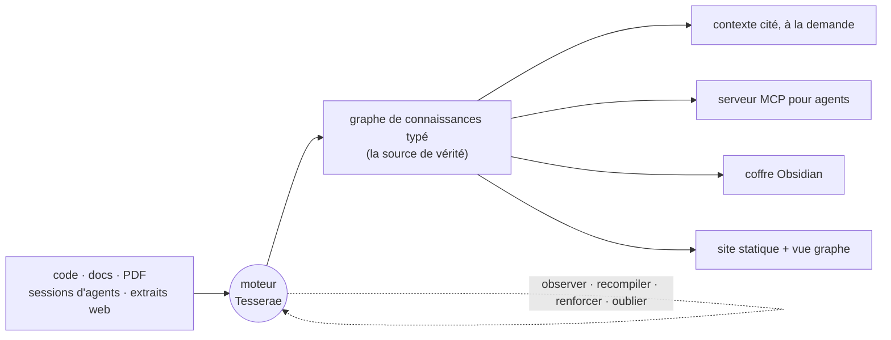

<div align="center">

# Tesserae

**Le moteur de contexte pour les agents de code.**

Transformez votre projet — son code, sa documentation et vos sessions d'agents —
en un graphe de connaissances typé et auto-améliorant, puis compilez exactement
le contexte dont un agent a besoin : fondé, cité, à la demande.

[](https://pypi.org/project/tesserae/)
[](https://www.npmjs.com/package/@jokerized/tesserae)
[](https://pypi.org/project/tesserae/)
[](https://github.com/ca1773130n/Tesserae/actions/workflows/tests.yml)
[](LICENSE)

[Démo en ligne](https://ca1773130n.github.io/Tesserae) ·
[Démarrage rapide](#démarrage-rapide) ·
[Documentation](docs/) ·
[Mémoire d'agent](docs/i18n/agent-memory.fr.md) ·
[Configuration MCP](docs/i18n/integrations/mcp.fr.md) ·
[Réglages](docs/i18n/tuning.fr.md) ·
[Notes de version](docs/release-notes/)

[English](./README.md) · [한국어](./README.ko.md) · [中文](./README.zh.md) · [日本語](./README.ja.md) · [Русский](./README.ru.md) · [Español](./README.es.md) · [Deutsch](./README.de.md)

</div>

---

## Le problème

Un agent ne vaut que le contexte qu'on lui donne. Alors vous collez des
fichiers, vous réexpliquez des décisions déjà prises la semaine dernière, et
vous le regardez redécouvrir le même piège pour la troisième fois — parce que
tout ce qu'il avait appris s'est évaporé à la fin de la conversation, et que
rien sur le disque ne sait comment votre projet s'articule réellement.

Tesserae est cette couche manquante. Il lit vos sources **et** observe vos
sessions d'agents, reconstruit un graphe de connaissances typé qui reste à jour,
et sert à l'agent précisément la tranche dont il a besoin — citée jusqu'au
fichier ou à la conversation d'origine. Tout tourne sur votre machine. C'est une
étape de build plus un moteur vivant, pas un service hébergé, et le chemin
courant **ne demande aucune clé d'API**.



Le graphe, le coffre et le site sont tous des **projections** d'une seule base
de connaissances. Le moteur est la boucle qui les maintient vraies.

## Démarrage rapide

Nécessite **Python 3.10+**. Aucune clé d'API pour le chemin par défaut.

```bash
pipx install tesserae          # ou : pip install tesserae · npx @jokerized/tesserae

cd /path/to/my-project
tesserae init --yes            # détecter le projet, écrire .tesserae/
tesserae compile               # construire le graphe à partir de vos sources
```

Posez-lui maintenant n'importe quelle question, ancrée dans votre code et votre
documentation réels :

```bash
tesserae ask "Où est implémenté l'analyse des arXiv ID, et qu'est-ce qui en dépend ?"
```

Ou compilez un document de contexte cité et sur mesure à remettre à n'importe
quel agent :

```bash
tesserae context "Comment le parseur gère-t-il les ID mal formés ?" --budget 32000 -o context.md
```

Parcourez le graphe et le wiki dans votre navigateur :

```bash
tesserae serve --port 8765
```

Voilà toute la boucle : **pointer, compiler, demander.** Les fonctionnalités
basées sur un LLM utilisent par défaut la CLI `codex` ou `claude` via OAuth —
détails, correctifs de PATH et options de fournisseur dans
[installation](docs/i18n/installation.fr.md) et
[démarrage rapide](docs/i18n/quickstart.fr.md).

## Ce qu'il fait

**Compile un graphe typé depuis vos sources.** Pointez-le vers du markdown, du
code source et, au choix, des PDF / documents Office / images. Tesserae en
extrait un graphe de plus de 70 types de nœuds — concepts, décisions, symboles
de code, articles, synthèses — avec des arêtes typées, validées contre un
schéma. La compilation est **déterministe à l'octet près** : mêmes entrées,
`graph.json` identique, à chaque fois.

**Transforme les conversations d'agents en mémoire.** Vos sessions Claude Code
et Codex sur le projet deviennent des nœuds de premier ordre — constats,
décisions, questions, TODO — reliés aux fichiers qu'elles ont touchés. Le savoir
d'une session survit à la session.

**Se souvient de ce qui s'est réellement passé, pas seulement de ce qui a été
dit.** Un résultat d'outil est un tour : les codes de sortie et les indicateurs
d'erreur survivent à l'ingestion et se posent sur des nœuds `Event`, si bien que
le graphe sait qu'une commande a **échoué**, et pas seulement qu'elle a été
lancée. À partir de deux résultats **observés** dans une même session — un appel
en échec, puis un appel ultérieur réussi sur le même opérande — Tesserae dérive
une arête `recovers`. C'est la seule arête causale du vocabulaire, et elle est
dérivée, jamais affirmée par un modèle : un `caused_by` qui n'est en réalité
qu'un `happened_near` se lit comme une preuve, ce qui est pire que pas d'arête
du tout.

**Sert du contexte cité à la demande.** Le compilateur de contexte lance un
Personalized PageRank depuis les nœuds d'amorce de votre requête, tasse le
sous-graphe le plus pertinent sous un budget de caractères et renvoie un
document cité prêt à coller — ou le diffuse à un agent via MCP.

**Se maintient à jour tout seul.** Un moteur supervisé surveille sources et
sessions, amortit les rafales, recompile et exécute une passe d'auto-amélioration
qui renforce les constats récurrents et remplace ceux qui sont périmés. Comme un
cerveau qui consolide la mémoire au repos, il **consolide aussi de lui-même la
mémoire des agents** lorsque le projet devient inactif — un cycle de sommeil
périodique, sans aucune commande : il compacte et oublie la mémoire récente
bruyante, **oublie par désuétude** (ce que personne ne consulte s'estompe, pas
seulement ce qui est ancien) et **découvre de nouvelles connexions** entre ce qui
subsiste. Un seul processus peut garder à jour tous vos projets.

**Donne à chaque agent sa propre mémoire qui grandit.** Distillez l'expérience
de chaque agent en une couche bornée de plus haut niveau ; laissez les
responsables ne lire que la couche distillée de leurs subordonnés, récursivement
le long de l'arbre organisationnel. Voir
[mémoire d'agent en couches](#mémoire-dagent-en-couches) ci-dessous.

## Ce qu'on obtient après `compile`

```text
.tesserae/
├── graph.json              # la base de connaissances typée — nœuds + arêtes
├── sqlite.db               # magasin de graphe interrogeable
├── markdown_projection/    # pages wiki lisibles par un humain
├── obsidian_vault/         # à déposer directement dans Obsidian
├── site/                   # site statique : vue graphe + wiki + recherche
├── harness_sessions/       # mémoire des sessions Claude / Codex importées
├── agents/                 # couches de mémoire distillée par agent (optionnel)
└── config.json · manifest.json · report.md
```

## Mémoire d'agent en couches

Aucun humain ne se souvient de tout, et aucune fenêtre de contexte ne contient
tout. La réponse de Tesserae est une **base de connaissances en couches, par
agent** : chaque agent fait croître sa mémoire à partir de ses propres sessions,
cette mémoire est périodiquement **distillée** en une couche bornée de plus haut
niveau, et les responsables ne voient que la couche distillée de leurs
subordonnés — récursivement, comme dans une vraie organisation.

```bash
export TESSERAE_AGENT_DISTILL=1
tesserae compile              # crée un nœud Agent par agent + arêtes d'attribution
tesserae agents init          # déduit l'organigramme de qui a lancé qui
tesserae agents tree          # inspection : hiérarchie, nombre de sessions, obsolescence
tesserae distill              # compacte l'expérience de chaque agent en une couche L1
```

Ensuite, tout outil de lecture du graphe — CLI ou MCP — accepte une portée
`agent=` :

```bash
tesserae query "checklist de release" --agent claude-code:me:reviewer   # la mémoire d'un exécutant
tesserae ask   "que sait mon équipe des déploiements ?" --agent org      # toute l'équipe, distillée
```

La distillation **organise, compacte et oublie — mais ne supprime jamais** : un
constat décliné est replié dans le distillat qui le cite et reste atteignable
via `agents drill`, jamais jeté. Le temps est l'horloge du corpus, l'identité
d'un nœud ne dépend jamais de la formulation d'un LLM, et les artefacts restent
déterministes. Conception complète dans
[docs/i18n/agent-memory.fr.md](docs/i18n/agent-memory.fr.md).

Inutile de lancer `distill` à la main : laissez `tesserae engine` tourner et il
**consolide de lui-même** pendant les périodes de repos — un cycle de sommeil
qui enveloppe cette même passe optionnelle, régulée par la pression mémoire.
Voir [docs/i18n/engine-consolidation.fr.md](docs/i18n/engine-consolidation.fr.md).

## Serveur MCP

`tesserae projects mcp-config` imprime une entrée de serveur prête à l'emploi
pour Claude Code, Codex ou tout client MCP. Chaque outil de lecture du graphe
accepte `graph_path` / `project` / `agent` sans surcoût. Les principaux :

| Outil | Rôle |
|---|---|
| `compile_context` | Document de contexte cité et sur mesure pour une requête ou des nœuds d'amorce (déterministe ; `preview=N` renvoie un handle plutôt que le corps complet) |
| `get_handle` | Paginer une charge volumineuse par tranches, pour que l'agent ne la garde jamais entièrement en contexte |
| `ask` · `query` · `search_nodes` · `node_context` | Réponses planifiées, recherche brute et navigation dans la base compilée |
| `graph_map` | Budgeted Descent : parcourir le graphe de haut en bas par portée plutôt que de deviner des termes de recherche — le point d'entrée canonique |
| `graph_ppr` · `search_facts` · `timeline` | Expansion par Personalized PageRank, faits temporels et chronologie. Deux horloges qui **se composent** : `as_of` (ce qui était VRAI alors, d'après les horodatages des sources elles-mêmes) et `observed_as_of` (ce que nous avions APPRIS à cette date, d'après le registre estampillé à la compilation). `current_only` et `as_of` sont refusés ensemble — ces deux-là sont bien des alternatives |
| `verify_claim` | Le graphe autorise-t-il ce triplet ? Un verdict déterministe, pas un avis généré |
| `find_session_findings` · `fresh_insights` · `activity_summary` · `query_decisions` | Mémoire issue des sessions, classée par décroissance et dédupliquée ; digests et registre des décisions |
| `agent_view_explain` · `drill_down` · `read_audit` | Résoudre la vue restreinte d'un agent ; remonter d'une note distillée à sa preuve brute (audité) ; et, en option via `TESSERAE_READ_AUDIT`, relire qui a lu le graphe |
| `ingest` · `graph_write` | Fusionner du web/texte brut (p. ex. un extrait de navigateur) dans le graphe ; laisser un agent réécrire des nœuds attribués — y compris une arête `retracts` pour dire « ceci est faux » sans inventer un remplacement |
| `doctor_run` · `doctor_report` · `lint_report` | Vérifications de santé et lint du graphe depuis la boucle de l'agent |

## Commandes du quotidien

`tesserae --help` pour la liste groupée, `tesserae <cmd> --help` pour les
options.

| Commande | Ce qu'elle fait |
|---|---|
| `tesserae init` | Prise en main en une étape : détecter le projet, choisir un fournisseur LLM, écrire `.tesserae/config.json`. `--yes` pour le mode non interactif. |
| `tesserae compile` | Reconstruit le graphe et toutes les projections. `compile <chemins>` ingère ponctuellement des fichiers supplémentaires. |
| `tesserae ask "<q>"` | Réponse citée, planifiée par un LLM. Un routeur intelligent choisit le projet ; `--scope federated` les fusionne en une seule réponse. |
| `tesserae query "<q>"` | Recherche brute — BM25/sémantique, sans synthèse LLM. |
| `tesserae context "<q>"` | Document de contexte cité à la demande via PPR sous `--budget`. Réserve une place à la mémoire **procédurale** — ce qui a réellement été exécuté et ce qu'il en est advenu — quand le graphe dispose de la provenance qui la justifie. |
| `tesserae graph-map` | Budgeted Descent : parcourir de haut en bas par portée, pas par terme de recherche. `--scope org:root` pour l'arbre organisationnel des agents. |
| `tesserae verify-claim` | Verdict déterministe : le graphe autorise-t-il ce triplet ? Sortie JSON. |
| `tesserae engine [--all]` | Démon de rafraîchissement supervisé — observer, amortir, recompiler et consolider la mémoire des agents au repos (le cycle de sommeil ; `--no-consolidate` le désactive). `--all` garde à jour tous les projets enregistrés dans un seul processus. |
| `tesserae refresh` | En une passe : importer les nouvelles sessions → compiler → synchroniser le coffre. |
| `tesserae agents …` | `init` (déduire l'organisation) · `tree` · `show` · `drill` — les outils de mémoire en couches. |
| `tesserae distill` | Compacte les sessions de chaque agent dans sa couche de mémoire L1 bornée. |
| `tesserae doctor` | Vérifications de santé ; `--fix` applique les réparations sûres. Codes de sortie `0/1/2` = sain/avertissements/erreurs. |
| `tesserae lint` | Lint du graphe — orphelins, citations périmées, dérive avec le wiki, couverture d'intervalles maigre, pools procéduraux non mérités. `--fix-trivial` pour les cas sûrs. |
| `tesserae domains status` | Affiche l'arbre des domaines de la charte (divisions → départements → équipes). Voir [architecture](docs/i18n/architecture.fr.md). |
| `tesserae federation status` | Inspecte la fédération inter-projets — ce que `--scope federated` atteint réellement. |
| `tesserae serve` | Sert tous les projets enregistrés — accueil sur `/`, chacun sur `/<alias>/`, avec un widget de question en direct. |
| `tesserae export site \| okf` | Construit le site statique, ou exporte un bundle portable [Google OKF](https://github.com/GoogleCloudPlatform/knowledge-catalog). |
| `tesserae projects …` | Registre multi-projets : `register`, `list`, `mcp-config`. |

## Multi-projets

Un registre dans `~/.tesserae/registry.json` résout les noms de projets partout
— CLI, MCP et moteur de flotte. Il n'y a pas de projet « actif » : les commandes
par projet résolvent celui dans lequel vous vous trouvez, et `ask` route entre
tous.

```bash
tesserae projects register /path/to/my-project --name myproj
tesserae ask "compare la recherche dans research et notes"   # → fédéré, avec renvois croisés
tesserae ask "comment myproj compile-t-il ?"                 # → routé vers ce projet
tesserae serve                                               # → tous les projets sous un serveur
```

Le markdown d'un projet peut pointer en profondeur vers un nœud d'un autre via
`wiki://<alias>/<kind>/<slug>` ; à la compilation, cela devient un nœud-pont
dans la vue graphe.

## Intégrations (toutes optionnelles)

- **Plugin Claude Code** — commandes slash, hooks de session, une skill et
  l'enregistrement MCP automatique en un seul `/plugin install`.
  [→](docs/i18n/integrations/claude-code-plugin.fr.md)
- **Graphe de sessions** — les conversations Claude Code / Codex deviennent des
  nœuds Insight / Decision / Question / TODO, reliés aux documents qu'elles ont
  touchés, sans clé d'API. [→](docs/i18n/integrations/sessions.fr.md)
- **RAG-Anything** — ingestion multimodale (PDF / Office / images via MinerU /
  Docling) plus un backend de questions LightRAG.
  [→](docs/i18n/integrations/rag-anything.fr.md)
- **Obsidian** — synchronisation bidirectionnelle du coffre avec une surcouche
  d'éditions utilisateur. [→](docs/i18n/integrations/obsidian.fr.md)
- **Web Clipper** — capturer une page ou une sélection dans le corpus en un
  clic. [→](docs/i18n/integrations/chrome-extension.fr.md)

## Comparaison

<details>
<summary><strong>Matrice de fonctionnalités</strong> face à Quartz, Logseq, Cognee, Foam</summary>

<br/>

| | Tesserae | Quartz | Logseq | Cognee | Foam |
|---|:---:|:---:|:---:|:---:|:---:|
| Site statique + vue graphe | ✅ | ✅ | ✅ | ➖ | ➖ |
| Schéma de nœuds typé | ✅ 70+ | ❌ | ➖ | ✅ | ❌ |
| Extraction de concepts depuis les sources | ✅ | ❌ | ❌ | ✅ | ❌ |
| Ingestion multimodale (PDF/image) | ✅ | ❌ | ➖ | ✅ | ❌ |
| Ingestion du graphe de code | ✅ | ❌ | ❌ | ➖ | ❌ |
| Serveur MCP | ✅ | ❌ | ❌ | ✅ | ❌ |
| Compilateur de contexte cité à la demande | ✅ | ❌ | ❌ | ❌ | ❌ |
| Sessions en direct → mémoire de graphe | ✅ | ❌ | ❌ | ❌ | ❌ |
| Mémoire en couches par agent | ✅ | ❌ | ❌ | ❌ | ❌ |
| Démon multi-projets (flotte) | ✅ | ❌ | ❌ | ❌ | ❌ |
| Fonctionne sans clé d'API | ✅ | — | — | ❌ | — |
| Compilation déterministe à l'octet près | ✅ | ✅ | — | ❌ | — |
| Édition en direct dans une UI | ❌ | ➖ | ✅ | — | ✅ |

</details>

### Mesuré, pas affirmé

Chaque chiffre ci-dessous vient d'un banc de ce dépôt, sur des données présentes sur disque, et
dit contre quoi il a été mesuré. Daté du 2026-08-30.

| quoi | Tesserae | la comparaison |
|---|---|---|
| répondre à des questions comparatives sur 148 articles complets, couverture des points requis, 57 questions × 8 réplicats | **0.373** — le graphe choisit 3 documents, le paquet porte leur prose d'origine | passages BM25 à budget, backbone et juge identiques : 0.290 — **+28.9%**, 8/8 réplicats, p=0.0078 ; un juge local de 7B voit +7%, non significatif |
| rappel des documents sur le même corpus, documents distincts @10 / @50 | 0.791 / 0.962 avec un encodeur entraîné (`TESSERAE_EMBEDDING_PREFER=st`) ; 0.754 / 0.914 tel que livré | magasin de fragments bruts de Mem0 OSS, même encodeur : 0.775 / 0.944 — parité |
| verdicts de vérification fabriqués, 426 négatifs | **0** | — (aucun concurrent ne livre de vérificateur) |
| signalements de relecture par phrase sur chaque réponse | gratuit ; cascade **0.935** contre un modèle sur chaque phrase 0.928, pour 40 % des appels | — |
| appels d'API au moment de la requête | **0** — BM25 local et plongements statiques | Mem0 : un appel de plongement par recherche |
| LoCoMo, rappel des sessions d'or recall@10, 9 conversations | **0.930** | BM25 0.923 |
| LoCoMo, réponses, le juge de Mem0 lui-même, une conversation | 90.5 | Mem0 92.5 sur dix — parité, dans le bruit d'une conversation |

Les lignes de recherche — le rappel des documents et les deux lignes LoCoMo — sont le mot
honnête, conversationnelle ou non : parité. Donnez le même encodeur à un magasin vectoriel et il trouve les mêmes documents. La
première ligne est là où la conception diffère — le graphe choisit quels documents un agent lit
et lui remet leur prose, pas une distillation — et les lignes de vérification sont des réponses
que l'on peut vérifier sans avoir à leur faire confiance. Le +28.9% a été trouvé en balayant k
sur le banc même qui le note (k=5 donne encore +12%), et il dépend du juge : relancé
avec un qwen2.5:7b local comme répondeur et juge, les mêmes bras ressortent à +7%
d'écart, dans le bruit (57 questions, un réplicat), et sur un second corpus plus petit —
la propre documentation de ce projet, 24 questions écrites à la main — ils perdent face
à BM25 de 17 à 26 %.

Tesserae choisit la **compilation depuis les sources plutôt que l'édition en
direct**. Si vous voulez éditer des notes dans une interface, prenez Logseq ou
Obsidian. Si vous voulez un outil de build *et un moteur vivant* qui entretient
un graphe de connaissances fondé — et le donne à manger à vos agents — c'est ce
projet.

**Utilisez-le si** vous voulez un graphe de connaissances durable et
inspectable au-dessus des sources d'un projet, un serveur MCP local ancré dans
vos propres fichiers, ou une mémoire par agent qui se capitalise au lieu de
s'évaporer.

**Passez votre chemin si** vous n'avez besoin que d'une recherche vectorielle
sur un petit dossier, si vous voulez un wiki hébergé avec interface d'édition,
ou si vous attendez un bot « demandez-moi n'importe quoi » clé en main :
Tesserae construit le substrat ; c'est vous qui le branchez à l'agent de votre
choix.

## Fournisseurs et confidentialité

Tout tourne en local, et le chemin courant **n'utilise aucune clé d'API** :

- **Codex CLI** (par défaut) et **Claude Code CLI** via OAuth, avec rotation
  multi-comptes.
- **Embeddings** par une voie hors-ligne, sans torch (`pip install
  "tesserae[semantic]"`, `model2vec`). `ANTHROPIC_API_KEY` /
  `OPENAI_API_KEY` sont utilisées si définies, jamais requises.

## État et limites

Voir les [notes de version](docs/release-notes/) pour la version courante.
Honnêtement :

- Les premières compilations sur des milliers de fichiers prennent des minutes ;
  le temps croît à peu près linéairement. La compilation incrémentale
  (`--changed-only`) existe mais reste expérimentale.
- Sans l'extra `semantic`, la recherche hybride se dégrade en un substitut non
  sémantique (avec un avertissement bien visible).
- Depuis 0.30.0, **la couche code est optionnelle** : sur un gros dépôt, les
  symboles de code écrasaient tout le reste, donc `compile` ne les ingère plus
  sans demande explicite. `tesserae code ingest` branche toujours CodeGraph de
  façon délibérée.
- La **charte** (`tesserae domains status`) est implémentée et testée, mais
  `compile` ne la produit pas encore ; d'ici là, la commande renvoie « no
  charter yet ».
- La description d'images de RAG-Anything n'est pas encore branchée de bout en
  bout.
- L'ensemble d'outils MCP est stable ; le schéma du graphe gagne encore des
  types de nœuds. Le vocabulaire causal ne fait délibérément qu'une arête de
  large — `recovers` — et se dérive uniquement de résultats observés, jamais
  affirmés par un modèle. La *vue `causal`* de récupération est plus large que
  cela à dessein (elle traverse aussi `resolved_by` et
  `attributes_improvement_to`, qui servent la même intention « pourquoi cela
  a-t-il cassé ») ; une seule arête que rien d'autre n'affirme serait une vue
  sans rien dedans.
- **La promotion est toujours une édition humaine.** `tesserae schema-drift`
  propose des sous-types de nœuds et le planificateur d'`ask` peut renvoyer un
  `proposed_write`, mais ni l'un ni l'autre n'écrit : une proposition n'est
  adoptée qu'en éditant vous-même `ResearchNodeType`, ou en soumettant la
  charge utile à `graph_write` avec une provenance que vous fournissez.

## Structure du projet

```text
tesserae/     # le paquet — CLI, compilateur, moteur, serveur MCP, adaptateurs
docs/         # documentation anglaise + docs/i18n/ pour sept autres langues
ontology/     # schémas de nœuds/arêtes que le compilateur valide
prompts/      # prompts d'extraction et de synthèse
tests/        # suite pytest (plus de 3 700 tests)
evals/        # bancs d'évaluation de la qualité du graphe
```

## Contribuer et documentation

- **Docs** : [démarrage rapide](docs/i18n/quickstart.fr.md) · [installation](docs/i18n/installation.fr.md) · [mémoire d'agent](docs/i18n/agent-memory.fr.md) · [architecture](docs/i18n/architecture.fr.md)
- **Traductions** : [English](./README.md) · [한국어](./README.ko.md) · [中文](./README.zh.md) · [日本語](./README.ja.md) · [Русский](./README.ru.md) · [Español](./README.es.md) · [Deutsch](./README.de.md) — les documents longs sont répliqués dans `docs/i18n/`.

## Licence

[MIT](LICENSE).
