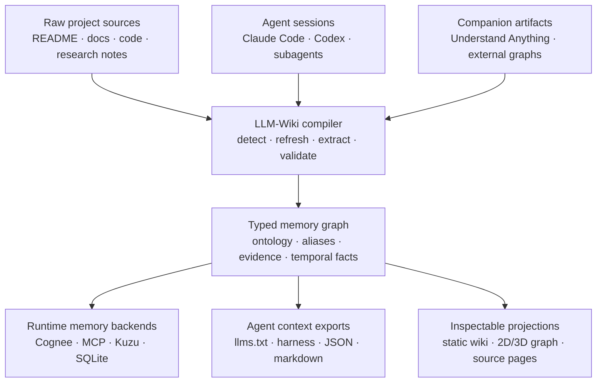
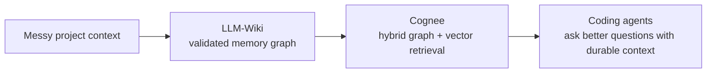

<h1 align="center">LLM-Wiki</h1>

<p align="center">
  <strong>コーディングエージェントのためのメモリコンパイラ。</strong>
  <br />
  <em>リポジトリ、ドキュメント、調査メモ、Claude/Codex セッション、補助グラフツールを、Cognee、MCP、Kuzu、SQLite、llms.txt、静的ドキュメント向けの検証済みメモリにコンパイルします。</em>
</p>

<p align="center">
  <a href="./README.md">English</a> ·
  <a href="./README.ko.md">한국어</a> ·
  <a href="./README.zh.md">中文</a> ·
  <a href="./README.ja.md">日本語</a> ·
  <a href="./README.ru.md">Русский</a> ·
  <a href="./README.es.md">Español</a> ·
  <a href="./README.fr.md">Français</a>
</p>

<p align="center">
  <a href="#クイックスタート"></a>
  <a href="#cognee--llm-wiki"></a>
  <a href="#エージェントが使う理由"></a>
  <a href="#メモリパイプライン"></a>
  <a href="./LICENSE"></a>
</p>

<p align="center">
  
</p>

---

## 提案

ほとんどの LLM wiki ツールは、生成されたノートページをもう 1 つ作るだけです。

**LLM-Wiki は、次のエージェントが出発点にできるメモリレイヤーを構築します。** ソースファイル、Markdown ドキュメント、調査メモ、ローカルの Claude/Codex トランスクリプト、外部グラフアーティファクトといったプロジェクトの雑多な現実を取り込み、型付きでポータブルなメモリシステムへコンパイルします。

Web サイトは単なるガラス窓です。製品の本体は、コンパイルされたメモリアーティファクトです。

<table>
  <tr>
    <td width="33%" valign="top">
      <h3>🧬 メモリを検証</h3>
      <p>検索に届く前にノードとエッジを制約します。ランダムな <code>related_to</code> の寄せ集め、重複エンティティ、漂流するスキーマを避けられます。</p>
    </td>
    <td width="33%" valign="top">
      <h3>🧠 エージェント作業を保持</h3>
      <p>Claude Code と Codex のセッションを、意思決定、コマンド、ファイル、要約、ツールトレースを含む検索可能なプロジェクトメモリに変換します。</p>
    </td>
    <td width="33%" valign="top">
      <h3>🔌 どこへでもエクスポート</h3>
      <p>同じメモリを Cognee、MCP、Kuzu、SQLite、Graphiti 風エピソード、<code>llms.txt</code>、Markdown、静的 Web サイトへ出力します。</p>
    </td>
  </tr>
</table>

---

## エージェントが使う理由

| もし持っているものが... | エージェントはまだ... | LLM-Wiki が与えるもの... |
|---|---|---|
| README | アーキテクチャと意思決定を再発見する必要があります | 型付きプロジェクトメモリ + ソース来歴 |
| ドキュメントサイト | 人間のようにページを探す必要があります | MCP ツール、`llms.txt`、JSON グラフ、ページごとのコンテキスト |
| ベクター DB | チャンクから関係を推測する必要があります | 検証済みノード、エッジ、エイリアス、主張、証拠 |
| グラフ可視化ツール | 図を眺めるだけです | 検索システムが使えるポータブルなグラフアーティファクト |
| チャット履歴 | 過去の作業を忘れてしまいます | インポートされたエージェントセッションを永続的なメモリとして保存 |

---

## メモリパイプライン



---

## Cognee + LLM-Wiki

**LLM-Wiki はメモリをコンパイルします。Cognee はそれを検索します。**

Cognee は AI メモリバックエンドとして強力です。グラフ + ベクター検索、セマンティックメモリ、オントロジーを意識したフックを備えています。しかし、取り込むメモリに制約がなければ、生のリポジトリ/ドキュメント取り込みは依然としてノイズが多くなり得ます。

LLM-Wiki は Cognee の前段のビルドステップとして機能します:

| レイヤー | LLM-Wiki の役割 | Cognee の役割 |
|---|---|---|
| ソース取得 | ドキュメント、コード、調査、セッション、補助アーティファクトを追跡 | 多様なデータ型を取り込める |
| 構造 | ノード/エッジ型、エイリアス、証拠、来歴を検証 | セマンティックメモリを保存・検索 |
| ランタイム | クリーンな Cognee バンドル、または Codex/OAuth cognify フローをエクスポート | ハイブリッドなグラフ/ベクターメモリをエージェントに提供 |
| 安全性 | 決定論的でローカルファーストな経路を維持 | 必要に応じてより豊かなメモリ検索を追加 |



コンパイル済みメモリをエージェントのためのライブ検索基盤にしたい場合は Cognee を使ってください。そのメモリがランタイムコンテキストになる前に、制御、検証、エクスポート、検査したい場合は LLM-Wiki を使ってください。

---

## クイックスタート

```bash
pip install llm-wiki

llm_wiki project setup
llm_wiki project compile
llm_wiki project ask "Which files implement Mermaid rendering?"
llm_wiki project build-site
llm_wiki project serve --port 8765
```

Understand Anything と Cognee を両方使う場合は、一度だけ次を実行します:

```bash
llm_wiki project setup \
  --with-understand-anything \
  --install-understand-anything \
  --understand-anything-platform codex \
  --run-cognee \
  --install-cognee
llm_wiki project compile
```

開く:

```text
http://127.0.0.1:8765/
```

セットアップウィザードは `README.md`、`docs`、`src`、`data`、補助アーティファクトなどの一般的なソースを検出します。Understand Anything を選ぶと、LLM-Wiki は要求に応じて補助スキルをインストールし、管理された refresh ラッパーを保存します。そのため `project compile` は、UA のインストール場所や `/understand` スラッシュコマンドをユーザーが知らなくても `.understand-anything/knowledge-graph.json` を更新できます。Cognee は既定の質問バックエンドとして有効になり、ランタイム cognify は `--run-cognee` で明示的に有効化します。

```text
◆ LLM-Wiki project setup
Choose sources and companion tools. Press Enter to accept defaults.

Sources
  ✓ README.md
  ✓ docs
  ✓ src
  ✓ .llm-wiki/external/understand-anything.md

External tools
  ◆ Understand Anything → .llm-wiki/external/understand-anything.md

Memory backends
  ◆ Cognee → my_project_memory (codex_cognify, manual cognify)
```

---

## エクスポートされるもの

| 出力 | 重要な理由 |
|---|---|
| `cognee_bundle/` | Cognee 風メモリワークフロー向けのクリーンなグラフアーティファクト |
| `graph.json` / `graph.jsonld` | ポータブルな型付きメモリグラフ |
| `sqlite.db` / Kuzu 出力 | クエリ可能なローカルグラフストレージ |
| `llms.txt` / `llms-full.txt` | 直接使えるエージェントコンテキストパック |
| MCP サーバー | `search_nodes`、`node_context`、`timeline`、グラフツール |
| `agent_harness/` | Claude Code、Codex、Gemini、Cursor、Kiro、OpenCode の設定 |
| `markdown_projection/` | 人間と編集者向けの読みやすい wiki ファイル |
| `.llm-wiki/site/` | 検査、共有、デバッグのための静的 Web サイト |

---

## 補助ツールであり、ロックインではない

LLM-Wiki はツールを置き換えるのではなく、ツールの間に位置するよう設計されています。

| ツール | 関係 |
|---|---|
| Understand Anything | 独立したコードグラフアーティファクト → Markdown プロジェクション → コンパイル済みメモリ |
| Cognee | ハイブリッドなグラフ/ベクター検索のためのメモリバックエンド |
| Graphiti スタイルのシステム | 時系列エピソード/ファクトのエクスポート経路 |
| Obsidian / markdown | 読みやすいプロジェクションであり、唯一の真実の源ではない |
| Claude Code / Codex | セッションメモリのソースであり、コンパイル済みコンテキストの利用者 |

管理されたセットアップを使うと、LLM-Wiki が補助スキルをインストールし、refresh ラッパーを保存し、Cognee ランタイムメモリまで一度に有効化できます:

```bash
llm_wiki project setup \
  --yes \
  --with-understand-anything \
  --install-understand-anything \
  --understand-anything-platform codex \
  --run-cognee \
  --install-cognee
llm_wiki project compile
```

コンパイル時、LLM-Wiki は UA グラフが存在しない、または古い場合に `project refresh-understand-anything` を実行し、`.llm-wiki/external/understand-anything.md` を生成し、`.llm-wiki/cognee_bundle/` を書き出し、設定されていれば Cognee ランタイムメモリも best-effort で更新します。ユーザーは UA や Cognee のインストール場所を知る必要がありません。

---

## LLM-Wiki が適したツールである場合

| 望むもの... | LLM-Wiki を使う理由... |
|---|---|
| より良いコーディングエージェントの継続性 | 以前の Claude/Codex セッションが検索可能なメモリになります |
| より安全な GraphRAG 入力 | 検索の前にスキーマ検証が行われます |
| ローカルファーストなワークフロー | 決定論的な抽出と CLI/OAuth 経路により、必須の API キー費用を避けられます |
| ポータブルなプロジェクトメモリ | 1 回のコンパイルで Cognee、MCP、SQLite、Kuzu、Markdown、JSON、サイトアーティファクトを出力します |
| 人間による検査 | 静的サイトで、エージェントが検索する内容をデバッグできます |

---

## ドキュメント

| ガイド | 得られるもの |
|---|---|
| [クイックスタート](./docs/quickstart.md) | 最初のプロジェクトメモリコンパイル |
| [インストール](./docs/installation.md) | インストールオプションとラッパー |
| [アーキテクチャ](./docs/architecture.md) | パイプライン内部とグラフモデル |
| [セッション履歴](./docs/session-history.md) | Claude/Codex トランスクリプトのインポート |
| [Understand Anything 補助ワークフロー](./docs/integrations/understand-anything.md) | 補助グラフの更新とプロジェクション |
| [公開チェックリスト](./docs/publishing-checklist.md) | 生成された静的サイトのデプロイ |

---

<p align="center">
  <strong>次のエージェントに空のリポジトリを渡さないでください。コンパイル済みメモリを渡しましょう。</strong>
</p>
