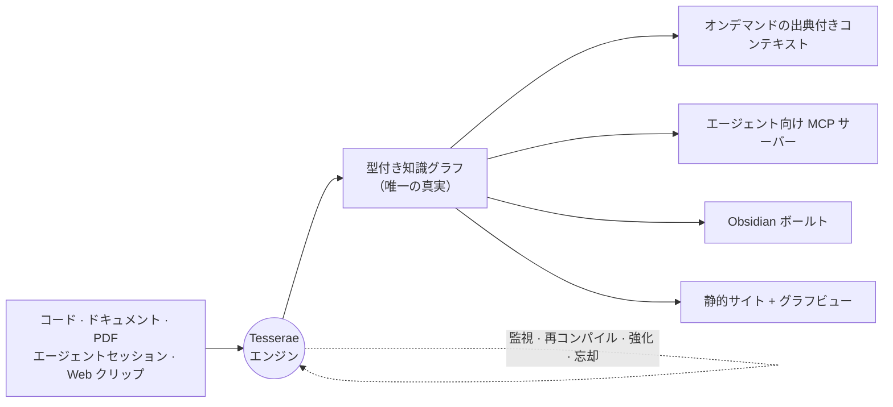

<div align="center">

# Tesserae

**コーディングエージェントのためのコンテキストエンジン。**

プロジェクト — コード、ドキュメント、そしてあなたのエージェントセッション — を
型付きで自己改善する知識グラフに変え、エージェントが必要とするコンテキストを
必要な分だけコンパイルします。根拠があり、出典付きで、オンデマンドに。

[](https://pypi.org/project/tesserae/)
[](https://www.npmjs.com/package/@jokerized/tesserae)
[](https://pypi.org/project/tesserae/)
[](https://github.com/ca1773130n/Tesserae/actions/workflows/tests.yml)
[](LICENSE)

[ライブデモ](https://ca1773130n.github.io/Tesserae) ·
[クイックスタート](#クイックスタート) ·
[ドキュメント](docs/) ·
[エージェントメモリ](docs/i18n/agent-memory.ja.md) ·
[MCP 設定](docs/i18n/integrations/mcp.ja.md) ·
[チューニング](docs/i18n/tuning.ja.md) ·
[リリースノート](docs/release-notes/)

[English](./README.md) · [한국어](./README.ko.md) · [中文](./README.zh.md) · [Русский](./README.ru.md) · [Español](./README.es.md) · [Français](./README.fr.md) · [Deutsch](./README.de.md)

</div>

---

## 課題

エージェントの実力は、渡されたコンテキストの質までしか届きません。だからあなたは
ファイルを貼り付け、先週すでに下したはずの決定をもう一度説明し、同じ落とし穴に
三度目にはまるのを眺めることになります — 会話が終わった瞬間に学んだことはすべて
蒸発し、ディスク上のどこにも、あなたのプロジェクトが実際にどう組み合わさって
いるかを知るものがないからです。

Tesserae はその欠けた層です。ソースを読むと**同時に**エージェントセッションを
観察し、常に最新の型付き知識グラフを再構成し、必要な断片だけを — その出所の
ファイルや会話まで引用したうえで — エージェントに渡します。すべてあなたのマシン上で
動きます。ホスティングサービスではなく、ビルドステップと生きたエンジンであり、
通常の経路に **API キーは不要**です。


```mermaid
flowchart LR
    S["コード · ドキュメント · PDF<br/>エージェントセッション · Web クリップ"]
    E(("Tesserae<br/>エンジン"))
    G["型付き知識グラフ<br/>（唯一の真実）"]
    O1["オンデマンドの出典付きコンテキスト"]
    O2["エージェント向け MCP サーバー"]
    O3["Obsidian ボールト"]
    O4["静的サイト + グラフビュー"]

    S --> E --> G
    G --> O1 & O2 & O3 & O4
    E -. "監視 · 再コンパイル · 強化 · 忘却" .-> E
```

グラフ、ボールト、サイトはすべて一つの知識ベースの**投影**です。エンジンは
それらを真であり続けさせるループです。

## クイックスタート

**Python 3.10+** が必要です。デフォルト経路に API キーは不要です。

```bash
pipx install tesserae          # または: pip install tesserae · npx @jokerized/tesserae

cd /path/to/my-project
tesserae init --yes            # プロジェクトを検出し .tesserae/ を作成
tesserae compile               # ソースから知識グラフを構築
```

これで、実際のコードとドキュメントに基づいて何でも尋ねられます:

```bash
tesserae ask "arXiv ID のパースはどこに実装されていて、何がそれに依存していますか？"
```

あるいは、任意のエージェントに渡すための出典付きコンテキスト文書をコンパイル
できます:

```bash
tesserae context "パーサーは不正な形式の ID をどう扱いますか？" --budget 32000 -o context.md
```

ブラウザでグラフと Wiki を閲覧するには:

```bash
tesserae serve --port 8765
```

これがループのすべてです: **指す、コンパイルする、尋ねる。** LLM を使う機能は
既定で OAuth 経由の `codex` または `claude` CLI を利用します — 詳細、PATH の修正、
プロバイダの選択肢は[インストール](docs/i18n/installation.ja.md)と
[クイックスタート](docs/i18n/quickstart.ja.md)を参照してください。

## 何をするか

**ソースから型付きグラフをコンパイルします。** Markdown、ソースコード、そして
必要なら PDF / Office 文書 / 画像を指定してください。Tesserae は 70 種類以上の
ノード種別 — 概念、決定、コードシンボル、論文、統合 — を型付きエッジとともに
抽出し、スキーマに対して検証します。コンパイルは**バイト単位で決定的**です:
同じ入力なら、毎回まったく同じ `graph.json` になります。

**エージェントとの会話を記憶に変えます。** プロジェクトに関する Claude Code や
Codex のセッションが一級ノード — インサイト、決定、疑問、TODO — になり、触れた
ファイルへリンクされます。セッションで得た知識はセッションより長く残ります。

**言われたことではなく、実際に起きたことを覚えます。** ツールの結果もひとつの
ターンです: 終了コードとエラーフラグが取り込みを生き延びて `Event` ノードに
刻まれるので、グラフはコマンドが実行されたことだけでなく、**失敗した**ことまで
把握します。同一セッション内で**観測された**二つの結果 — 失敗した呼び出しと、
同じオペランドに対して後から成功した呼び出し — から、Tesserae は `recovers`
エッジを導出します。語彙に存在する唯一の因果エッジであり、モデルが主張するので
はなく観測から導かれます。実態が `happened_near` にすぎない `caused_by` は証拠
として読まれてしまうため、そんなエッジは無いほうがましだからです。

**出典付きコンテキストをオンデマンドで提供します。** コンテキストコンパイラは
クエリのシードノードから Personalized PageRank を走らせ、最も関連の深い部分
グラフを文字数バジェット内に詰め込み、そのまま貼り付けられる出典付き文書を返す
か、MCP 経由でエージェントにストリームします。

**自らを新鮮に保ちます。** 監督付きエンジンがソースとセッションを監視し、バース
トをまとめ、再コンパイルし、繰り返し現れる発見を強化して古いものを置き換える
自己改善パスを実行します。休息中に記憶を整理する脳のように、プロジェクトが
アイドルになると**自らエージェントメモリを統合**します — コマンド不要の周期的な
睡眠サイクルです: 騒がしい直近の記憶を圧縮して忘れ、**使われないことで忘れ**
（古い知識だけでなく、誰も取り出さない知識が薄れます）、生き残ったものの間に
**新しいつながりを発見**します。一つのプロセスで、あなたの持つすべての
プロジェクトを最新に保てます。

**すべてのエージェントに、育っていく自分だけの記憶を与えます。** 各エージェントの
経験を有界の上位レイヤーへ蒸留し、マネージャーは部下の蒸留レイヤーだけを読む —
組織ツリーを再帰的に。下記の[階層型エージェントメモリ](#階層型エージェントメモリ)
を参照してください。

## `compile` のあとに何ができるか

```text
.tesserae/
├── graph.json              # 型付き知識ベース — ノード + エッジ
├── sqlite.db               # クエリ可能なグラフストア
├── markdown_projection/    # 人が読める Wiki ページ
├── obsidian_vault/         # そのまま Obsidian へ
├── site/                   # 静的サイト: グラフビュー + Wiki + 検索
├── harness_sessions/       # 取り込まれた Claude / Codex セッション記憶
├── agents/                 # エージェントごとの蒸留メモリ層（オプトイン）
└── config.json · manifest.json · report.md
```

## 階層型エージェントメモリ

すべてを覚えている人間はいませんし、すべてが収まるコンテキストウィンドウを
持つエージェントもいません。Tesserae の答えは**階層型・エージェント別の知識
ベース**です: 各エージェントは自分のセッションから自分の記憶を育て、その記憶は
定期的に有界の上位レイヤーへ**蒸留**され、マネージャーは部下の蒸留レイヤーだけを
見ます — 実際の組織のように再帰的に。

```bash
export TESSERAE_AGENT_DISTILL=1
tesserae compile              # エージェントごとの Agent ノード + 帰属エッジを生成
tesserae agents init          # 誰が誰を起動したかから組織図を推論
tesserae agents tree          # 階層・セッション数・鮮度を確認
tesserae distill              # 各エージェントの経験を L1 レイヤーへ圧縮
```

その後は、あらゆるグラフ読み取りツール — CLI でも MCP でも — が `agent=`
スコープを受け取ります:

```bash
tesserae query "リリースチェックリスト" --agent claude-code:me:reviewer   # ワーカー自身の記憶
tesserae ask   "私のチームはデプロイについて何を知っている？" --agent org   # チーム全体、蒸留済み
```

蒸留は**整理し、圧縮し、忘れますが、決して削除しません**: 減衰した発見はそれを
引用する蒸留物へ折り畳まれ、`agents drill` で到達可能なまま残り、捨てられること
はありません。時間はコーパスの時計であり、ノードの同一性が LLM の言い回しに
依存することはなく、成果物は決定的なままです。設計の全体は
[docs/i18n/agent-memory.ja.md](docs/i18n/agent-memory.ja.md) にあります。

`distill` を手で走らせる必要はありません: `tesserae engine` を起動したままに
しておけば、アイドルの休息中に**自ら統合**します — 同じオプトインでメモリ圧に
ゲートされたパスを包む睡眠サイクルです。
[docs/i18n/engine-consolidation.ja.md](docs/i18n/engine-consolidation.ja.md) を
参照してください。

## MCP サーバー

`tesserae projects mcp-config` は Claude Code、Codex、あるいは任意の MCP
クライアント向けのサーバーエントリをそのまま出力します。グラフを読むツールは
すべて `graph_path` / `project` / `agent` を無償で受け付けます。主要なツール:

| ツール | 用途 |
|---|---|
| `compile_context` | クエリまたはシードノードに対する、出典付きの特化コンテキスト文書（決定的。`preview=N` は本文ではなくハンドルを返す） |
| `get_handle` | 大きなペイロードをスライスして取得 — エージェントが一度にすべてを抱え込まずに済む |
| `ask` · `query` · `search_nodes` · `node_context` | 計画された回答、生の検索、コンパイル済みベース上のグラフナビゲーション |
| `graph_map` | Budgeted Descent: 検索語を当てずっぽうに試すのではなく、スコープに沿って上から下へグラフをたどる — 標準の入口 |
| `graph_ppr` · `search_facts` · `timeline` | Personalized PageRank 展開、時間的ファクト、年表。**合成できる** 2 つの時計: `as_of`（ソース自身のタイムスタンプによる「その時点で何が真だったか」）と `observed_as_of`（コンパイル時に押された台帳による「その時点までに何を学んでいたか」）。`current_only` と `as_of` は同時指定が拒否されます — この 2 つは本当に択一です |
| `verify_claim` | このトリプルをグラフは是認するか？ 生成された意見ではなく決定的な判定 |
| `find_session_findings` · `fresh_insights` · `activity_summary` · `query_decisions` | セッション由来の記憶（減衰順・重複排除済み）、ダイジェスト、決定の記録 |
| `agent_view_explain` · `drill_down` · `read_audit` | エージェントスコープのビューを解決し、蒸留ノートを元の証拠へ昇格（監査あり）。さらに `TESSERAE_READ_AUDIT` で任意に有効化すれば、誰がグラフを読んでいたかを読み戻せます |
| `ingest` · `graph_write` | 生の Web / テキスト（ブラウザクリップなど）をグラフへ統合。エージェントが帰属付きノードを書き戻す — 代替を捏造せずに「これは誤りだ」と言うための `retracts` エッジも含みます |
| `doctor_run` · `doctor_report` · `lint_report` | エージェントループの内側からのヘルスチェックとグラフ lint |

## 日常のコマンド

グループ一覧は `tesserae --help`、各コマンドのフラグは `tesserae <cmd> --help`。

| コマンド | 何をするか |
|---|---|
| `tesserae init` | ワンステップのオンボーディング: プロジェクト検出、LLM プロバイダ選択、`.tesserae/config.json` の作成。`--yes` で非対話。 |
| `tesserae compile` | グラフとすべての投影を再構築。`compile <パス>` は追加ファイルをその場で取り込みます。 |
| `tesserae ask "<質問>"` | LLM が計画した出典付きの回答。スマートルーターが対象プロジェクトを選び、`--scope federated` は複数を一つの回答へ統合します。 |
| `tesserae query "<質問>"` | 生の検索 — BM25 / セマンティック、LLM による統合なし。 |
| `tesserae context "<質問>"` | `--budget` の下で PPR によるオンデマンドの出典付きコンテキスト文書。グラフにそれを裏付ける来歴があるとき、**手続き的**記憶 — 実際に何を実行し、その結果どうなったか — のための枠を確保します。 |
| `tesserae graph-map` | Budgeted Descent: 検索語ではなくスコープで上から下へ。エージェント組織ツリーは `--scope org:root`。 |
| `tesserae verify-claim` | グラフがトリプルを是認するかの決定的判定。JSON 出力。 |
| `tesserae engine [--all]` | 監督付きリフレッシュデーモン — 監視、デバウンス、再コンパイル、アイドル時のエージェントメモリ統合（睡眠サイクル。`--no-consolidate` で無効）。`--all` は登録済みの全プロジェクトを一つのプロセスで最新に保ちます。 |
| `tesserae refresh` | ワンショット: 新しいセッションの取り込み → コンパイル → ボールト同期。 |
| `tesserae agents …` | `init`（組織を推論） · `tree` · `show` · `drill` — 階層型メモリの組織ツール。 |
| `tesserae distill` | 各エージェントのセッションを有界の L1 メモリ層へ圧縮。 |
| `tesserae doctor` | ヘルスチェック。`--fix` は安全な修復のみ適用。終了コード `0/1/2` = 正常 / 警告 / エラー。 |
| `tesserae lint` | グラフ lint — 孤立ノード、古い引用、Wiki とのドリフト、薄い区間カバレッジ、来歴に裏付けられていない手続き的プール。安全なものは `--fix-trivial`。 |
| `tesserae domains status` | 憲章に基づくドメインツリー（部門 → 部 → チーム）を表示。[アーキテクチャ](docs/i18n/architecture.ja.md)を参照。 |
| `tesserae federation status` | プロジェクト横断のフェデレーションを確認 — `--scope federated` が実際に何に届くか。 |
| `tesserae serve` | 登録済みの全プロジェクトを配信 — `/` がランディング、各プロジェクトは `/<alias>/`、ライブ ask ウィジェット付き。 |
| `tesserae export site \| okf` | 静的サイトのビルド、または可搬な [Google OKF](https://github.com/GoogleCloudPlatform/knowledge-catalog) バンドルのエクスポート。 |
| `tesserae projects …` | マルチプロジェクトレジストリ: `register`、`list`、`mcp-config`。 |

## マルチプロジェクト

`~/.tesserae/registry.json` のレジストリが、CLI・MCP・フリートエンジンの
どこからでもプロジェクト名を解決します。「アクティブな」プロジェクトという概念は
ありません: プロジェクト単位のコマンドは今いる場所を解決し、`ask` はすべてを
横断してルーティングします。

```bash
tesserae projects register /path/to/my-project --name myproj
tesserae ask "research と notes の検索方式を比較して"   # → フェデレーション、相互参照
tesserae ask "myproj はどうコンパイルする？"             # → そのプロジェクトへルーティング
tesserae serve                                        # → 一つのサーバーで全プロジェクト
```

あるプロジェクトの Markdown は `wiki://<alias>/<kind>/<slug>` で別プロジェクトの
ノードへディープリンクでき、コンパイル時にグラフビュー上のブリッジノードに
なります。

## 連携（すべてオプトイン）

- **Claude Code プラグイン** — スラッシュコマンド、セッションフック、スキル、
  MCP 自動登録を `/plugin install` 一発で。
  [→](docs/i18n/integrations/claude-code-plugin.ja.md)
- **セッショングラフ** — Claude Code / Codex の会話がインサイト / 決定 / 疑問 /
  TODO ノードになり、触れたドキュメントへリンクされます。API キー不要。
  [→](docs/i18n/integrations/sessions.ja.md)
- **RAG-Anything** — マルチモーダル取り込み（MinerU / Docling による PDF /
  Office / 画像）と LightRAG 質問バックエンド。
  [→](docs/i18n/integrations/rag-anything.ja.md)
- **Obsidian** — ユーザー編集オーバーレイ付きの双方向ボールト同期。
  [→](docs/i18n/integrations/obsidian.ja.md)
- **Web Clipper** — ページや選択範囲をワンクリックでコーパスへ。
  [→](docs/i18n/integrations/chrome-extension.ja.md)

## 比較

<details>
<summary><strong>機能マトリクス</strong>（Quartz・Logseq・Cognee・Foam との比較）</summary>

<br/>

| | Tesserae | Quartz | Logseq | Cognee | Foam |
|---|:---:|:---:|:---:|:---:|:---:|
| 静的サイト + グラフビュー | ✅ | ✅ | ✅ | ➖ | ➖ |
| 型付きノードスキーマ | ✅ 70+ | ❌ | ➖ | ✅ | ❌ |
| ソースからの概念抽出 | ✅ | ❌ | ❌ | ✅ | ❌ |
| マルチモーダル取り込み（PDF / 画像） | ✅ | ❌ | ➖ | ✅ | ❌ |
| コードグラフの取り込み | ✅ | ❌ | ❌ | ➖ | ❌ |
| MCP サーバー | ✅ | ❌ | ❌ | ✅ | ❌ |
| オンデマンドの出典付きコンテキストコンパイラ | ✅ | ❌ | ❌ | ❌ | ❌ |
| ライブセッション → グラフ記憶 | ✅ | ❌ | ❌ | ❌ | ❌ |
| エージェント別の階層メモリ | ✅ | ❌ | ❌ | ❌ | ❌ |
| マルチプロジェクトデーモン（フリート） | ✅ | ❌ | ❌ | ❌ | ❌ |
| API キーなしで動作 | ✅ | — | — | ❌ | — |
| バイト単位で決定的なコンパイル | ✅ | ✅ | — | ❌ | — |
| UI でのライブ編集 | ❌ | ➖ | ✅ | — | ✅ |

</details>

### 主張ではなく測定

以下の数字はすべて、このリポジトリのハーネスが、ディスク上のデータで出したもので、何と比べて
測ったかを明記している。2026-08-30 時点。

| 項目 | Tesserae | 比較対象 |
|---|---|---|
| 論文 148 本全文に対する比較質問への回答、必須ポイントのカバレッジ、57 問 × 8 反復 | **0.373** — グラフが文書 3 本を選び、バンドルはその原文の散文を運ぶ | 同じ予算・バックボーン・ジャッジの BM25 パッセージ: 0.290 — **+28.9%**、8/8 反復、p=0.0078 |
| 同じコーパスでの文書再現率、異なる文書 @10 / @50 | 学習済みエンコーダ(`TESSERAE_EMBEDDING_PREFER=st`)で 0.791 / 0.962、同梱のままで 0.754 / 0.914 | Mem0 OSS の生チャンクストア、同じエンコーダ: 0.775 / 0.944 — 同等 |
| 捏造された検証判定、負例 426 | **0** | —（検証器を出している競合はない） |
| すべての答えに付く文ごとのレビュー印 | 無料; カスケード **0.935** 対 全文にモデルを使う 0.928、呼び出しの 40% で | — |
| クエリ時の API 呼び出し | **0** — ローカル BM25 と静的埋め込み | Mem0: 検索ごとに埋め込み呼び出し 1 回 |
| LoCoMo 正解セッション recall@10、9 会話 | **0.930** | BM25 0.923 |
| LoCoMo の回答、Mem0 自身のジャッジ、1 会話 | 90.5 | Mem0 は 10 会話で 92.5 — 同等、1 会話のノイズの内側 |

最後の 2 行が、会話型であれ何であれ、検索についての正直な言葉である: 同等。ベクトルストアに
同じエンコーダを与えれば、同じ文書を見つける。最初の行が設計の分かれ目だ — エージェントが読む
文書をグラフが選び、要約ではなく原文の散文を渡す — そして検証の行は、信じなくても確かめられる
答えである。+28.9% は採点に使うそのベンチマーク上で k を掃引して見つけた値で、保守的な設定の
k=5 でも +12% になる。

Tesserae は**ライブ編集ではなくソースからのコンパイル**を選びました。UI でノートを
編集したいなら Logseq か Obsidian を使ってください。根拠のある知識グラフを保ち、
それをエージェントに供給する*ビルドツールであり生きたエンジン*が欲しいなら、
このプロジェクトです。

**向いている人**: プロジェクトのソース上に永続的で検証可能な知識グラフが欲しい、
自分のファイルに根ざしたローカル MCP サーバーが欲しい、蒸発せず複利で積み上がる
エージェント別メモリが欲しい。

**向いていない人**: 小さなフォルダにベクター検索があれば十分、編集 UI 付きの
ホスティング Wiki が欲しい、あるいはすぐ使える「何でも答える」ボットを期待して
いる。Tesserae は土台を作り、どのエージェントに繋ぐかはあなたが決めます。

## プロバイダとプライバシー

すべてローカルで動き、通常の経路は **API キーを使いません**:

- **Codex CLI**（既定）と **Claude Code CLI** を OAuth で、マルチアカウント
  ローテーション付きで。
- **埋め込み**はオフラインで torch 不要のレーン（`pip install "tesserae[semantic]"`,
  `model2vec`）。`ANTHROPIC_API_KEY` / `OPENAI_API_KEY` は設定されていれば使われ
  ますが、必須ではありません。

## 現状と制限

現在のバージョンは[リリースノート](docs/release-notes/)を参照してください。
正直に言うと:

- 数千ファイルの初回コンパイルには数分かかり、時間はおおむね線形に伸びます。
  増分コンパイル（`--changed-only`）は提供済みですが実験的です。
- `semantic` エクストラなしではハイブリッド検索は非セマンティックなスタブに
  劣化します（目立つ警告付き）。
- 0.30.0 から**コードレイヤーはオプトイン**です — 大きなリポジトリではコード
  シンボルが他のすべてを押しのけてしまうため、`compile` は明示的に指示しない
  限りコードシンボルを取り込まなくなりました。`tesserae code ingest` で
  CodeGraph を意図的に接続できます。
- **憲章**（`tesserae domains status`）は実装もテストも済んでいますが、まだ
  `compile` が生成しません。それまでこのコマンドは "no charter yet" と報告します。
- RAG-Anything の画像説明はまだエンドツーエンドに接続されていません。
- MCP ツールセットは安定していますが、グラフスキーマにはまだノード型が増えます。
  因果の語彙は意図的に `recovers` の一本だけで、モデルの主張ではなく観測された
  結果からのみ導かれます。検索の *`causal` ビュー* は意図的にそれより広く
  （「なぜ壊れたのか」という同じ意図に資する `resolved_by` と
  `attributes_improvement_to` も辿ります）、他に誰も主張しない一本のエッジだけ
  では中身が何もないビューになってしまいます。
- **昇格は常に人間の編集です。** `tesserae schema-drift` はノードのサブタイプを
  提案し、`ask` のプランナーは `proposed_write` を返すことがありますが、どちらも
  書き込みません: 提案が採用されるのは、あなた自身が `ResearchNodeType` を編集
  したときか、あなたが供給する来歴を添えてペイロードを `graph_write` に渡した
  ときだけです。

## プロジェクト構成

```text
tesserae/     # パッケージ本体 — CLI、コンパイラ、エンジン、MCP サーバー、アダプタ
docs/         # 英語ドキュメント + 他七言語のための docs/i18n/
ontology/     # コンパイラが検証するノード / エッジスキーマ
prompts/      # 抽出・統合プロンプト
tests/        # pytest スイート（3,700 件以上）
evals/        # グラフ品質の評価ハーネス
```

## コントリビュートとドキュメント

- **ドキュメント**: [クイックスタート](docs/i18n/quickstart.ja.md) · [インストール](docs/i18n/installation.ja.md) · [エージェントメモリ](docs/i18n/agent-memory.ja.md) · [アーキテクチャ](docs/i18n/architecture.ja.md)
- **各言語版**: [English](./README.md) · [한국어](./README.ko.md) · [中文](./README.zh.md) · [Русский](./README.ru.md) · [Español](./README.es.md) · [Français](./README.fr.md) · [Deutsch](./README.de.md) — 長文ドキュメントは `docs/i18n/` にミラーされています。

## ライセンス

[MIT](LICENSE)。
