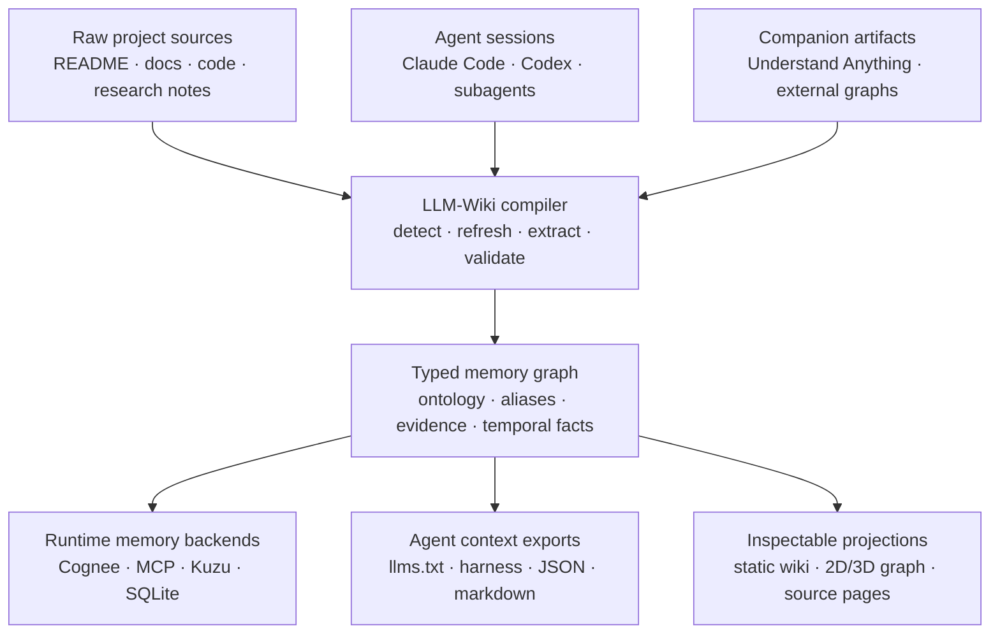
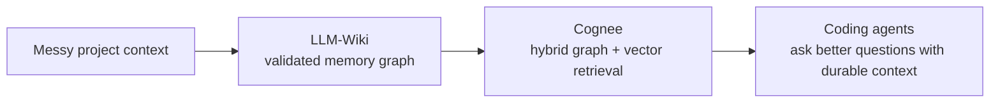

<h1 align="center">LLM-Wiki</h1>

<p align="center">
  <strong>코딩 에이전트를 위한 메모리 컴파일러.</strong>
  <br />
  <em>저장소, 문서, 연구 노트, Claude/Codex 세션, 보조 그래프 도구를 Cognee, MCP, Kuzu, SQLite, llms.txt, 정적 문서를 위한 검증된 메모리로 컴파일합니다.</em>
</p>

<p align="center">
  <a href="./README.md">English</a> ·
  <a href="./README.ko.md">한국어</a> ·
  <a href="./README.zh.md">中文</a> ·
  <a href="./README.ja.md">日本語</a> ·
  <a href="./README.ru.md">Русский</a> ·
  <a href="./README.es.md">Español</a> ·
  <a href="./README.fr.md">Français</a>
</p>

<p align="center">
  <a href="#빠른-시작"></a>
  <a href="#cognee--llm-wiki"></a>
  <a href="#에이전트가-사용하는-이유"></a>
  <a href="#메모리-파이프라인"></a>
  <a href="./LICENSE"></a>
</p>

<p align="center">
  
</p>

---

## 제안

대부분의 LLM 위키 도구는 생성된 노트 페이지를 하나 더 만들 뿐입니다.

**LLM-Wiki는 다음 에이전트가 시작할 메모리 계층을 구축합니다.** 프로젝트의 복잡한 현실 — 소스 파일, 마크다운 문서, 연구 노트, 로컬 Claude/Codex 기록, 외부 그래프 아티팩트 — 을 가져와 타입이 지정된 이식 가능한 메모리 시스템으로 컴파일합니다.

웹사이트는 유리창일 뿐입니다. 제품의 본질은 컴파일된 메모리 아티팩트입니다.

<table>
  <tr>
    <td width="33%" valign="top">
      <h3>🧬 메모리 검증</h3>
      <p>검색에 도달하기 전에 노드와 엣지를 제한합니다. 무작위 <code>related_to</code> 수프, 중복 엔티티, 흔들리는 스키마를 피하세요.</p>
    </td>
    <td width="33%" valign="top">
      <h3>🧠 에이전트 작업 보존</h3>
      <p>Claude Code와 Codex 세션을 검색 가능한 프로젝트 메모리로 바꿉니다: 결정, 명령, 파일, 요약, 도구 추적.</p>
    </td>
    <td width="33%" valign="top">
      <h3>🔌 어디로든 내보내기</h3>
      <p>동일한 메모리를 Cognee, MCP, Kuzu, SQLite, Graphiti 스타일 에피소드, <code>llms.txt</code>, 마크다운, 정적 웹사이트로 전달합니다.</p>
    </td>
  </tr>
</table>

---

## 에이전트가 사용하는 이유

| 만약 가진 것이... | 에이전트는 여전히... | LLM-Wiki는... |
|---|---|---|
| README | 아키텍처와 결정을 다시 발견해야 합니다 | 타입이 지정된 프로젝트 메모리 + 소스 출처 |
| 문서 사이트 | 사람처럼 페이지를 검색해야 합니다 | MCP 도구, `llms.txt`, JSON 그래프, 페이지별 컨텍스트 |
| 벡터 DB | 청크에서 관계를 추측해야 합니다 | 검증된 노드, 엣지, 별칭, 주장, 증거 |
| 그래프 시각화 도구 | 그림을 감상할 뿐입니다 | 검색 시스템이 사용할 수 있는 이식 가능한 그래프 아티팩트 |
| 채팅 기록 | 이전 작업을 잊습니다 | 가져온 에이전트 세션을 지속 가능한 메모리로 저장 |

---

## 메모리 파이프라인



---

## Cognee + LLM-Wiki

**LLM-Wiki는 메모리를 컴파일합니다. Cognee는 그것을 검색합니다.**

Cognee는 AI 메모리 백엔드로 강력합니다: 그래프 + 벡터 검색, 의미 메모리, 온톨로지 인식 훅. 하지만 원시 저장소/문서 수집은 입력되는 메모리에 제약이 없으면 여전히 노이즈가 많아질 수 있습니다.

LLM-Wiki는 Cognee 이전의 빌드 단계로 작동합니다:

| 계층 | LLM-Wiki 역할 | Cognee 역할 |
|---|---|---|
| 소스 캡처 | 문서, 코드, 연구, 세션, 보조 아티팩트를 추적 | 여러 데이터 유형을 수집 가능 |
| 구조 | 노드/엣지 타입, 별칭, 증거, 출처를 검증 | 의미 메모리를 저장하고 검색 |
| 런타임 | 깨끗한 Cognee 번들 또는 Codex/OAuth cognify 흐름을 내보냄 | 하이브리드 그래프/벡터 메모리를 에이전트에 제공 |
| 안전성 | 결정적이고 로컬 우선인 경로를 유지 | 필요할 때 더 풍부한 메모리 검색을 추가 |



컴파일된 메모리를 에이전트를 위한 라이브 검색 기반으로 만들고 싶다면 Cognee를 사용하세요. 그 메모리가 런타임 컨텍스트가 되기 전에 제어, 검증, 내보내기, 검사하고 싶다면 LLM-Wiki를 사용하세요.

---

## 빠른 시작

```bash
pip install llm-wiki

llm_wiki project setup
llm_wiki project compile
llm_wiki project ask "Which files implement Mermaid rendering?"
llm_wiki project build-site
llm_wiki project serve --port 8765
```

Understand Anything과 Cognee를 함께 쓰려면 한 번만 이렇게 설정하세요:

```bash
llm_wiki project setup \
  --with-understand-anything \
  --install-understand-anything \
  --understand-anything-platform codex \
  --run-cognee \
  --install-cognee
llm_wiki project compile
```

열기:

```text
http://127.0.0.1:8765/
```

설정 마법사는 `README.md`, `docs`, `src`, `data`, 보조 아티팩트 같은 일반적인 소스를 감지합니다. Understand Anything을 선택하면 LLM-Wiki가 요청 시 보조 스킬을 설치하고 관리형 새로고침 래퍼를 저장하므로, `project compile`이 UA 설치 경로나 `/understand` 슬래시 명령을 사용자가 알 필요 없이 `.understand-anything/knowledge-graph.json`을 새로고침할 수 있습니다. Cognee는 기본 질문 백엔드로 활성화되며, 런타임 cognify는 `--run-cognee`로 명시적으로 켭니다.

```text
◆ LLM-Wiki project setup
Choose sources and companion tools. Press Enter to accept defaults.

Sources
  ✓ README.md
  ✓ docs
  ✓ src
  ✓ .llm-wiki/external/understand-anything.md

External tools
  ◆ Understand Anything → .llm-wiki/external/understand-anything.md

Memory backends
  ◆ Cognee → my_project_memory (codex_cognify, manual cognify)
```

---

## 내보내는 항목

| 출력 | 중요한 이유 |
|---|---|
| `cognee_bundle/` | Cognee 스타일 메모리 워크플로를 위한 깨끗한 그래프 아티팩트 |
| `graph.json` / `graph.jsonld` | 이식 가능한 타입 지정 메모리 그래프 |
| `sqlite.db` / Kuzu 출력 | 쿼리 가능한 로컬 그래프 저장소 |
| `llms.txt` / `llms-full.txt` | 직접적인 에이전트 컨텍스트 팩 |
| MCP 서버 | `search_nodes`, `node_context`, `timeline`, 그래프 도구 |
| `agent_harness/` | Claude Code, Codex, Gemini, Cursor, Kiro, OpenCode 설정 |
| `markdown_projection/` | 사람과 편집자를 위한 읽기 쉬운 위키 파일 |
| `.llm-wiki/site/` | 검사, 공유, 디버깅을 위한 정적 웹사이트 |

---

## 보조 도구, 종속이 아님

LLM-Wiki는 도구를 대체하는 것이 아니라 도구 사이에 위치하도록 설계되었습니다.

| 도구 | 관계 |
|---|---|
| Understand Anything | 독립 코드 그래프 아티팩트 → 마크다운 프로젝션 → 컴파일된 메모리 |
| Cognee | 하이브리드 그래프/벡터 검색을 위한 메모리 백엔드 |
| Graphiti 스타일 시스템 | 시간 기반 에피소드/팩트 내보내기 경로 |
| Obsidian / markdown | 읽기 쉬운 프로젝션이며, 유일한 진실의 원천은 아님 |
| Claude Code / Codex | 세션 메모리의 소스이자 컴파일된 컨텍스트의 소비자 |

관리형 설정 경로를 사용하면 LLM-Wiki가 보조 스킬을 설치하고 새로고침 래퍼를 저장하며, Cognee 런타임 메모리까지 한 번에 켤 수 있습니다:

```bash
llm_wiki project setup \
  --yes \
  --with-understand-anything \
  --install-understand-anything \
  --understand-anything-platform codex \
  --run-cognee \
  --install-cognee
llm_wiki project compile
```

컴파일 시 LLM-Wiki는 UA 그래프가 없거나 오래되면 `project refresh-understand-anything`를 실행하고, `.llm-wiki/external/understand-anything.md`를 생성하며, `.llm-wiki/cognee_bundle/`을 쓰고, 설정된 경우 Cognee 런타임 메모리를 best-effort로 새로고침합니다. 사용자는 UA나 Cognee가 어디 설치됐는지 알 필요가 없습니다.

---

## LLM-Wiki가 적합한 경우

| 원하는 것... | LLM-Wiki를 사용하는 이유... |
|---|---|
| 더 나은 코딩 에이전트 연속성 | 이전 Claude/Codex 세션이 검색 가능한 메모리가 됩니다 |
| 더 안전한 GraphRAG 입력 | 검색 전에 스키마 검증이 수행됩니다 |
| 로컬 우선 워크플로 | 결정적 추출과 CLI/OAuth 경로가 필수 API 키 비용을 피하게 합니다 |
| 이식 가능한 프로젝트 메모리 | 한 번의 컴파일로 Cognee, MCP, SQLite, Kuzu, 마크다운, JSON, 사이트 아티팩트를 생성합니다 |
| 사람이 검사 가능 | 정적 사이트로 에이전트가 검색할 내용을 디버그할 수 있습니다 |

---

## 문서

| 가이드 | 얻을 수 있는 것 |
|---|---|
| [빠른 시작](./docs/quickstart.md) | 첫 프로젝트 메모리 컴파일 |
| [설치](./docs/installation.md) | 설치 옵션과 래퍼 |
| [아키텍처](./docs/architecture.md) | 파이프라인 내부 구조와 그래프 모델 |
| [세션 기록](./docs/session-history.md) | Claude/Codex 기록 가져오기 |
| [Understand Anything 보조 워크플로](./docs/integrations/understand-anything.md) | 보조 그래프 새로고침과 프로젝션 |
| [게시 체크리스트](./docs/publishing-checklist.md) | 생성된 정적 사이트 배포 |

---

<p align="center">
  <strong>다음 에이전트에게 빈 저장소를 주지 마세요. 컴파일된 메모리를 주세요.</strong>
</p>
