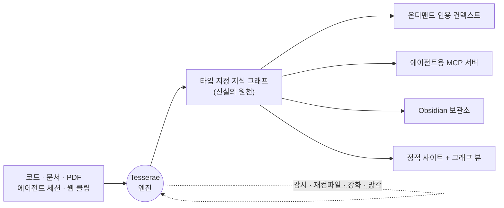

<div align="center">

# Tesserae

**코딩 에이전트를 위한 컨텍스트 엔진.**

프로젝트 — 코드, 문서, 그리고 당신의 에이전트 세션 — 를 타입이 지정된
자기 개선 지식 그래프로 바꾸고, 에이전트에게 필요한 컨텍스트를 정확히
컴파일해 전달합니다. 근거가 있고, 출처가 달려 있으며, 필요할 때 바로.

[](https://pypi.org/project/tesserae/)
[](https://www.npmjs.com/package/@jokerized/tesserae)
[](https://pypi.org/project/tesserae/)
[](https://github.com/ca1773130n/Tesserae/actions/workflows/tests.yml)
[](LICENSE)

[라이브 데모](https://ca1773130n.github.io/Tesserae) ·
[빠른 시작](#빠른-시작) ·
[문서](docs/) ·
[에이전트 메모리](docs/i18n/agent-memory.ko.md) ·
[MCP 설정](docs/i18n/integrations/mcp.ko.md) ·
[튜닝](docs/i18n/tuning.ko.md) ·
[릴리스 노트](docs/release-notes/)

[English](./README.md) · [中文](./README.zh.md) · [日本語](./README.ja.md) · [Русский](./README.ru.md) · [Español](./README.es.md) · [Français](./README.fr.md) · [Deutsch](./README.de.md)

</div>

---

## 문제

에이전트는 당신이 건네준 컨텍스트만큼만 똑똑합니다. 그래서 파일을 붙여넣고,
지난주에 이미 내린 결정을 다시 설명하고, 같은 함정을 세 번째로 다시
발견하는 걸 지켜보게 됩니다 — 대화가 끝나는 순간 에이전트가 배운 모든 것이
증발했고, 디스크 위의 무엇도 당신의 프로젝트가 실제로 어떻게 맞물리는지
모르기 때문입니다.

Tesserae는 그 빠진 계층입니다. 소스를 읽는 **동시에** 에이전트 세션을
지켜보고, 항상 최신인 타입 지정 지식 그래프를 재구성하며, 에이전트에게
필요한 조각만을 정확히 — 출처가 된 파일이나 대화까지 인용해서 — 제공합니다.
전부 당신의 기계에서 돌아갑니다. 호스팅 서비스가 아니라 빌드 단계이자 라이브
엔진이고, 일반적인 경로에는 **API 키가 필요 없습니다**.


```mermaid
flowchart LR
    S["코드 · 문서 · PDF<br/>에이전트 세션 · 웹 클립"]
    E(("Tesserae<br/>엔진"))
    G["타입 지정 지식 그래프<br/>(진실의 원천)"]
    O1["온디맨드 인용 컨텍스트"]
    O2["에이전트용 MCP 서버"]
    O3["Obsidian 보관소"]
    O4["정적 사이트 + 그래프 뷰"]

    S --> E --> G
    G --> O1 & O2 & O3 & O4
    E -. "감시 · 재컴파일 · 강화 · 망각" .-> E
```

그래프, 보관소, 사이트는 모두 하나의 지식 베이스의 **프로젝션**입니다.
엔진은 그것들을 참으로 유지하는 루프입니다.

## 빠른 시작

**Python 3.10+**가 필요합니다. 기본 경로에는 API 키가 필요 없습니다.

```bash
pipx install tesserae          # 또는: pip install tesserae · npx @jokerized/tesserae

cd /path/to/my-project
tesserae init --yes            # 프로젝트를 감지하고 .tesserae/ 작성
tesserae compile               # 소스에서 지식 그래프 빌드
```

이제 실제 코드와 문서에 근거해 무엇이든 물어보세요:

```bash
tesserae ask "arXiv ID 파싱은 어디에 구현되어 있고, 무엇이 그것에 의존하나요?"
```

또는 어떤 에이전트에게든 건넬 맞춤형 인용 컨텍스트 문서를 컴파일하세요:

```bash
tesserae context "파서는 잘못된 형식의 ID를 어떻게 처리하나요?" --budget 32000 -o context.md
```

브라우저에서 그래프와 위키를 둘러보세요:

```bash
tesserae serve --port 8765
```

이것이 전체 루프입니다: **가리키고, 컴파일하고, 물어보기.** LLM 기반 기능은
기본적으로 OAuth를 통해 `codex` 또는 `claude` CLI를 사용합니다 — 자세한 내용,
PATH 수정, 제공자 옵션은 [설치](docs/i18n/installation.ko.md)와
[빠른 시작](docs/i18n/quickstart.ko.md)을 보세요.

## 무엇을 하나요

**소스에서 타입 지정 그래프를 컴파일합니다.** 마크다운, 소스 코드, 그리고
선택적으로 PDF/Office 문서/이미지를 가리키세요. Tesserae는 70종 이상의 노드
종류 — 개념, 결정, 코드 심볼, 논문, 합성 — 를 타입 지정 엣지와 함께
스키마에 검증해 추출합니다. 컴파일은 **바이트 단위로 결정적**입니다: 같은
입력이면 언제나 동일한 `graph.json`.

**에이전트 대화를 메모리로 바꿉니다.** 프로젝트에 관한 Claude Code와 Codex
세션이 1급 노드 — 인사이트, 결정, 질문, TODO — 가 되어 그것들이 건드린
파일에 연결됩니다. 세션에서 얻은 지식이 세션보다 오래 남습니다.

**말한 것이 아니라 실제로 일어난 일을 기억합니다.** 도구 결과도 하나의
턴입니다: 종료 코드와 오류 플래그가 수집 과정을 살아남아 `Event` 노드에
새겨지므로, 그래프는 명령이 실행되었다는 사실만이 아니라 **실패했다는
사실**까지 압니다. 한 세션 안에서 관측된 두 결과 — 실패한 호출, 그리고 같은
피연산자에 대해 나중에 성공한 호출 — 로부터 Tesserae는 `recovers` 엣지를
도출합니다. 어휘에 존재하는 유일한 인과 엣지이며, 모델이 주장하는 것이 아니라
**관측에서 도출**됩니다. 실은 `happened_near`인 `caused_by`는 증거로 읽히기
때문에, 그런 엣지는 아예 없느니만 못합니다.

**인용된 컨텍스트를 온디맨드로 제공합니다.** 컨텍스트 컴파일러는 쿼리의 시드
노드에서 Personalized PageRank를 실행하고, 가장 관련 있는 부분 그래프를 문자
예산 안에 담아, 붙여넣을 준비가 된 인용 문서를 돌려주거나 MCP를 통해
에이전트에게 스트리밍합니다.

**스스로를 최신으로 유지합니다.** 감독형 엔진이 소스와 세션을 감시하고,
버스트를 합치고, 재컴파일하며, 반복되는 발견을 강화하고 오래된 것을 대체하는
자기 개선 패스를 실행합니다. 휴식 중 기억을 정리하는 뇌처럼, 프로젝트가
유휴 상태가 되면 **스스로 에이전트 메모리를 통합합니다** — 명령이 필요 없는
주기적 수면 주기입니다: 시끄러운 최근 기억을 압축하고 잊으며, **사용되지
않으면 잊고**(오래된 지식만이 아니라 아무도 꺼내 쓰지 않는 지식이 흐려집니다),
살아남은 것들 사이에서 **새로운 연결을 발견합니다**. 하나의 프로세스가 당신이
가진 모든 프로젝트를 최신으로 유지할 수 있습니다.

**모든 에이전트에게 자라나는 자기만의 메모리를 줍니다.** 각 에이전트의 경험을
크기가 제한된 상위 계층으로 증류하고, 관리자는 자기 보고자의 증류 계층만
읽게 하세요 — 조직 트리를 따라 재귀적으로. 아래
[계층형 에이전트 메모리](#계층형-에이전트-메모리)를 보세요.

## `compile` 이후의 모습

```text
.tesserae/
├── graph.json              # 타입 지정 지식 베이스 — 노드 + 엣지
├── sqlite.db               # 질의 가능한 그래프 저장소
├── markdown_projection/    # 사람이 읽는 위키 페이지
├── obsidian_vault/         # Obsidian에 그대로 넣으세요
├── site/                   # 정적 사이트: 그래프 뷰 + 위키 + 검색
├── harness_sessions/       # 가져온 Claude / Codex 세션 메모리
├── agents/                 # 에이전트별 증류 메모리 계층 (선택)
└── config.json · manifest.json · report.md
```

## 계층형 에이전트 메모리

모든 것을 기억하는 사람은 없고, 모든 것을 담을 만한 컨텍스트 윈도우를 가진
에이전트도 없습니다. Tesserae의 답은 **계층형, 에이전트별 지식 베이스**입니다:
모든 에이전트가 자신의 세션에서 자기 메모리를 키우고, 그 메모리는 주기적으로
크기가 제한된 상위 계층으로 **증류**되며, 관리자는 보고자의 증류 계층만 봅니다
— 실제 조직처럼 재귀적으로.

```bash
export TESSERAE_AGENT_DISTILL=1
tesserae compile              # 에이전트별 Agent 노드 + 귀속 엣지 생성
tesserae agents init          # 누가 누구를 스폰했는지로 조직도 추론
tesserae agents tree          # 계층, 세션 수, 신선도 점검
tesserae distill              # 각 에이전트의 경험을 L1 계층으로 압축
```

그러면 모든 그래프 읽기 도구 — CLI든 MCP든 — 가 `agent=` 스코프를 받습니다:

```bash
tesserae query "릴리스 체크리스트" --agent claude-code:me:reviewer   # 작업자 자신의 메모리
tesserae ask   "우리 팀은 배포에 대해 무엇을 아나요?" --agent org      # 팀 전체, 증류본
```

증류는 **정리하고, 압축하고, 잊지만 결코 삭제하지 않습니다**: 감쇠된 발견은
그것을 인용하는 증류본 안으로 접혀 들어가 `agents drill`로 여전히 도달
가능하며, 버려지지 않습니다. 시간은 코퍼스의 시계이고, 노드 정체성은 결코
LLM의 표현에 의존하지 않으며, 산출물은 결정적으로 유지됩니다. 전체 설계는
[docs/i18n/agent-memory.ko.md](docs/i18n/agent-memory.ko.md)에 있습니다.

`distill`을 직접 실행할 필요는 없습니다: `tesserae engine`을 띄워 두면 유휴
휴식 중에 **스스로 통합합니다** — 동일한 선택형, 메모리 압력 게이트가 걸린
패스를 감싼 수면 주기입니다.
[docs/i18n/engine-consolidation.ko.md](docs/i18n/engine-consolidation.ko.md)를
보세요.

## MCP 서버

`tesserae projects mcp-config`는 Claude Code, Codex 또는 임의의 MCP
클라이언트를 위한 서버 항목을 바로 출력합니다. 모든 그래프 읽기 도구는
`graph_path` / `project` / `agent`를 기본으로 받습니다. 주요 도구:

| 도구 | 용도 |
|---|---|
| `compile_context` | 쿼리나 시드 노드에 대한 맞춤 인용 컨텍스트 문서 (결정적; `preview=N`은 본문 대신 핸들 반환) |
| `get_handle` | 큰 페이로드를 조각으로 페이징 — 에이전트가 한 번에 전부 컨텍스트에 들고 있지 않도록 |
| `ask` · `query` · `search_nodes` · `node_context` | 계획된 답변, 원시 검색, 컴파일된 베이스 위의 그래프 탐색 |
| `graph_map` | Budgeted Descent: 검색어를 추측하는 대신 스코프를 따라 위에서 아래로 그래프를 탐색 — 표준 진입점 |
| `graph_ppr` · `search_facts` · `timeline` | Personalized PageRank 확장, 시간적 사실, 연대기. **합성되는** 두 개의 시계: `as_of`(출처 자신의 타임스탬프로 본 "그때 무엇이 참이었는가")와 `observed_as_of`(컴파일마다 찍히는 원장으로 본 "그때까지 무엇을 알게 되었는가"). `current_only`와 `as_of`는 함께 쓰면 거부됩니다 — 이 둘은 정말로 택일입니다 |
| `verify_claim` | 이 트리플을 그래프가 승인하는가? 생성된 의견이 아니라 결정적 판정 |
| `find_session_findings` · `fresh_insights` · `activity_summary` · `query_decisions` | 세션에서 유래한 메모리(감쇠 순위, 중복 제거), 다이제스트, 결정 기록 |
| `agent_view_explain` · `drill_down` · `read_audit` | 에이전트 스코프 뷰 해석; 증류된 노트를 원본 증거로 승격 (감사 기록됨); 그리고 `TESSERAE_READ_AUDIT`으로 선택 활성화하면 누가 그래프를 읽어 왔는지 되읽기 |
| `ingest` · `graph_write` | 원시 웹/텍스트(예: 브라우저 클립)를 그래프에 병합; 에이전트가 귀속된 노드를 되쓰기 — 대체물을 지어내지 않고 "이것은 틀렸다"고 말하는 `retracts` 엣지 포함 |
| `doctor_run` · `doctor_report` · `lint_report` | 에이전트 루프 안에서의 헬스 체크와 그래프 린트 |

## 일상적인 명령어

그룹별 목록은 `tesserae --help`, 플래그는 `tesserae <cmd> --help`로 보세요.

| 명령어 | 하는 일 |
|---|---|
| `tesserae init` | 원스텝 온보딩: 프로젝트 감지, LLM 제공자 선택, `.tesserae/config.json` 작성. `--yes`는 비대화형. |
| `tesserae compile` | 그래프와 모든 프로젝션을 재빌드. `compile <경로>`는 추가 파일을 임시로 수집. |
| `tesserae ask "<질문>"` | LLM이 계획한 인용 답변. 스마트 라우터가 대상 프로젝트를 고르고, `--scope federated`는 여러 프로젝트를 하나의 답으로 병합. |
| `tesserae query "<질문>"` | 원시 검색 — BM25/시맨틱, LLM 합성 없음. |
| `tesserae context "<질문>"` | `--budget` 아래 PPR로 온디맨드 인용 컨텍스트 문서. 그래프에 그럴 만한 출처가 있을 때 **절차적** 메모리 — 실제로 무엇을 실행했고 그 결과가 무엇이었는지 — 를 위한 슬롯을 예약합니다. |
| `tesserae graph-map` | Budgeted Descent: 검색어가 아니라 스코프를 따라 위에서 아래로. 에이전트 조직 트리는 `--scope org:root`. |
| `tesserae verify-claim` | 그래프가 트리플을 승인하는지에 대한 결정적 판정. JSON 출력. |
| `tesserae engine [--all]` | 감독형 갱신 데몬 — 감시, 디바운스, 재컴파일, 유휴 시 에이전트 메모리 통합(수면 주기; `--no-consolidate`로 해제). `--all`은 등록된 모든 프로젝트를 한 프로세스로 유지. |
| `tesserae refresh` | 원샷: 새 세션 가져오기 → 컴파일 → 보관소 동기화. |
| `tesserae agents …` | `init`(조직 추론) · `tree` · `show` · `drill` — 계층형 메모리 조직 도구. |
| `tesserae distill` | 각 에이전트의 세션을 크기 제한된 L1 메모리 계층으로 압축. |
| `tesserae doctor` | 헬스 체크; `--fix`는 안전한 복구만 적용. 종료 코드 `0/1/2` = 정상/경고/오류. |
| `tesserae lint` | 그래프 린트 — 고아 노드, 오래된 인용, 위키 드리프트, 빈약한 구간 커버리지, 근거 없는 절차적 풀. 안전한 항목은 `--fix-trivial`. |
| `tesserae domains status` | 헌장에 따른 도메인 트리(부문 → 부서 → 팀) 출력. [아키텍처](docs/i18n/architecture.ko.md) 참고. |
| `tesserae federation status` | 프로젝트 간 연합 점검 — `--scope federated`가 실제로 무엇에 도달하는지. |
| `tesserae serve` | 등록된 모든 프로젝트를 서빙 — `/`에 랜딩, 각각 `/<alias>/`, 라이브 ask 위젯 포함. |
| `tesserae export site \| okf` | 정적 사이트 빌드 또는 이식 가능한 [Google OKF](https://github.com/GoogleCloudPlatform/knowledge-catalog) 번들 내보내기. |
| `tesserae projects …` | 다중 프로젝트 레지스트리: `register`, `list`, `mcp-config`. |

## 다중 프로젝트

`~/.tesserae/registry.json`의 레지스트리가 어디서나 — CLI, MCP, 플릿 엔진 —
프로젝트 이름을 해석합니다. "활성" 프로젝트라는 개념은 없습니다: 프로젝트별
명령은 당신이 서 있는 프로젝트를 해석하고, `ask`는 전체를 가로질러
라우팅합니다.

```bash
tesserae projects register /path/to/my-project --name myproj
tesserae ask "research와 notes의 검색 방식을 비교해줘"   # → 연합, 상호 참조
tesserae ask "myproj는 어떻게 컴파일하나요?"              # → 해당 프로젝트로 라우팅
tesserae serve                                          # → 하나의 서버 아래 모든 프로젝트
```

한 프로젝트의 마크다운은 `wiki://<alias>/<kind>/<slug>`로 다른 프로젝트의
노드를 딥링크할 수 있고, 컴파일 시점에 그래프 뷰의 브리지 노드가 됩니다.

## 통합 (모두 선택)

- **Claude Code 플러그인** — 슬래시 명령, 세션 훅, 스킬, MCP 자동 등록을
  `/plugin install` 하나로. [→](docs/i18n/integrations/claude-code-plugin.ko.md)
- **세션 그래프** — Claude Code / Codex 대화가 인사이트 / 결정 / 질문 / TODO
  노드가 되어 관련 문서에 연결됩니다. API 키 불필요.
  [→](docs/i18n/integrations/sessions.ko.md)
- **RAG-Anything** — 멀티모달 수집(MinerU / Docling을 통한 PDF / Office /
  이미지)과 LightRAG 질의 백엔드. [→](docs/i18n/integrations/rag-anything.ko.md)
- **Obsidian** — 사용자 편집 오버레이가 있는 양방향 보관소 동기화.
  [→](docs/i18n/integrations/obsidian.ko.md)
- **웹 클리퍼** — 페이지나 선택 영역을 한 번에 코퍼스로 클리핑.
  [→](docs/i18n/integrations/chrome-extension.ko.md)

## 비교

<details>
<summary><strong>기능 매트릭스</strong> — Quartz, Logseq, Cognee, Foam 대비</summary>

<br/>

| | Tesserae | Quartz | Logseq | Cognee | Foam |
|---|:---:|:---:|:---:|:---:|:---:|
| 정적 사이트 + 그래프 뷰 | ✅ | ✅ | ✅ | ➖ | ➖ |
| 타입 지정 노드 스키마 | ✅ 70종+ | ❌ | ➖ | ✅ | ❌ |
| 소스에서 개념 추출 | ✅ | ❌ | ❌ | ✅ | ❌ |
| 멀티모달 수집 (PDF/이미지) | ✅ | ❌ | ➖ | ✅ | ❌ |
| 코드 그래프 수집 | ✅ | ❌ | ❌ | ➖ | ❌ |
| MCP 서버 | ✅ | ❌ | ❌ | ✅ | ❌ |
| 온디맨드 인용 컨텍스트 컴파일러 | ✅ | ❌ | ❌ | ❌ | ❌ |
| 라이브 세션 → 그래프 메모리 | ✅ | ❌ | ❌ | ❌ | ❌ |
| 에이전트별 계층 메모리 | ✅ | ❌ | ❌ | ❌ | ❌ |
| 다중 프로젝트 데몬 (플릿) | ✅ | ❌ | ❌ | ❌ | ❌ |
| API 키 없이 동작 | ✅ | — | — | ❌ | — |
| 바이트 단위 결정적 컴파일 | ✅ | ✅ | — | ❌ | — |
| UI에서 라이브 편집 | ❌ | ➖ | ✅ | — | ✅ |

</details>

### 측정한 것이지, 주장한 것이 아니다

아래의 모든 수치는 이 저장소의 하니스에서, 디스크에 있는 데이터로 나왔고, 무엇과 비교해
측정했는지를 밝힌다. 2026-08-30 기준.

| 항목 | Tesserae | 비교 대상 |
|---|---|---|
| 전체 논문 148편에 대한 비교 질문 답변, 필수 요점 커버리지, 질문 57개 × 반복 8회 | **0.373** — 그래프가 문서 3편을 고르고, 번들은 그 원문 산문을 싣는다 | 같은 예산·백본·판정기의 BM25 패시지: 0.290 — **+28.9%**, 8/8 반복, p=0.0078; 로컬 7B 판정기로는 +7%, 유의하지 않음 |
| 같은 코퍼스의 문서 재현율, 서로 다른 문서 @10 / @50 | 학습된 인코더(`TESSERAE_EMBEDDING_PREFER=st`)로 0.791 / 0.962; 기본 탑재로 0.754 / 0.914 | Mem0 OSS 원시 청크 저장소, 같은 인코더: 0.775 / 0.944 — 동등 |
| 조작된 검증 판정, 음성 426개 | **0** | — (검증기를 내놓은 경쟁자는 없다) |
| 모든 답변의 문장별 검토 플래그 | 무료; 캐스케이드 **0.935** 대 모든 문장에 모델을 쓴 0.928, 호출의 40%로 | — |
| 질의 시점의 API 호출 | **0** — 로컬 BM25와 정적 임베딩 | Mem0: 검색마다 임베딩 호출 한 번 |
| LoCoMo 정답 세션 recall@10, 대화 9개 | **0.930** | BM25 0.923 |
| LoCoMo 답변, Mem0 자체 판정기, 대화 1개 | 90.5 | Mem0는 10개 대화에서 92.5 — 동등, 대화 하나의 잡음 안 |

검색 행들 — 문서 재현율과 LoCoMo 두 행 — 이 대화형이든 아니든 정직한 표현이다: 동등. 벡터 저장소에
같은 인코더를 주면 같은 문서를 찾는다. 첫 행이 설계가 갈리는 지점이다 — 에이전트가
읽을 문서를 그래프가 고르고 요약본이 아닌 원문 산문을 건넨다 — 그리고 검증 행들은
믿지 않고도 확인할 수 있는 답변이다. +28.9%는 채점에 쓰인 바로 그 벤치마크에서 k를
훑어 찾은 값이고(k=5로도 +12%), 판정기에 민감하다: 로컬 qwen2.5:7b를 답변자이자
판정기로 다시 돌리면 같은 두 팔의 차이는 +7%로, 잡음 안이다(질문 57개, 반복 1회). 그리고 두 번째의 더
작은 코퍼스 — 이 프로젝트 자체의 문서, 손으로 쓴 질문 24개 — 에서는 BM25에 17–26% 진다.

Tesserae는 라이브 편집이 아니라 **소스로부터의 컴파일**을 택했습니다. UI에서
노트를 편집하고 싶다면 Logseq나 Obsidian을 쓰세요. 근거 있는 지식 그래프를
유지하고 그것을 에이전트에게 먹이는 *빌드 도구이자 라이브 엔진*을 원한다면,
이 프로젝트입니다.

**쓰세요** — 프로젝트 소스 위의 지속적이고 점검 가능한 지식 그래프, 당신의
파일에 근거한 로컬 MCP 서버, 증발하지 않고 복리로 쌓이는 에이전트별 메모리를
원한다면.

**건너뛰세요** — 작은 폴더에 대한 벡터 검색만 필요하거나, 편집 UI가 있는
호스팅 위키를 원하거나, 턴키 "무엇이든 물어보세요" 봇을 기대한다면. Tesserae는
기반을 만들고, 에이전트와의 연결은 당신이 선택합니다.

## 제공자와 프라이버시

모든 것이 로컬에서 돌아가고, 일반적인 경로는 **API 키를 쓰지 않습니다**:

- **Codex CLI**(기본)와 **Claude Code CLI**를 OAuth로, 다중 계정 로테이션과
  함께.
- **임베딩**은 오프라인, torch 없는 경로로(`pip install "tesserae[semantic]"`,
  `model2vec`). `ANTHROPIC_API_KEY` / `OPENAI_API_KEY`는 설정되어 있으면
  쓰이지만 결코 필수가 아닙니다.

## 현황 및 제한 사항

현재 버전은 [릴리스 노트](docs/release-notes/)를 보세요. 솔직히 말하면:

- 수천 개 파일에 대한 첫 컴파일은 몇 분 걸리며, 시간은 대체로 선형으로
  늘어납니다. 증분 컴파일(`--changed-only`)은 제공되지만 실험적입니다.
- `semantic` 엑스트라 없이는 하이브리드 검색이 비시맨틱 스텁으로 저하됩니다
  (경고를 크게 출력).
- 0.30.0부터 **코드 계층은 선택 사항**입니다 — 큰 저장소에서 코드 심볼이 다른
  모든 것을 밀어냈기 때문에, `compile`은 명시적으로 요청하지 않는 한 더 이상
  코드 심볼을 수집하지 않습니다. `tesserae code ingest`로 CodeGraph를 의도적으로
  연결할 수 있습니다.
- **헌장**(`tesserae domains status`)은 구현과 테스트가 끝났지만 아직 `compile`이
  생성하지 않습니다. 그때까지 이 명령은 "no charter yet"을 보고합니다.
- RAG-Anything 이미지 설명은 아직 엔드투엔드로 연결되지 않았습니다.
- MCP 도구 집합은 안정적이지만, 그래프 스키마는 여전히 노드 타입이 늘어납니다.
  인과 어휘는 의도적으로 `recovers` 하나뿐이며, 모델이 주장하는 것이 아니라
  관측된 결과에서만 도출됩니다. 검색의 *`causal` 뷰*는 의도적으로 그보다 넓습니다
  ("이게 왜 깨졌는가"라는 같은 의도를 수행하는 `resolved_by`와
  `attributes_improvement_to`도 순회합니다). 다른 무엇도 주장하지 않는 엣지 하나만
  있으면 안에 아무것도 없는 뷰가 됩니다.
- **승격은 언제나 사람의 편집입니다.** `tesserae schema-drift`는 노드 하위 타입을
  제안하고 `ask` 플래너는 `proposed_write`를 반환할 수 있지만, 둘 다 쓰지는
  않습니다: 제안은 직접 `ResearchNodeType`을 편집하거나, 직접 제공한 provenance와
  함께 페이로드를 `graph_write`에 제출할 때에만 채택됩니다.

## 프로젝트 구조

```text
tesserae/     # 패키지 — CLI, 컴파일러, 엔진, MCP 서버, 어댑터
docs/         # 영어 문서 + 나머지 7개 언어를 위한 docs/i18n/
ontology/     # 컴파일러가 검증하는 노드/엣지 스키마
prompts/      # 추출 및 합성 프롬프트
tests/        # pytest 스위트 (3,700개 이상)
evals/        # 그래프 품질 평가 하네스
```

## 기여 및 문서

- **문서**: [빠른 시작](docs/i18n/quickstart.ko.md) · [설치](docs/i18n/installation.ko.md) · [에이전트 메모리](docs/i18n/agent-memory.ko.md) · [아키텍처](docs/i18n/architecture.ko.md)
- **다른 언어**: [English](./README.md) · [中文](./README.zh.md) · [日本語](./README.ja.md) · [Русский](./README.ru.md) · [Español](./README.es.md) · [Français](./README.fr.md) · [Deutsch](./README.de.md) — 긴 문서는 `docs/i18n/` 아래에 미러링되어 있습니다.

## 라이선스

[MIT](LICENSE).
