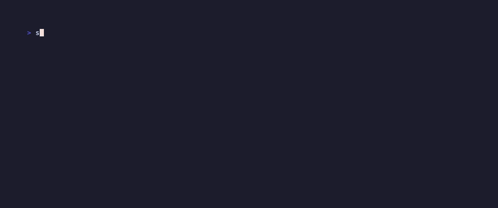
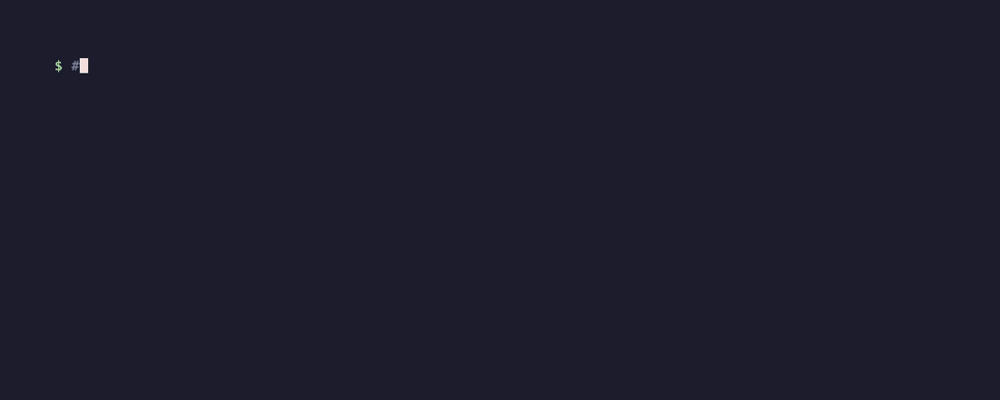
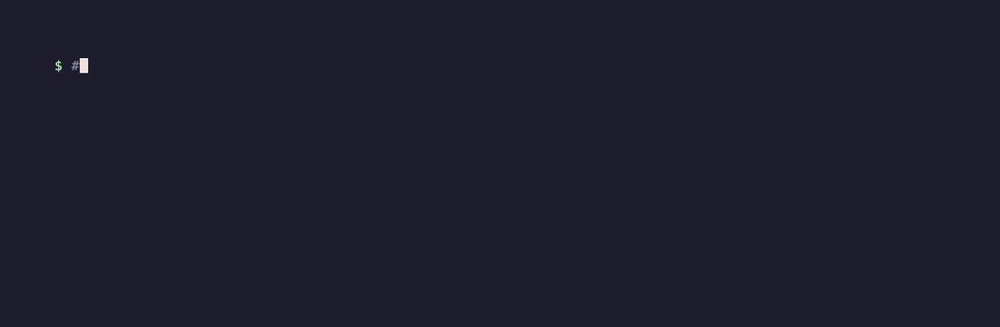
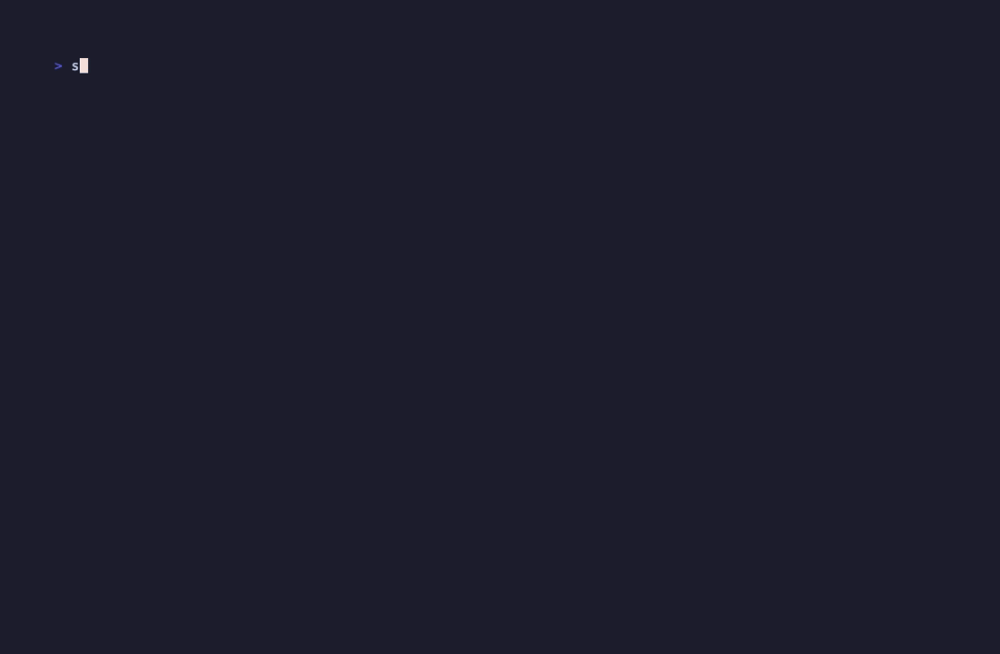

# Tesserae

<p align="center">
  
</p>

<p align="center">
  <a href="./README.ko.md">한국어</a> ·
  <a href="./README.zh.md">中文</a> ·
  <a href="./README.ja.md">日本語</a> ·
  <a href="./README.ru.md">Русский</a> ·
  <a href="./README.es.md">Español</a> ·
  <a href="./README.fr.md">Français</a> ·
  <a href="./README.de.md">Deutsch</a>
</p>

> Compile your sources into a typed wiki agents can read.

<p align="center">
   compile -> ask, recorded against the 135-doc demo corpus" width="100%" />
</p>

[Live demo](https://ca1773130n.github.io/Tesserae) · [Docs](docs/) · [v0.2.0 release notes](docs/release-notes/v0.2.0.md) · [MCP setup](docs/integrations/mcp.md) · [Obsidian export](docs/integrations/obsidian.md)

Tesserae is a project-memory compiler. Point it at a directory containing markdown, source files, and (optionally) PDFs/Office docs/images, and it extracts a typed knowledge graph, writes a queryable wiki, and emits portable artifacts: a markdown projection, a Cognee-ready bundle, an agent harness, and an MCP server you can wire into Claude Code, Codex, or any MCP client. It is a build step for project context, not a hosted service.

## How it compares

A flat comparison against the four closest open-source alternatives. No softening:

| Feature | Tesserae | Quartz | Logseq | Cognee | Foam |
|---|---|---|---|---|---|
| Static HTML output | yes | yes | partial (export) | no | partial (publish) |
| Built-in graph view | yes | yes | yes | yes (separate UI) | yes (VSCode) |
| Typed node schema | yes (41 types) | no | partial (tags) | yes | no |
| Concept extraction from sources | yes (LLM) | no | no | yes | no |
| Multimodal ingestion (PDF/image) | yes (via RAG-Anything) | no | partial (embeds) | yes | no |
| Code-graph ingestion | yes | no | no | partial | no |
| MCP server | yes | no | no | yes | no |
| Multi-project registry | yes | no | yes (graphs) | partial | no |
| Works without API key (OAuth) | yes | n/a | n/a | no | n/a |
| Multi-language i18n docs | yes | partial | yes | partial | partial |
| Deterministic byte-identical compile | yes | yes | n/a | no | n/a |
| Per-page ask widget (proposed B3) | not yet | no | no | no | no |
| Live edit | no | partial | yes | n/a | yes |
| Mobile-first reading | no | yes | yes | n/a | n/a |
| Real-time collaboration | no | no | yes (DB beta) | no | no |

Tesserae picks compile-from-source over live editing. If you want to edit notes
in a UI, use Logseq or Obsidian. If you want a build tool for your knowledge
graph, this is the project.

## When to use this (and when not to)

Use it if:

- You want a durable, inspectable knowledge graph over a single project's text-heavy sources (docs, code, research notes).
- You want a local MCP server that answers questions grounded in your own files.
- You want to feed a clean bundle into Cognee, or a markdown projection into Obsidian, without writing the glue yourself.

Skip it if:

- You only need a vector search over a small directory — `ripgrep` plus an embedding library is simpler.
- You want a hosted wiki with editing UI. The static site here is read-only.
- You need accurate semantic embeddings out of the box. The default RAG-Anything embedding is deterministic (see [Limitations](#status)).
- You expect a turnkey "ask anything" agent. This builds the substrate; you still wire it into your agent of choice.

## Status

This is an evolving research/agent-tooling project. Known limitations:

- Compile time scales roughly linearly with corpus size. First-run compiles over large markdown trees (thousands of files) can take minutes.
- The default RAG-Anything embedding provider is `deterministic`. It is reproducible and dependency-free, but semantic recall is limited. Switch to `ollama` (e.g. `qwen3-embedding:0.6b`) or an OpenAI-compatible endpoint for better retrieval — see [docs/integrations/rag-anything.md](docs/integrations/rag-anything.md).
- Vision support for RAG-Anything (image content extraction) is not yet wired end-to-end. Image files are parsed structurally but not described.
- Cognee runtime cognify is best-effort: missing providers, paid API keys, or network failures are logged and skipped rather than aborting the build.
- The MCP server exposes a stable set of tools, but the underlying graph schema is still subject to additions.

## Quickstart

Requires Python 3.9+. RAG-Anything needs Python 3.10+ if you enable it.

```bash
pip install tesserae

cd /path/to/my-project
tesserae project setup
tesserae project compile
tesserae project ask "Where is Mermaid rendering implemented?"
tesserae project build-site && tesserae project serve --port 8765
```

The setup wizard detects common sources (`README.md`, `docs/`, `src/`, `data/`) and writes `.tesserae/config.json`. LLM-calling features default to the `codex` CLI over OAuth, so no API keys are required for the common path. See [docs/quickstart.md](docs/quickstart.md) and [docs/installation.md](docs/installation.md) for the longer version.

> [!tip]
> **`tesserae: command not found` after install?** `pip` dropped the binary somewhere your shell doesn't search. Most reliable fix on **any platform** is [`pipx`](https://pipx.pypa.io/) — it puts CLI tools in isolated venvs and auto-manages your `PATH`:
>
> ```bash
> # macOS — `brew install pipx`
> # Ubuntu / Debian — `sudo apt install pipx`
> # other — `python3 -m pip install --user pipx`
> pipx ensurepath          # adds ~/.local/bin to PATH; open a new shell after
> pipx install tesserae
> ```
>
> **Ubuntu 23.04+** gotchas you'll likely hit with plain `pip install tesserae`:
>
> | Error | Cause | Fix |
> |---|---|---|
> | `error: externally-managed-environment` | PEP 668 — system Python is locked | Use `pipx` (above), or `pip install --user --break-system-packages tesserae` (ugly), or a venv |
> | `tesserae: command not found` after `pip install --user …` | `~/.local/bin` isn't on `PATH` | `echo 'export PATH=$HOME/.local/bin:$PATH' >> ~/.bashrc && source ~/.bashrc` |
> | `ModuleNotFoundError: pydantic` on Ubuntu 20.04 | system `python3` is 3.8, tesserae needs ≥3.9 | `sudo apt install python3.11 python3.11-venv` then `python3.11 -m pip install --user tesserae` |

### Walkthrough

Each step in the Quickstart, recorded against the bundled 135-doc demo corpus
(`examples/demo-corpus/data/research/`). Rebuild any of these GIFs with
`vhs docs/screencasts/<name>.tape` — the tape files document what they
recorded and the workspace they assume.

<details>
<summary><strong>1. Setup</strong> — point at a research directory, get a project wiki scaffold</summary>
<br/>

</details>

<details>
<summary><strong>2. Compile + build site</strong> — deterministic, no LLM calls</summary>
<br/>

</details>

<details>
<summary><strong>3. Ask</strong> — query the compiled wiki from the CLI</summary>
<br/>

</details>

## What you get after compile

```text
.tesserae/
  config.json
  graph.json              # typed nodes/edges
  manifest.json           # source fingerprints (used by --changed-only)
  sqlite.db               # queryable graph store
  temporal_facts.jsonl
  graphiti_episodes.jsonl
  report.md
  markdown_projection/    # human-readable wiki pages
  obsidian_vault/         # ready to drop into Obsidian
  agent_harness/          # per-agent config (Claude/Codex/Gemini/Cursor/...)
  harness_sessions/       # imported Claude/Codex session memory
  cognee_bundle/          # JSONL ready for Cognee ingest
  site/                   # static site built by build-site
  external/               # companion-tool outputs (UA, RAG-Anything)
```

`ls .tesserae/` after `project compile` to verify what landed.

## CLI overview

Daily-use commands. Run `tesserae <subcommand> --help` for full flags.

| Command | What it does |
|---|---|
| `tesserae project setup` | Interactive wizard. Writes `.tesserae/config.json`. Accepts `--with-understand-anything`, `--with-raganything`, `--run-cognee`, etc. |
| `tesserae project compile` | Reads configured sources, runs companion refreshes, writes all artifacts under `.tesserae/`. Use `--changed-only` for incremental rebuilds. |
| `tesserae project build-site` | Builds the static frontend at `.tesserae/site/`. |
| `tesserae project serve --port 8765` | Serves the static site locally and exposes `/api/ask` so every detail page's inline ask widget can route questions to `ask_project`. On any other host (file://, GitHub Pages, S3) the widget gracefully collapses to a one-line static footer. |
| `tesserae project refresh-understand-anything` | Runs Tesserae's managed Understand Anything refresh wrapper. |
| `tesserae project refresh-raganything --parser mineru` | Re-parses non-code sources (PDFs, Office, images) via RAG-Anything. |
| `tesserae project ask "<question>"` | Asks the configured backend (`auto`/`raganything`/`cognee`/`wiki`). |
| `tesserae project mcp-config` | Prints an MCP server config snippet you can paste into Claude Code, Codex, or Hermes. |
| `tesserae wiki register <path> --name <alias>` | Registers a project in the shared registry. |
| `tesserae wiki list` / `tesserae wiki activate <name>` | Lists registered projects; sets the active one. |
| `tesserae ask "<question>" [--wiki <name>]` | Top-level ask that resolves through the registry. |

## Integrations

All integrations are opt-in. None are required to use Tesserae on a plain markdown/code project.

- **Claude Code plugin** — slash commands (`/tesserae:compile`, `/tesserae:ask "<question>"`, `/tesserae:refresh`, `/tesserae:status`, …), four hooks (SessionStart status / SessionEnd auto-compile / opt-in PostToolUse incremental recompile / PreToolUse large-graph confirmation gate), a `using-tesserae` skill, and MCP auto-registration — all in one `/plugin install`. See [docs/integrations/claude-code-plugin.md](docs/integrations/claude-code-plugin.md).
- **Session graph** — turns your Claude Code / Codex conversations about the project into first-class graph nodes (Insight / Decision / Question / TODO / Hypothesis / Takeaway), linked back to the docs that came up. Run `tesserae sessions discover --import` once, then every `tesserae project compile` ingests new sessions. Structural pass is free; LLM pass auto-runs when the `claude` CLI is signed in — **no API key required**. See [docs/integrations/sessions.md](docs/integrations/sessions.md).
- **Understand Anything** — a separate project ([Lum1104/Understand-Anything](https://github.com/Lum1104/Understand-Anything)) that produces a code knowledge graph at `.understand-anything/knowledge-graph.json`. Enable with `--with-understand-anything`. Tesserae stores a managed refresh wrapper so `project compile` keeps the graph current. See [docs/integrations/understand-anything.md](docs/integrations/understand-anything.md).
- **RAG-Anything** — multimodal ingestion ([HKUDS/RAG-Anything](https://github.com/HKUDS/RAG-Anything)) for PDFs, Office documents, and images via MinerU/Docling/PaddleOCR. Enable with `--with-raganything`. Also acts as a runtime question backend (LightRAG). Requires Python 3.10+. See [docs/integrations/rag-anything.md](docs/integrations/rag-anything.md).
- **Cognee** — graph+vector memory backend. Enable with `--run-cognee --install-cognee`. The normal compile always writes `.tesserae/cognee_bundle/`; the runtime `cognify` pass is best-effort and only runs when explicitly enabled.

## Multi-project registry

A persistent registry at `~/.tesserae/registry.json` lets the top-level `ask` CLI and the MCP server resolve project names to roots without `--project` on every call.

```bash
tesserae wiki register /path/to/my-project --name myproj
tesserae wiki activate myproj
tesserae ask "Where is the parser entry point?"
```

The same registry is read by the MCP server, so MCP clients can call `list_projects`, `activate_project`, and `ask` against any registered wiki.

### Cross-vault linking (`wiki://` URI scheme)

Source markdown in one registered project can reference a node in another registered project via a stable URI:

```
wiki://<alias>/<kind>/<slug>
```

Examples:

- `wiki://research/concepts/rlhf` — the RLHF concept in the `research` vault.
- `wiki://other-vault/papers/arxiv-2510-12323` — a paper in `other-vault`.
- `[See RLHF in research](wiki://research/concepts/rlhf)` — works inside a Markdown link too.

At compile time these URIs become *bridge nodes* in the graph view (group `external`, violet) with a "Cross-project bridges" toggle in the toolbar so you can hide them. Unregistered aliases render as tombstones; registered-but-not-yet-built links render as placeholders.

### Querying across vaults (`--scope all-registered`)

`tesserae ask` and the MCP `ask` tool accept a `--scope` flag:

```bash
# Default — just the active/named project.
tesserae ask "..."

# Fan out across every registered project; aggregate envelopes by alias.
tesserae ask "..." --scope all-registered

# Restrict to a hand-picked subset of registered aliases.
tesserae ask "..." --scope all-registered --scope-aliases research work
```

The aggregated JSON shape is `{"scope": "all-registered", "question": ..., "by_project": {"<alias>": <envelope>, ...}}`. Per-project failures are captured as `{"error": "..."}` entries; a single failing project never aborts the fan-out.

## MCP

`tesserae project mcp-config` prints a server entry you can paste into Claude Code, Codex, or any MCP-aware client. The server exposes tools including `schema`, `graph_summary`, `search_nodes`, `node_context`, `search_facts`, `timeline`, `wiki_page`, `raw_source`, `lint_report`, `ask`, and the registry tools `list_projects` / `register_project` / `activate_project` / `unregister_project`. Tools that need a specific project resolve through the same registry as the CLI.

## Authentication and LLM providers

The common path uses no API keys:

- **Codex CLI** (default) over OAuth. `--raganything-llm-provider codex` is the default; Cognee `codex_cognify` mode patches Cognee's LLM client to the Codex CLI.
- **Claude Code CLI** over OAuth. Set `--raganything-llm-provider claude` for RAG-Anything runtime queries. Multi-account setups use `--raganything-claude-config-dir ~/.claude` (Tesserae exports `CLAUDE_CONFIG_DIR` before each call).
- **Embeddings** default to a deterministic in-process provider. Switch to Ollama with `--cognee-embedding-provider ollama --cognee-ollama-embedding-model qwen3-embedding:0.6b`, or wire OpenAI-compatible endpoints — both documented in the integration pages.

If you set `ANTHROPIC_API_KEY` or `OPENAI_API_KEY` they will be picked up by the corresponding paths, but they are not required.

## Project layout

```text
tesserae/        # the package (CLI, compiler, MCP server, adapters)
docs/            # English docs + docs/i18n/ for the six other languages
ontology/        # node/edge schemas the compiler validates against
prompts/         # extraction and synthesis prompts
scripts/         # maintenance scripts
tests/           # pytest suite
evals/           # graph quality eval harnesses
data/            # example research notes used by self-dogfooding
```

## Localized docs

[한국어](./README.ko.md) ·
[中文](./README.zh.md) ·
[日本語](./README.ja.md) ·
[Русский](./README.ru.md) ·
[Español](./README.es.md) ·
[Français](./README.fr.md)

Long-form docs are mirrored under `docs/i18n/` and `docs/i18n/integrations/`.

## License

MIT. See [LICENSE](LICENSE).
