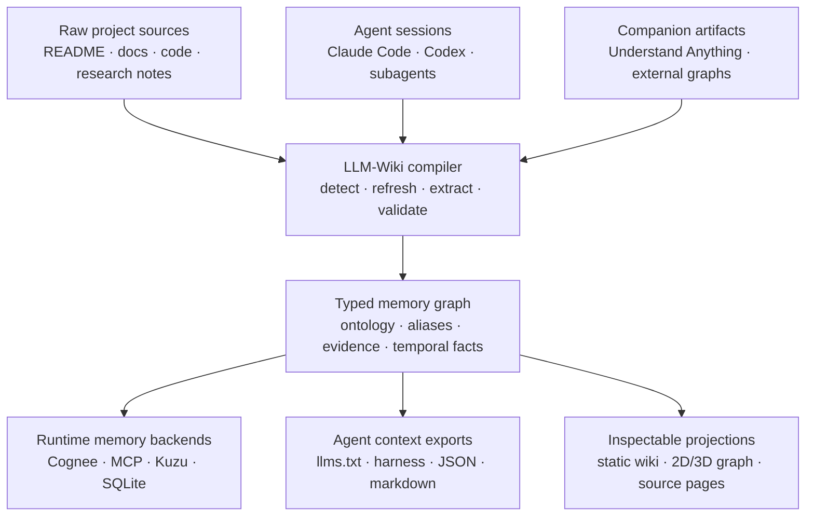
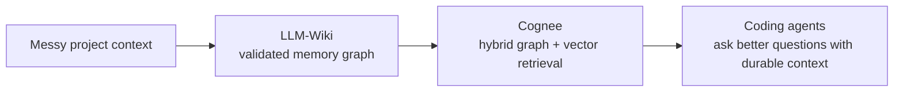

<h1 align="center">LLM-Wiki</h1>

<p align="center">
  <strong>The memory compiler for coding agents.</strong>
  <br />
  <em>Compile repos, docs, research notes, Claude/Codex sessions, and companion graph tools into validated memory for Cognee, MCP, Kuzu, SQLite, llms.txt, and static docs.</em>
</p>

<p align="center">
  <a href="docs/i18n/README.ko.md">한국어</a> ·
  <a href="docs/i18n/README.zh.md">中文</a> ·
  <a href="docs/i18n/README.ja.md">日本語</a> ·
  <a href="docs/i18n/README.ru.md">Русский</a> ·
  <a href="docs/i18n/README.es.md">Español</a> ·
  <a href="docs/i18n/README.fr.md">Français</a>
</p>

<p align="center">
  <a href="#quick-start"></a>
  <a href="#cognee--llm-wiki"></a>
  <a href="#why-agents-use-it"></a>
  <a href="#memory-pipeline"></a>
  <a href="LICENSE"></a>
</p>

<p align="center">
  
</p>

---

## The pitch

Most LLM wiki tools make another page of generated notes.

**LLM-Wiki builds the memory layer your next agent starts from.** It takes the messy reality of a project — source files, markdown docs, research notes, local Claude/Codex transcripts, and external graph artifacts — and compiles it into a typed, portable memory system.

The website is just the glass window. The product is the compiled memory artifact.

<table>
  <tr>
    <td width="33%" valign="top">
      <h3>🧬 Validate memory</h3>
      <p>Constrain nodes and edges before they reach retrieval. Avoid random <code>related_to</code> soup, duplicate entities, and drifting schemas.</p>
    </td>
    <td width="33%" valign="top">
      <h3>🧠 Preserve agent work</h3>
      <p>Turn Claude Code and Codex sessions into searchable project memory: decisions, commands, files, summaries, and tool traces.</p>
    </td>
    <td width="33%" valign="top">
      <h3>🔌 Export everywhere</h3>
      <p>Ship the same memory to Cognee, MCP, Kuzu, SQLite, Graphiti-style episodes, <code>llms.txt</code>, markdown, and a static website.</p>
    </td>
  </tr>
</table>

---

## Why agents use it

| If you only have... | Your agent still has to... | LLM-Wiki gives it... |
|---|---|---|
| A README | rediscover architecture and decisions | typed project memory + source provenance |
| A docs site | search pages like a human | MCP tools, `llms.txt`, JSON graph, per-page context |
| A vector DB | guess relationships from chunks | validated nodes, edges, aliases, claims, evidence |
| A graph visualizer | admire a picture | portable graph artifacts that retrieval systems can use |
| Chat history | forget previous work | imported agent sessions as durable memory |

---

## Memory pipeline



---

## Cognee + LLM-Wiki

**LLM-Wiki compiles memory. Cognee retrieves it.**

Cognee is powerful as an AI memory backend: graph + vector retrieval, semantic memory, and ontology-aware hooks. But raw repo/docs ingestion can still become noisy if the memory going in is unconstrained.

LLM-Wiki acts as the build step before Cognee:

| Layer | LLM-Wiki role | Cognee role |
|---|---|---|
| Source capture | tracks docs, code, research, sessions, companion artifacts | can ingest many data types |
| Structure | validates node/edge types, aliases, evidence, provenance | stores and retrieves semantic memory |
| Runtime | exports clean Cognee bundles or Codex/OAuth cognify flows | serves hybrid graph/vector memory to agents |
| Safety | keeps deterministic/local-first paths available | adds richer memory retrieval when desired |



Use Cognee when you want the compiled memory to become a live retrieval substrate for agents. Use LLM-Wiki when you want to control, validate, export, and inspect that memory before it becomes runtime context.

Ask through the configured memory backend:

```bash
llm_wiki project ask "Where is Mermaid rendering implemented?"
```

`project ask` uses Cognee automatically when the project config enables it, and falls back to compiled wiki search if Cognee is unavailable. To make Cognee a live runtime memory backend during compile, opt in once:

```bash
llm_wiki project setup --run-cognee --install-cognee
```

Normal compile still writes `.llm-wiki/cognee_bundle/`; runtime Cognee cognify stays explicit and best-effort so missing providers or paid API settings do not break the local wiki build.

---

## Quick start

```bash
pip install llm-wiki

llm_wiki project setup
llm_wiki project compile
llm_wiki project ask "Which files implement Mermaid rendering?"
llm_wiki project build-site
llm_wiki project serve --port 8765
```

Want both companion code graphs and runtime memory retrieval?

```bash
llm_wiki project setup \
  --with-understand-anything \
  --install-understand-anything \
  --understand-anything-platform codex \
  --run-cognee \
  --install-cognee
llm_wiki project compile
```

Open:

```text
http://127.0.0.1:8765/
```

The setup wizard detects common sources like `README.md`, `docs`, `src`, `data`, and companion artifacts. If you select Understand Anything, LLM-Wiki installs the companion skills when requested and stores a managed refresh wrapper, so `project compile` can refresh `.understand-anything/knowledge-graph.json` without users knowing UA install paths or slash commands. Cognee is enabled as the default question backend; runtime cognify is opt-in with `--run-cognee`.

```text
◆ LLM-Wiki project setup
Choose sources and companion tools. Press Enter to accept defaults.

Sources
  ✓ README.md
  ✓ docs
  ✓ src
  ✓ .llm-wiki/external/understand-anything.md

External tools
  ◆ Understand Anything → .llm-wiki/external/understand-anything.md

Memory backends
  ◆ Cognee → my_project_memory (codex_cognify, manual cognify)
```

---

## What it exports

| Output | Why it matters |
|---|---|
| `cognee_bundle/` | clean graph artifacts for Cognee-style memory workflows |
| `graph.json` / `graph.jsonld` | portable typed memory graph |
| `sqlite.db` / Kuzu output | queryable local graph storage |
| `llms.txt` / `llms-full.txt` | direct agent context packs |
| MCP server | `search_nodes`, `node_context`, `timeline`, and graph tools |
| `agent_harness/` | Claude Code, Codex, Gemini, Cursor, Kiro, OpenCode setup |
| `markdown_projection/` | readable wiki files for humans and editors |
| `.llm-wiki/site/` | static website for inspection, sharing, and debugging |

---

## Companion tools, not lock-in

LLM-Wiki is designed to sit between tools, not replace them.

| Tool | Relationship |
|---|---|
| Understand Anything | independent code graph artifact → markdown projection → compiled memory |
| Cognee | memory backend for hybrid graph/vector retrieval |
| Graphiti-style systems | temporal episode/fact export path |
| Obsidian / markdown | readable projection, not the only source of truth |
| Claude Code / Codex | both source of session memory and consumers of compiled context |

Use the managed setup path; LLM-Wiki installs the companion skills and stores a refresh command for you:

```bash
llm_wiki project setup \
  --yes \
  --with-understand-anything \
  --install-understand-anything \
  --understand-anything-platform codex
llm_wiki project compile
```

On compile, LLM-Wiki runs its own `project refresh-understand-anything` wrapper when the UA graph is missing or stale, then materializes `.llm-wiki/external/understand-anything.md`. Users do not need to know where UA is installed or how to invoke `/understand` manually.

---

## When LLM-Wiki is the right tool

| You want... | Use LLM-Wiki because... |
|---|---|
| better coding-agent continuity | old Claude/Codex sessions become searchable memory |
| safer GraphRAG inputs | schema validation happens before retrieval |
| local-first workflows | deterministic extraction and CLI/OAuth paths avoid mandatory API-key spend |
| portable project memory | one compile emits Cognee, MCP, SQLite, Kuzu, markdown, JSON, and site artifacts |
| human inspection | the static site lets you debug what agents will retrieve |

---

## Docs

| Guide | What you get |
|---|---|
| [Quickstart](docs/quickstart.md) | first project memory compile |
| [Installation](docs/installation.md) | install options and wrappers |
| [Architecture](docs/architecture.md) | pipeline internals and graph model |
| [Session history](docs/session-history.md) | Claude/Codex transcript import |
| [Understand Anything companion workflow](docs/integrations/understand-anything.md) | companion graph refresh and projection |
| [Publishing checklist](docs/publishing-checklist.md) | deploy the generated static site |

---

<p align="center">
  <strong>Do not give your next agent a blank repo. Give it compiled memory.</strong>
</p>
