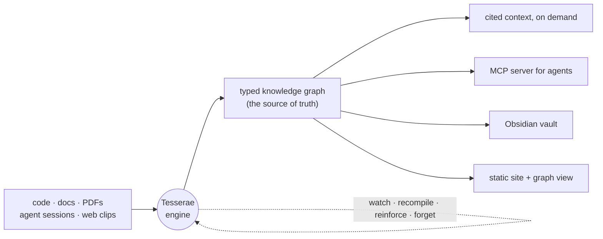

<div align="center">

# Tesserae

**The context engine for coding agents.**

Turn your project — its code, its docs, and your agent sessions — into a typed,
self-improving knowledge graph, then compile exactly the context an agent needs:
grounded, cited, and on demand.

[](https://pypi.org/project/tesserae/)
[](https://www.npmjs.com/package/@jokerized/tesserae)
[](https://pypi.org/project/tesserae/)
[](https://github.com/ca1773130n/Tesserae/actions/workflows/tests.yml)
[](LICENSE)

[Live demo](https://ca1773130n.github.io/Tesserae) ·
[Quickstart](#quickstart) ·
[Docs](docs/) ·
[Agent memory](docs/agent-memory.md) ·
[MCP setup](docs/integrations/mcp.md) ·
[Tuning](docs/tuning.md) ·
[Release notes](docs/release-notes/)

[한국어](./README.ko.md) · [中文](./README.zh.md) · [日本語](./README.ja.md) · [Русский](./README.ru.md) · [Español](./README.es.md) · [Français](./README.fr.md) · [Deutsch](./README.de.md)

</div>

---

## The problem

An agent is only as good as the context you hand it. So you paste files,
re-explain decisions you already made last week, and watch it rediscover the
same gotcha for the third time — because everything it learned evaporated when
the conversation ended, and nothing on disk knows how your project actually fits
together.

Tesserae is the missing layer. It reads your sources **and** watches your agent
sessions, reconstructs a typed knowledge graph that stays current, and serves an
agent precisely the slice it needs — cited back to the file or the conversation
it came from. It runs entirely on your machine. It's a build step plus a live
engine, not a hosted service, and the common path needs **no API keys**.


```mermaid
flowchart LR
    S["code · docs · PDFs<br/>agent sessions · web clips"]
    E(("Tesserae<br/>engine"))
    G["typed knowledge graph<br/>(the source of truth)"]
    O1["cited context, on demand"]
    O2["MCP server for agents"]
    O3["Obsidian vault"]
    O4["static site + graph view"]

    S --> E --> G
    G --> O1 & O2 & O3 & O4
    E -. "watch · recompile · reinforce · forget" .-> E
```

The graph, the vault, and the site are all **projections** of one knowledge
base. The engine is the loop that keeps them true.

## Quickstart

Requires **Python 3.10+**. No API key required for the default path.

```bash
pipx install tesserae          # or: pip install tesserae · npx @jokerized/tesserae

cd /path/to/my-project
tesserae init --yes            # detect the project, write .tesserae/
tesserae compile               # build the knowledge graph from your sources
```

Now ask it anything, grounded in your actual code and docs:

```bash
tesserae ask "Where is arXiv ID parsing implemented, and what depends on it?"
```

Or compile a tailored, cited context document to hand to any agent:

```bash
tesserae context "How does the parser handle malformed IDs?" --budget 32000 -o context.md
```

Browse the graph and wiki in your browser:

```bash
tesserae serve --port 8765
```

That's the whole loop: **point, compile, ask.** LLM-backed features use the
`codex` or `claude` CLI over OAuth by default — see
[installation](docs/installation.md) and [quickstart](docs/quickstart.md) for
the details, PATH fixes, and provider options.

## What it does

**Compiles a typed graph from your sources.** Point it at markdown, source code,
and optionally PDFs/Office docs/images. Tesserae extracts a graph of 70+ node
kinds — concepts, decisions, code symbols, papers, syntheses — with typed edges,
validated against a schema. The compile is **byte-deterministic**: same inputs,
identical `graph.json`, every time.

**Turns agent conversations into memory.** Your Claude Code and Codex sessions
about the project become first-class nodes — insights, decisions, questions,
TODOs — linked to the files they touched. The knowledge from a session outlives
the session.

**Remembers what actually happened, not just what was said.** A tool result is
a turn: exit codes and error flags survive ingest and land on `Event` nodes, so
the graph knows a command failed rather than only that it was run. From two
observed outcomes in one session — a call that failed, then a later call that
succeeded on the same operand — Tesserae derives a `recovers` edge. It is the
only causal edge in the vocabulary, and it is derived, never asserted by a
model, because `caused_by` that is really `happened_near` reads as evidence and
is worse than no edge at all.

**Serves cited context on demand.** The context compiler runs Personalized
PageRank from your query's seed nodes, packs the most relevant subgraph under a
character budget, and returns a cited document ready to paste — or streams it to
an agent over MCP.

**Keeps itself fresh.** A supervised engine watches sources and sessions,
debounces bursts, recompiles, and runs a self-improvement pass that reinforces
recurring findings and supersedes stale ones. Like a brain consolidating memory
during rest, it also **consolidates agent memory on its own** when the project
goes idle — a periodic sleep cycle, no command required: it compacts and forgets
loud recent memory, **forgets by disuse** (knowledge nothing retrieves fades,
not just old knowledge), and **discovers new connections** between what
survives. One process can keep every project you own current.

**Gives every agent its own growing memory.** Distill each agent's experience
into a bounded, higher-level layer; let managers read only the distilled layer of
their reports, recursively up an org tree. See [layered agent
memory](#layered-agent-memory) below.

## How it works after `compile`

```text
.tesserae/
├── graph.json              # the typed knowledge base — nodes + edges
├── sqlite.db               # queryable graph store
├── markdown_projection/    # human-readable wiki pages
├── obsidian_vault/         # drop straight into Obsidian
├── site/                   # static site: graph view + wiki + search
├── harness_sessions/       # imported Claude / Codex session memory
├── agents/                 # per-agent distilled memory layers (opt-in)
└── config.json · manifest.json · report.md
```

## Layered agent memory

No human remembers everything, and no agent's context window fits everything.
Tesserae's answer is a **layered, per-agent knowledge base**: every agent grows
its own memory from its own sessions, that memory is periodically **distilled**
into a bounded higher-level layer, and managers see only the distilled layer of
their reports — recursively, like a real organization.

```bash
export TESSERAE_AGENT_DISTILL=1
tesserae compile              # mints an Agent node per agent + attribution edges
tesserae agents init          # infer the org chart from who spawned whom
tesserae agents tree          # inspect it — hierarchy, session counts, staleness
tesserae distill              # compact each agent's experience into an L1 layer
```

Then every graph-reading tool — CLI or MCP — takes an `agent=` scope:

```bash
tesserae query "release checklist" --agent claude-code:me:reviewer   # a worker's own memory
tesserae ask   "what does my team know about deploys?" --agent org   # the whole team, distilled
```

Distillation **organizes, compacts, and forgets — but never deletes**: a
decayed finding is folded into the distillate that cites it and stays reachable
via `agents drill`, never dropped. Time is the corpus clock, node identity never
depends on LLM wording, and the artifacts stay deterministic. Full design in
[docs/agent-memory.md](docs/agent-memory.md).

You need not run `distill` by hand: leave `tesserae engine` running and it
**consolidates on its own** during idle rest — a sleep cycle that wraps the
same opt-in, memory-pressure-gated pass. See
[docs/engine-consolidation.md](docs/engine-consolidation.md).

## MCP server

`tesserae projects mcp-config` prints a ready server entry for Claude Code,
Codex, or any MCP client. Every graph-reading tool accepts `graph_path` /
`project` / `agent` for free. The headline tools:

| Tool | Purpose |
|---|---|
| `compile_context` | Tailored, cited context doc for a query or seed nodes (deterministic; `preview=N` returns a handle instead of the full body) |
| `get_handle` | Page a large payload in slices, so the agent never holds it all in context at once |
| `ask` · `query` · `search_nodes` · `node_context` | Planned answers, raw retrieval, and graph navigation over the compiled base |
| `graph_map` | Budgeted Descent: navigate the graph top-down by scope instead of guessing search terms — the canonical entry point |
| `graph_ppr` · `search_facts` · `timeline` | Personalized-PageRank expansion, temporal facts, and chronology. Two clocks that **compose**: `as_of` (what was TRUE then, from the sources' own timestamps) and `observed_as_of` (what we had LEARNED by then, from the compile-stamped ledger). `current_only` and `as_of` are refused together — those two really are alternatives |
| `verify_claim` | Does the graph license this triple? A deterministic verdict, not a generated opinion |
| `find_session_findings` · `fresh_insights` · `activity_summary` · `query_decisions` | Session-derived memory, decay-ranked and deduplicated; digests and the decision record |
| `agent_view_explain` · `drill_down` · `read_audit` | Resolve an agent's scoped view; escalate a distilled note to its raw evidence (audited); and, opt-in via `TESSERAE_READ_AUDIT`, read back who has been reading the graph |
| `ingest` · `graph_write` | Merge raw web/text (e.g. a browser clip) into the graph; let an agent write attributed nodes back — including a `retracts` edge to say "this is wrong" without inventing a replacement |
| `doctor_run` · `doctor_report` · `lint_report` | Health checks and graph lint, from inside the agent loop |

## Everyday commands

Run `tesserae --help` for the grouped list, `tesserae <cmd> --help` for flags.

| Command | What it does |
|---|---|
| `tesserae init` | One-step onboarding: detect the project, pick an LLM provider, write `.tesserae/config.json`. `--yes` non-interactive. |
| `tesserae compile` | Rebuild the graph and all projections. `compile <paths>` ad-hoc ingests extra files. |
| `tesserae ask "<q>"` | LLM-planned, cited answer over the base. A smart router picks the target project; `--scope federated` merges them into one answer. |
| `tesserae query "<q>"` | Raw retrieval — BM25/semantic search, no LLM synthesis. |
| `tesserae context "<q>"` | On-demand cited context doc via PPR under `--budget`. Reserves a slot for **procedural** memory — what was actually run and what came of it — when the graph has provenance to earn it. |
| `tesserae graph-map` | Budgeted Descent: walk the graph top-down by scope rather than by search term. `--scope org:root` for the agent org tree. |
| `tesserae verify-claim` | Deterministic verdict on whether the graph licenses a triple. JSON out. |
| `tesserae engine [--all]` | Supervised refresh daemon — watch, debounce, recompile, and consolidate agent memory on idle (the sleep cycle; `--no-consolidate` to disable). `--all` keeps every registered project fresh in one process. |
| `tesserae refresh` | One-shot: import new sessions → compile → sync vault. |
| `tesserae agents …` | `init` (infer the org) · `tree` · `show` · `drill` — the layered-memory org tools. |
| `tesserae distill` | Compact each agent's sessions into its bounded L1 memory layer. |
| `tesserae doctor` | Health checks; `--fix` applies safe repairs. Exit `0/1/2` = healthy/warnings/errors. |
| `tesserae lint` | Graph lint — orphans, stale citations, wiki drift, thin interval coverage, unearned procedural pools. `--fix-trivial` for the safe ones. |
| `tesserae domains status` | Print the chartered domain tree (divisions → departments → teams). See [architecture](docs/architecture.md#the-charter). |
| `tesserae federation status` | Inspect cross-project federation — what `--scope federated` will actually reach. |
| `tesserae serve` | Serve every registered project — landing at `/`, each at `/<alias>/`, with a live ask widget. |
| `tesserae export site \| okf` | Build the static site, or export a portable [Google OKF](https://github.com/GoogleCloudPlatform/knowledge-catalog) bundle. |
| `tesserae projects …` | Multi-project registry: `register`, `list`, `mcp-config`. |

## Multi-project

A registry at `~/.tesserae/registry.json` resolves project names everywhere —
CLI, MCP, and the fleet engine. There is no "active" project: per-project
commands resolve the one you're standing in, and `ask` routes across all of
them.

```bash
tesserae projects register /path/to/my-project --name myproj
tesserae ask "compare retrieval in research and notes"   # → federated, cross-referenced
tesserae ask "how does myproj compile?"                  # → routes to that project
tesserae serve                                           # → every project under one server
```

Markdown in one project can deep-link a node in another via
`wiki://<alias>/<kind>/<slug>`; at compile time these become bridge nodes in the
graph view.

## Integrations (all opt-in)

- **Claude Code plugin** — slash commands, session hooks, a skill, and MCP
  auto-registration in one `/plugin install`. [→](docs/integrations/claude-code-plugin.md)
- **Session graph** — Claude Code / Codex conversations become Insight /
  Decision / Question / TODO nodes, linked to the docs they touched, no API key
  needed. [→](docs/integrations/sessions.md)
- **RAG-Anything** — multimodal ingestion (PDF / Office / images via
  MinerU / Docling) plus a LightRAG question backend. [→](docs/integrations/rag-anything.md)
- **Obsidian** — bidirectional vault sync with a user-edit overlay. [→](docs/integrations/obsidian.md)
- **Web Clipper** — one-click clip a page or selection into the corpus. [→](docs/integrations/chrome-extension.md)

## How it compares

<details>
<summary><strong>Feature matrix</strong> vs Quartz, Logseq, Cognee, Foam</summary>

<br/>

| | Tesserae | Quartz | Logseq | Cognee | Foam |
|---|:---:|:---:|:---:|:---:|:---:|
| Static site + graph view | ✅ | ✅ | ✅ | ➖ | ➖ |
| Typed node schema | ✅ 70+ | ❌ | ➖ | ✅ | ❌ |
| Concept extraction from sources | ✅ | ❌ | ❌ | ✅ | ❌ |
| Multimodal ingestion (PDF/image) | ✅ | ❌ | ➖ | ✅ | ❌ |
| Code-graph ingestion | ✅ | ❌ | ❌ | ➖ | ❌ |
| MCP server | ✅ | ❌ | ❌ | ✅ | ❌ |
| On-demand cited context compiler | ✅ | ❌ | ❌ | ❌ | ❌ |
| Live session → graph memory | ✅ | ❌ | ❌ | ❌ | ❌ |
| Per-agent layered memory | ✅ | ❌ | ❌ | ❌ | ❌ |
| Multi-project daemon (fleet) | ✅ | ❌ | ❌ | ❌ | ❌ |
| Works without an API key | ✅ | — | — | ❌ | — |
| Deterministic byte-identical compile | ✅ | ✅ | — | ❌ | — |
| Live editing in a UI | ❌ | ➖ | ✅ | — | ✅ |

</details>

Tesserae chooses **compile-from-source over live editing**. If you want to edit
notes in a UI, use Logseq or Obsidian. If you want a build tool *and a live
engine* that keeps a grounded knowledge graph — and feeds it to your agents —
this is the project.

**Use it if** you want a durable, inspectable knowledge graph over a project's
sources, a local MCP server grounded in your own files, or per-agent memory that
compounds instead of evaporating.

**Skip it if** you only need vector search over a small folder, want a hosted
wiki with an editing UI, or expect a turnkey "ask anything" bot — Tesserae builds
the substrate; you wire it into the agent of your choice.

## Providers & privacy

Everything runs locally, and the common path uses **no API keys**:

- **Codex CLI** (default) and **Claude Code CLI** over OAuth, with multi-account
  rotation.
- **Embeddings** via an offline, torch-free lane (`pip install "tesserae[semantic]"`,
  `model2vec`). `ANTHROPIC_API_KEY` / `OPENAI_API_KEY` are used if set, never
  required.

## Status & limitations

See the [release notes](docs/release-notes/) for the current version. Honestly:

- First-run compiles over thousands of files take minutes; time scales roughly
  linearly. Incremental compile (`--changed-only`) ships but is experimental.
- Without the `semantic` extra, hybrid retrieval degrades to a non-semantic stub
  (with a loud warning).
- The **code layer is opt-in** as of 0.30.0 — `compile` no longer ingests code
  symbols unless you ask, because on a large repo they crowded out everything
  else. `tesserae code ingest` still wires CodeGraph in deliberately.
- The **charter** (`tesserae domains status`) is built and tested but not yet
  produced by `compile`; the command reports "no charter yet" until it is.
- RAG-Anything image description is not yet wired end-to-end.
- The MCP tool set is stable; the graph schema still gains node types. The
  causal vocabulary is deliberately one edge wide — `recovers` — and derived
  only from observed outcomes, never asserted by a model. The retrieval
  *`causal` view* is wider than that on purpose (it also traverses
  `resolved_by` and `attributes_improvement_to`, which serve the same "why did
  this break" intent); one edge that nothing else asserts would be a view with
  nothing in it.
- **Promotion is always a human edit.** `tesserae schema-drift` proposes node
  sub-types and the `ask` planner can return a `proposed_write`, but neither
  writes: a proposal is adopted only by editing `ResearchNodeType` yourself, or
  by submitting the payload to `graph_write` with provenance you supply.

## Project layout

```text
tesserae/     # the package — CLI, compiler, engine, MCP server, adapters
docs/         # English docs + docs/i18n/ for seven other languages
ontology/     # node/edge schemas the compiler validates against
prompts/      # extraction and synthesis prompts
tests/        # pytest suite (3,700+ tests)
evals/        # graph-quality eval harnesses
```

## Contributing & docs

- **Docs**: [quickstart](docs/quickstart.md) · [installation](docs/installation.md) · [agent memory](docs/agent-memory.md) · [architecture](docs/architecture.md)
- **Localized**: [한국어](./README.ko.md) · [中文](./README.zh.md) · [日本語](./README.ja.md) · [Русский](./README.ru.md) · [Español](./README.es.md) · [Français](./README.fr.md) · [Deutsch](./README.de.md) — long-form docs mirrored under `docs/i18n/`.

## License

[MIT](LICENSE).
