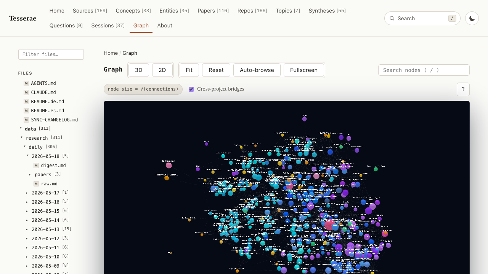

# Tesserae

<p align="center">
  
</p>

<p align="center">
  <a href="./README.md">English</a> ·
  <a href="./README.ko.md">한국어</a> ·
  <a href="./README.zh.md">中文</a> ·
  <a href="./README.ja.md">日本語</a> ·
  <a href="./README.es.md">Español</a> ·
  <a href="./README.fr.md">Français</a> ·
  <a href="./README.de.md">Deutsch</a>
</p>

[Демо](https://ca1773130n.github.io/Tesserae) · [Документация](docs/) · [Настройка MCP](docs/i18n/integrations/mcp.ru.md) · [Экспорт в Obsidian](docs/i18n/integrations/obsidian.ru.md)

Tesserae — это компилятор памяти проекта. Дайте ему директорию с Markdown-файлами, исходным кодом и, при желании, PDF/Office-документами/изображениями, и он извлечёт типизированный граф знаний, построит запрашиваемое wiki и сгенерирует переносимые артефакты: Markdown-проекцию, bundle для Cognee, agent harness и MCP-сервер, который можно подключить к Claude Code, Codex или любому другому MCP-клиенту. Это шаг сборки для проектного контекста, а не размещённый сервис.

## Когда это использовать (и когда не стоит)

Подходит, если:

- Вам нужен долговечный, доступный для инспекции граф знаний по одному проекту с преимущественно текстовыми источниками (документация, код, исследовательские заметки).
- Вам нужен локальный MCP-сервер, который отвечает на вопросы, опираясь на ваши собственные файлы.
- Вы хотите подавать чистый bundle в Cognee или Markdown-проекцию в Obsidian, не написав связующий код самостоятельно.

Не стоит использовать, если:

- Вам нужен только векторный поиск по маленькой директории — `ripgrep` плюс embedding-библиотека проще.
- Вам нужен размещённый wiki с UI редактирования. Здешний статический сайт — только для чтения.
- Вам нужны точные семантические embeddings из коробки. Стандартный RAG-Anything embedding детерминирован (см. [Статус](#статус)).
- Вы ожидаете «спроси что угодно»-агент под ключ. Этот проект строит подложку; подключение к нужному агенту по-прежнему за вами.

## Статус

Это развивающийся исследовательский / agent-tooling проект. Известные ограничения:

- Время компиляции растёт примерно линейно с размером корпуса. Первая компиляция больших Markdown-деревьев (тысячи файлов) может занять минуты.
- Стандартный embedding-провайдер RAG-Anything — `deterministic`. Он воспроизводимый и без внешних зависимостей, но семантическая полнота ограничена. Для лучшего поиска переключайтесь на `ollama` (например, `qwen3-embedding:0.6b`) или OpenAI-совместимый endpoint — см. [docs/integrations/rag-anything.md](docs/integrations/rag-anything.md).
- Поддержка зрения для RAG-Anything (извлечение содержимого изображений) ещё не подключена end-to-end. Файлы изображений разбираются структурно, но не описываются.
- Cognee runtime cognify работает по принципу best-effort: отсутствующие провайдеры, платные API-ключи или сбои сети логируются и пропускаются, а не прерывают сборку.
- MCP-сервер предоставляет стабильный набор инструментов, но базовая схема графа всё ещё может пополняться.

## Быстрый старт

Требуется Python 3.9 и выше. Для RAG-Anything нужен Python 3.10 и выше.

```bash
pip install tesserae

cd /path/to/my-project
tesserae project setup
tesserae project compile
tesserae project ask "Where is Mermaid rendering implemented?"
tesserae project build-site && tesserae project serve --port 8765
```

Мастер настройки определяет типичные источники (`README.md`, `docs/`, `src/`, `data/`) и пишет `.tesserae/config.json`. Возможности, требующие LLM, по умолчанию используют `codex` CLI через OAuth, поэтому в обычном сценарии API-ключи не нужны. Полные версии — в [docs/quickstart.md](docs/quickstart.md) и [docs/installation.md](docs/installation.md).

> [!tip]
> **`tesserae: command not found` после установки?** `pip` положил бинарник туда, где ваш шелл его не ищет. Самое надёжное решение на **любой платформе** — [`pipx`](https://pipx.pypa.io/) — он ставит CLI-инструменты в изолированные venv и автоматически управляет `PATH`:
>
> ```bash
> # macOS — `brew install pipx`
> # Ubuntu / Debian — `sudo apt install pipx`
> # другое — `python3 -m pip install --user pipx`
> pipx ensurepath          # добавляет ~/.local/bin в PATH; откройте новый шелл после
> pipx install tesserae
> ```
>
> **Ubuntu 23.04+** — типичные проблемы при простом `pip install tesserae`:
>
> | Ошибка | Причина | Решение |
> |---|---|---|
> | `error: externally-managed-environment` | PEP 668 — системный Python заблокирован | Используйте `pipx` (выше), либо `pip install --user --break-system-packages tesserae` (некрасиво), либо venv |
> | `tesserae: command not found` после `pip install --user …` | `~/.local/bin` не в `PATH` | `echo 'export PATH=$HOME/.local/bin:$PATH' >> ~/.bashrc && source ~/.bashrc` |
> | `ModuleNotFoundError: pydantic` на Ubuntu 20.04 | системный `python3` — 3.8, tesserae нужен ≥3.9 | `sudo apt install python3.11 python3.11-venv` затем `python3.11 -m pip install --user tesserae` |


## Что вы получаете после compile

```text
.tesserae/
  config.json
  graph.json              # типизированные узлы/рёбра
  manifest.json           # отпечатки источников (используется --changed-only)
  sqlite.db               # запрашиваемое хранилище графа
  temporal_facts.jsonl
  graphiti_episodes.jsonl
  report.md
  markdown_projection/    # читаемые человеком страницы wiki
  obsidian_vault/         # готов к подкладыванию в Obsidian
  agent_harness/          # конфигурация под каждого агента (Claude/Codex/Gemini/Cursor/...)
  harness_sessions/       # импортированная память сессий Claude/Codex
  cognee_bundle/          # JSONL для ingest в Cognee
  site/                   # статический сайт, который собирает build-site
  external/               # выходы сопутствующих инструментов (UA, RAG-Anything)
```

`ls .tesserae/` после `project compile` покажет, что именно появилось.

## Обзор CLI

Команды повседневного использования. Полный набор флагов — `tesserae <subcommand> --help`.

| Команда | Что делает |
|---|---|
| `tesserae project setup` | Интерактивный мастер. Пишет `.tesserae/config.json`. Принимает `--with-understand-anything`, `--with-raganything`, `--run-cognee` и т.п. |
| `tesserae project compile` | Читает настроенные источники, запускает обновления сопутствующих инструментов и пишет все артефакты в `.tesserae/`. Для инкрементальной пересборки используйте `--changed-only`. |
| `tesserae project build-site` | Собирает статический фронтенд в `.tesserae/site/`. |
| `tesserae project serve --port 8765` | Локально отдаёт статический сайт. |
| `tesserae project refresh-understand-anything` | Запускает управляемый Tesserae refresh-врапер Understand Anything. |
| `tesserae project refresh-raganything --parser mineru` | Через RAG-Anything заново парсит источники, не являющиеся кодом (PDF, Office, изображения). |
| `tesserae project ask "<question>"` | Задаёт вопрос настроенному бэкенду (`auto`/`raganything`/`cognee`/`wiki`). |
| `tesserae project mcp-config` | Печатает фрагмент конфигурации MCP-сервера, который можно вставить в Claude Code, Codex или Hermes. |
| `tesserae wiki register <path> --name <alias>` | Регистрирует проект в общем registry. |
| `tesserae wiki list` / `tesserae wiki activate <name>` | Показывает зарегистрированные проекты; выставляет активный. |
| `tesserae ask "<question>" [--wiki <name>]` | Команда верхнего уровня ask, которая резолвится через registry. |

## Интеграции

Все интеграции — opt-in. Ни одна из них не обязательна для использования Tesserae на простом Markdown/коде.

- **Граф сессий** — превращает ваши разговоры Claude Code / Codex о проекте в первоклассные узлы графа (Insight / Decision / Question / TODO / Hypothesis / Takeaway), связанные с документами, которые упоминались. Один раз запустите `tesserae sessions discover --import`, и затем каждый `tesserae project compile` импортирует новые сессии. Структурный проход бесплатный; проход LLM запускается автоматически, когда вы вошли в `claude` CLI — **ключ API не требуется**. См. [docs/integrations/sessions.md](docs/integrations/sessions.md).
- **Understand Anything** — отдельный проект ([Lum1104/Understand-Anything](https://github.com/Lum1104/Understand-Anything)), который пишет граф знаний кода в `.understand-anything/knowledge-graph.json`. Включается через `--with-understand-anything`. Tesserae хранит управляемый refresh-врапер, так что `project compile` поддерживает граф в актуальном виде. См. [docs/integrations/understand-anything.md](docs/integrations/understand-anything.md).
- **RAG-Anything** — мультимодальный ingest ([HKUDS/RAG-Anything](https://github.com/HKUDS/RAG-Anything)) для PDF, Office-документов и изображений через MinerU/Docling/PaddleOCR. Включается через `--with-raganything`. Также работает как runtime question backend (LightRAG). Требует Python 3.10+. См. [docs/integrations/rag-anything.md](docs/integrations/rag-anything.md).
- **Cognee** — memory backend на основе графа и векторов. Включается через `--run-cognee --install-cognee`. Обычный compile всегда пишет `.tesserae/cognee_bundle/`; runtime `cognify` — best-effort и запускается только при явном включении.

## Мульти-проектный registry

Постоянный registry по пути `~/.tesserae/registry.json` позволяет верхнеуровневой команде `ask` и MCP-серверу резолвить имена проектов в корневые пути без необходимости передавать `--project` каждый раз.

```bash
tesserae wiki register /path/to/my-project --name myproj
tesserae wiki activate myproj
tesserae ask "Where is the parser entry point?"
```

MCP-сервер читает тот же registry, так что MCP-клиенты могут вызывать `list_projects`, `activate_project`, `ask` для любого зарегистрированного wiki.

## MCP

`tesserae project mcp-config` печатает запись сервера, которую можно вставить в Claude Code, Codex или любой MCP-совместимый клиент. Сервер предоставляет инструменты, в том числе `schema`, `graph_summary`, `search_nodes`, `node_context`, `search_facts`, `timeline`, `wiki_page`, `raw_source`, `lint_report`, `ask`, а также registry-инструменты `list_projects` / `register_project` / `activate_project` / `unregister_project`. Инструменты, требующие конкретного проекта, резолвятся через тот же registry, что и CLI.

## Аутентификация и LLM-провайдеры

Обычный путь не требует API-ключей:

- **Codex CLI** (по умолчанию) через OAuth. `--raganything-llm-provider codex` — значение по умолчанию; Cognee-режим `codex_cognify` патчит LLM-клиент Cognee на Codex CLI.
- **Claude Code CLI** через OAuth. Для runtime-запросов RAG-Anything задайте `--raganything-llm-provider claude`. Для мульти-аккаунтных конфигураций используйте `--raganything-claude-config-dir ~/.claude` (Tesserae экспортирует `CLAUDE_CONFIG_DIR` перед каждым вызовом).
- **Embeddings** по умолчанию — детерминированный in-process провайдер. Переключение на Ollama: `--cognee-embedding-provider ollama --cognee-ollama-embedding-model qwen3-embedding:0.6b`; OpenAI-совместимые endpoints — также поддерживаются и описаны в документации интеграций.

Если установить `ANTHROPIC_API_KEY` или `OPENAI_API_KEY`, соответствующие пути их подхватят, но они не обязательны.

## Структура проекта

```text
tesserae/        # пакет (CLI, компилятор, MCP-сервер, adapters)
docs/            # английская документация + docs/i18n/ для шести других языков
ontology/        # схемы узлов/рёбер, по которым валидирует компилятор
prompts/         # промпты извлечения и синтеза
scripts/         # утилитарные скрипты
tests/           # pytest suite
evals/           # harness-ы для оценки качества графа
data/            # примеры исследовательских заметок для self-dogfood
```

## Локализованные документы

[English](./README.md) ·
[한국어](./README.ko.md) ·
[中文](./README.zh.md) ·
[日本語](./README.ja.md) ·
[Español](./README.es.md) ·
[Français](./README.fr.md)

Длинные документы зеркалируются в `docs/i18n/` и `docs/i18n/integrations/`.

## Лицензия

MIT. См. [LICENSE](LICENSE).
