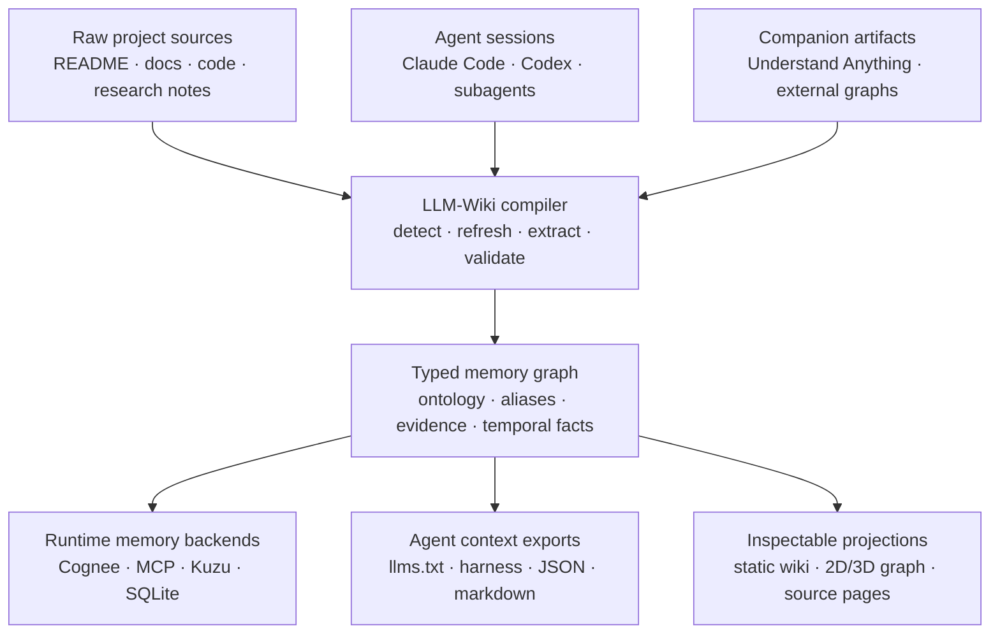
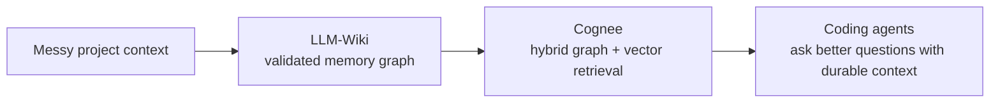

<h1 align="center">LLM-Wiki</h1>

<p align="center">
  <strong>Компилятор памяти для кодирующих агентов.</strong>
  <br />
  <em>Компилируйте репозитории, документацию, исследовательские заметки, сеансы Claude/Codex и сопутствующие графовые инструменты в проверенную память для Cognee, MCP, Kuzu, SQLite, llms.txt и статической документации.</em>
</p>

<p align="center">
  <a href="./README.md">English</a> ·
  <a href="./README.ko.md">한국어</a> ·
  <a href="./README.zh.md">中文</a> ·
  <a href="./README.ja.md">日本語</a> ·
  <a href="./README.ru.md">Русский</a> ·
  <a href="./README.es.md">Español</a> ·
  <a href="./README.fr.md">Français</a>
</p>

<p align="center">
  <a href="#быстрый-старт"></a>
  <a href="#cognee--llm-wiki"></a>
  <a href="#почему-агенты-используют-это"></a>
  <a href="#конвейер-памяти"></a>
  <a href="./LICENSE"></a>
</p>

<p align="center">
  
</p>

---

## Кратко о ценности

Большинство LLM wiki-инструментов создают еще одну страницу сгенерированных заметок.

**LLM-Wiki строит слой памяти, с которого стартует ваш следующий агент.** Он берет беспорядочную реальность проекта — исходные файлы, Markdown-документацию, исследовательские заметки, локальные стенограммы Claude/Codex и внешние графовые артефакты — и компилирует ее в типизированную, переносимую систему памяти.

Веб-сайт — это лишь витрина. Продукт — это скомпилированный артефакт памяти.

<table>
  <tr>
    <td width="33%" valign="top">
      <h3>🧬 Проверяйте память</h3>
      <p>Ограничивайте узлы и ребра до того, как они попадут в retrieval. Избегайте случайной каши из <code>related_to</code>, дублирующихся сущностей и расползающихся schema.</p>
    </td>
    <td width="33%" valign="top">
      <h3>🧠 Сохраняйте работу агентов</h3>
      <p>Превращайте сеансы Claude Code и Codex в доступную для поиска память проекта: решения, команды, файлы, сводки и трассы инструментов.</p>
    </td>
    <td width="33%" valign="top">
      <h3>🔌 Экспортируйте куда угодно</h3>
      <p>Поставляйте одну и ту же память в Cognee, MCP, Kuzu, SQLite, Graphiti-style episodes, <code>llms.txt</code>, Markdown и статический сайт.</p>
    </td>
  </tr>
</table>

---

## Почему агенты используют это

| Если у вас есть только... | Вашему агенту все равно нужно... | LLM-Wiki дает ему... |
|---|---|---|
| README | заново находить архитектуру и решения | типизированную память проекта + происхождение источников |
| Сайт документации | искать по страницам как человек | инструменты MCP, `llms.txt`, JSON-граф, контекст для каждой страницы |
| Векторная БД | угадывать связи по chunks | проверенные узлы, ребра, aliases, claims и evidence |
| Визуализатор графа | любоваться картинкой | переносимые графовые артефакты, которые могут использовать retrieval-системы |
| История чата | забывать предыдущую работу | импортированные сеансы агентов как долговременную память |

---

## Конвейер памяти



---

## Cognee + LLM-Wiki

**LLM-Wiki компилирует память. Cognee извлекает ее.**

Cognee силен как бэкенд AI-памяти: граф + векторный retrieval, семантическая память и ontology-aware hooks. Но сырая загрузка репозитория/документации все равно может стать шумной, если входящая память ничем не ограничена.

LLM-Wiki выступает шагом сборки перед Cognee:

| Слой | Роль LLM-Wiki | Роль Cognee |
|---|---|---|
| Захват источников | отслеживает документацию, код, исследования, сеансы и сопутствующие артефакты | может ingest много типов данных |
| Структура | проверяет типы узлов/ребер, aliases, evidence и provenance | хранит и извлекает семантическую память |
| Runtime | экспортирует чистые Cognee bundles или Codex/OAuth cognify flows | предоставляет агентам гибридную graph/vector память |
| Безопасность | сохраняет доступными детерминированные и local-first пути | добавляет более богатый retrieval памяти, когда это нужно |



Используйте Cognee, когда хотите, чтобы скомпилированная память стала живой retrieval-основой для агентов. Используйте LLM-Wiki, когда хотите контролировать, проверять, экспортировать и инспектировать эту память до того, как она станет runtime-контекстом.

---

## Быстрый старт

```bash
pip install llm-wiki

llm_wiki project setup
llm_wiki project compile
llm_wiki project ask "Which files implement Mermaid rendering?"
llm_wiki project build-site
llm_wiki project serve --port 8765
```

Чтобы использовать Understand Anything и Cognee вместе, настройте их один раз:

```bash
llm_wiki project setup \
  --with-understand-anything \
  --install-understand-anything \
  --understand-anything-platform codex \
  --run-cognee \
  --install-cognee
llm_wiki project compile
```

Откройте:

```text
http://127.0.0.1:8765/
```

Мастер setup обнаруживает типичные источники вроде `README.md`, `docs`, `src`, `data` и сопутствующие артефакты. Если выбрать Understand Anything, LLM-Wiki по запросу устанавливает companion skills и сохраняет управляемый refresh-wrapper, поэтому `project compile` может обновлять `.understand-anything/knowledge-graph.json` без знания пользователем пути установки UA или slash-команды `/understand`. Cognee включается как backend вопросов по умолчанию; runtime cognify явно включается через `--run-cognee`.

```text
◆ LLM-Wiki project setup
Choose sources and companion tools. Press Enter to accept defaults.

Sources
  ✓ README.md
  ✓ docs
  ✓ src
  ✓ .llm-wiki/external/understand-anything.md

External tools
  ◆ Understand Anything → .llm-wiki/external/understand-anything.md

Memory backends
  ◆ Cognee → my_project_memory (codex_cognify, manual cognify)
```

---

## Что экспортируется

| Выход | Почему это важно |
|---|---|
| `cognee_bundle/` | чистые графовые артефакты для Cognee-style memory workflows |
| `graph.json` / `graph.jsonld` | переносимый типизированный граф памяти |
| `sqlite.db` / Kuzu output | запрашиваемое локальное графовое хранилище |
| `llms.txt` / `llms-full.txt` | готовые пакеты контекста для агентов |
| MCP server | `search_nodes`, `node_context`, `timeline` и графовые инструменты |
| `agent_harness/` | настройка Claude Code, Codex, Gemini, Cursor, Kiro, OpenCode |
| `markdown_projection/` | читаемые wiki-файлы для людей и редакторов |
| `.llm-wiki/site/` | статический сайт для инспекции, совместного доступа и отладки |

---

## Сопутствующие инструменты, а не lock-in

LLM-Wiki спроектирован как слой между инструментами, а не как их замена.

| Инструмент | Связь |
|---|---|
| Understand Anything | независимый артефакт кодового графа → Markdown-проекция → скомпилированная память |
| Cognee | backend памяти для гибридного graph/vector retrieval |
| Graphiti-подобные системы | путь экспорта временных episodes/facts |
| Obsidian / markdown | читаемая проекция, а не единственный источник истины |
| Claude Code / Codex | источники session memory и потребители скомпилированного контекста |

Используйте управляемый setup: LLM-Wiki установит companion skills, сохранит refresh-wrapper и может включить runtime memory Cognee одной командой:

```bash
llm_wiki project setup \
  --yes \
  --with-understand-anything \
  --install-understand-anything \
  --understand-anything-platform codex \
  --run-cognee \
  --install-cognee
llm_wiki project compile
```

Во время компиляции LLM-Wiki запускает `project refresh-understand-anything`, если граф UA отсутствует или устарел, материализует `.llm-wiki/external/understand-anything.md`, записывает `.llm-wiki/cognee_bundle/` и при наличии настройки best-effort обновляет runtime memory Cognee. Пользователю не нужно знать, где установлены UA или Cognee.

---

## Когда LLM-Wiki — правильный инструмент

| Вы хотите... | Используйте LLM-Wiki, потому что... |
|---|---|
| лучшую непрерывность для coding-agent | старые сеансы Claude/Codex становятся доступной для поиска памятью |
| более безопасные входные данные GraphRAG | schema validation происходит до retrieval |
| local-first workflows | детерминированное извлечение и CLI/OAuth пути избегают обязательных затрат на API key |
| переносимую память проекта | одна компиляция выпускает артефакты Cognee, MCP, SQLite, Kuzu, Markdown, JSON и сайта |
| человеческую инспекцию | статический сайт позволяет отлаживать то, что будут извлекать агенты |

---

## Документация

| Руководство | Что вы получите |
|---|---|
| [Quickstart](./docs/quickstart.md) | первая компиляция памяти проекта |
| [Installation](./docs/installation.md) | варианты установки и wrappers |
| [Architecture](./docs/architecture.md) | внутреннее устройство конвейера и модель графа |
| [Session history](./docs/session-history.md) | импорт стенограмм Claude/Codex |
| [Understand Anything companion workflow](./docs/integrations/understand-anything.md) | обновление и проекция сопутствующего графа |
| [Publishing checklist](./docs/publishing-checklist.md) | развертывание сгенерированного статического сайта |

---

<p align="center">
  <strong>Не давайте своему следующему агенту пустой репозиторий. Дайте ему скомпилированную память.</strong>
</p>
