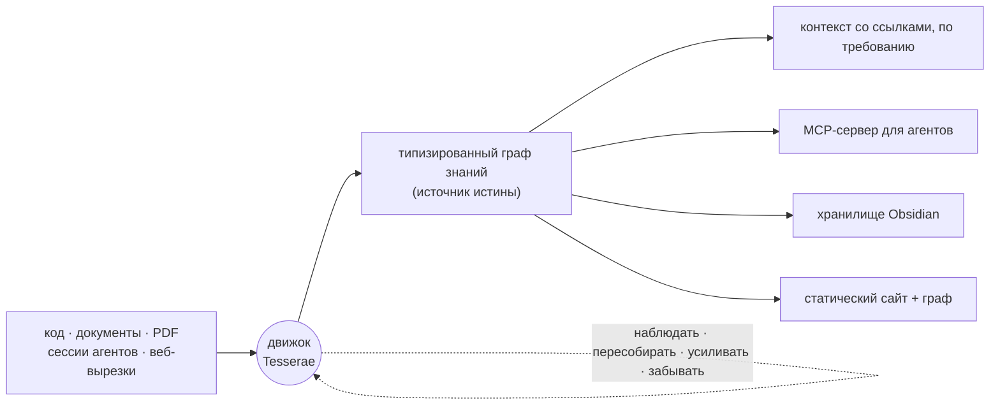

<div align="center">

# Tesserae

**Контекстный движок для кодовых агентов.**

Превращает ваш проект — его код, документацию и ваши сессии с агентами — в
типизированный самоулучшающийся граф знаний, а затем компилирует ровно тот
контекст, который нужен агенту: обоснованный, со ссылками и по требованию.

[](https://pypi.org/project/tesserae/)
[](https://www.npmjs.com/package/@jokerized/tesserae)
[](https://pypi.org/project/tesserae/)
[](https://github.com/ca1773130n/Tesserae/actions/workflows/tests.yml)
[](LICENSE)

[Живая демонстрация](https://ca1773130n.github.io/Tesserae) ·
[Быстрый старт](#быстрый-старт) ·
[Документация](docs/) ·
[Память агента](docs/i18n/agent-memory.ru.md) ·
[Настройка MCP](docs/i18n/integrations/mcp.ru.md) ·
[Тюнинг](docs/i18n/tuning.ru.md) ·
[Примечания к выпускам](docs/release-notes/)

[English](./README.md) · [한국어](./README.ko.md) · [中文](./README.zh.md) · [日本語](./README.ja.md) · [Español](./README.es.md) · [Français](./README.fr.md) · [Deutsch](./README.de.md)

</div>

---

## Проблема

Агент хорош ровно настолько, насколько хорош контекст, который вы ему дали.
Поэтому вы вставляете файлы, заново объясняете решения, принятые ещё на прошлой
неделе, и наблюдаете, как он в третий раз заново открывает ту же ловушку —
потому что всё, чему он научился, испарилось вместе с концом разговора, а на
диске нет ничего, что знало бы, как ваш проект на самом деле устроен.

Tesserae — это недостающий слой. Он читает ваши источники **и** наблюдает за
сессиями агентов, восстанавливает типизированный граф знаний, который остаётся
актуальным, и отдаёт агенту ровно тот срез, который нужен, — со ссылкой на файл
или разговор, откуда он взялся. Всё работает на вашей машине. Это шаг сборки
плюс живой движок, а не облачный сервис, и обычный путь **не требует API-ключей**.


```mermaid
flowchart LR
    S["код · документы · PDF<br/>сессии агентов · веб-вырезки"]
    E(("движок<br/>Tesserae"))
    G["типизированный граф знаний<br/>(источник истины)"]
    O1["контекст со ссылками, по требованию"]
    O2["MCP-сервер для агентов"]
    O3["хранилище Obsidian"]
    O4["статический сайт + граф"]

    S --> E --> G
    G --> O1 & O2 & O3 & O4
    E -. "наблюдать · пересобирать · усиливать · забывать" .-> E
```

Граф, хранилище и сайт — это **проекции** одной базы знаний. Движок — это цикл,
который держит их правдивыми.

## Быстрый старт

Требуется **Python 3.10+**. Для пути по умолчанию API-ключ не нужен.

```bash
pipx install tesserae          # или: pip install tesserae · npx @jokerized/tesserae

cd /path/to/my-project
tesserae init --yes            # определить проект, создать .tesserae/
tesserae compile               # построить граф знаний из ваших источников
```

Теперь спрашивайте о чём угодно — с опорой на ваш реальный код и документацию:

```bash
tesserae ask "Где реализован разбор arXiv ID и что от него зависит?"
```

Или скомпилируйте адресный документ-контекст со ссылками, чтобы передать любому
агенту:

```bash
tesserae context "Как парсер обрабатывает некорректные ID?" --budget 32000 -o context.md
```

Посмотрите граф и вики в браузере:

```bash
tesserae serve --port 8765
```

Вот и весь цикл: **укажи, скомпилируй, спроси.** Функции на базе LLM по умолчанию
используют CLI `codex` или `claude` через OAuth — подробности, исправление PATH и
варианты провайдеров см. в
[установке](docs/i18n/installation.ru.md) и
[быстром старте](docs/i18n/quickstart.ru.md).

## Что он делает

**Компилирует типизированный граф из ваших источников.** Укажите на markdown,
исходный код и, при желании, PDF / документы Office / изображения. Tesserae
извлекает граф из 70+ видов узлов — концепции, решения, символы кода, статьи,
синтезы — с типизированными рёбрами, проверенными по схеме. Компиляция
**побайтово детерминирована**: одинаковый вход — каждый раз идентичный
`graph.json`.

**Превращает разговоры с агентами в память.** Ваши сессии Claude Code и Codex по
проекту становятся полноценными узлами — инсайты, решения, вопросы, TODO —
связанными с файлами, которых они касались. Знание из сессии переживает саму
сессию.

**Помнит, что произошло на самом деле, а не только что было сказано.** Результат
вызова инструмента — это тоже ход: коды возврата и флаги ошибок переживают
загрузку и оседают на узлах `Event`, так что граф знает, что команда **упала**, а
не просто что она была запущена. Из двух **наблюдённых** исходов в одной сессии —
вызова, который завершился ошибкой, и более позднего вызова, который на том же
операнде завершился успехом, — Tesserae выводит ребро `recovers`. Это
единственное причинное ребро в словаре, и оно именно выводится, а не заявляется
моделью: `caused_by`, который на деле означает `happened_near`, читается как
доказательство, и это хуже, чем отсутствие ребра вовсе.

**Выдаёт контекст со ссылками по требованию.** Компилятор контекста запускает
Personalized PageRank от стартовых узлов запроса, упаковывает наиболее релевантный
подграф в бюджет символов и возвращает готовый к вставке документ со ссылками —
или передаёт его агенту по MCP.

**Поддерживает себя в актуальном состоянии.** Управляемый движок следит за
источниками и сессиями, гасит всплески, пересобирает граф и выполняет проход
самоулучшения, усиливая повторяющиеся находки и вытесняя устаревшие. Как мозг,
консолидирующий память во сне, он также **сам консолидирует память агентов**,
когда проект простаивает, — периодический цикл сна, без единой команды: сжимает и
забывает шумную недавнюю память, **забывает по неиспользованию** (тускнеет то,
что никто не запрашивает, а не просто старое), и **находит новые связи** между
тем, что уцелело. Один процесс способен держать актуальными все ваши проекты.

**Даёт каждому агенту собственную растущую память.** Дистиллируйте опыт каждого
агента в ограниченный слой более высокого уровня; пусть руководители читают
только дистиллят своих подчинённых — рекурсивно вверх по дереву организации. См.
[многослойную память агентов](#многослойная-память-агентов) ниже.

## Что получается после `compile`

```text
.tesserae/
├── graph.json              # типизированная база знаний — узлы + рёбра
├── sqlite.db               # запрашиваемое хранилище графа
├── markdown_projection/    # читаемые человеком вики-страницы
├── obsidian_vault/         # можно сразу открыть в Obsidian
├── site/                   # статический сайт: граф + вики + поиск
├── harness_sessions/       # импортированная память сессий Claude / Codex
├── agents/                 # дистиллированные слои памяти по агентам (по выбору)
└── config.json · manifest.json · report.md
```

## Многослойная память агентов

Ни один человек не помнит всего, и ни в одно контекстное окно агента всё не
поместится. Ответ Tesserae — **многослойная база знаний по каждому агенту**:
каждый агент растит свою память из своих сессий, эта память периодически
**дистиллируется** в ограниченный слой более высокого уровня, а руководители
видят только дистиллят подчинённых — рекурсивно, как в настоящей организации.

```bash
export TESSERAE_AGENT_DISTILL=1
tesserae compile              # создаёт узел Agent на агента + рёбра атрибуции
tesserae agents init          # выводит оргструктуру из того, кто кого породил
tesserae agents tree          # осмотреть: иерархия, число сессий, устаревание
tesserae distill              # сжать опыт каждого агента в слой L1
```

После этого любой инструмент чтения графа — CLI или MCP — принимает область
`agent=`:

```bash
tesserae query "чек-лист релиза" --agent claude-code:me:reviewer   # память самого исполнителя
tesserae ask   "что моя команда знает о деплоях?" --agent org      # вся команда, в дистилляте
```

Дистилляция **организует, сжимает и забывает — но никогда не удаляет**: угасшая
находка сворачивается в дистиллят, который на неё ссылается, и остаётся доступной
через `agents drill`, а не выбрасывается. Время отсчитывается по часам корпуса,
идентичность узла никогда не зависит от формулировок LLM, а артефакты остаются
детерминированными. Полное описание — в
[docs/i18n/agent-memory.ru.md](docs/i18n/agent-memory.ru.md).

Запускать `distill` вручную не обязательно: оставьте `tesserae engine`
работающим, и он **консолидирует сам** во время простоя — цикл сна, оборачивающий
тот же самый опциональный проход с ограничением по нагрузке на память. См.
[docs/i18n/engine-consolidation.ru.md](docs/i18n/engine-consolidation.ru.md).

## MCP-сервер

`tesserae projects mcp-config` печатает готовую запись сервера для Claude Code,
Codex или любого MCP-клиента. Каждый инструмент чтения графа бесплатно принимает
`graph_path` / `project` / `agent`. Основные инструменты:

| Инструмент | Назначение |
|---|---|
| `compile_context` | Адресный документ-контекст со ссылками для запроса или стартовых узлов (детерминированный; `preview=N` возвращает дескриптор вместо полного текста) |
| `get_handle` | Постранично забирать большую полезную нагрузку, чтобы агент не держал её целиком в контексте |
| `ask` · `query` · `search_nodes` · `node_context` | Спланированные ответы, сырой поиск и навигация по скомпилированной базе |
| `graph_map` | Budgeted Descent: обход графа сверху вниз по областям вместо угадывания поисковых слов — канонический вход |
| `graph_ppr` · `search_facts` · `timeline` | Расширение через Personalized PageRank, временные факты и хронология. Двое часов, которые **сочетаются**: `as_of` (что было ИСТИНОЙ тогда, по собственным меткам времени источников) и `observed_as_of` (что мы УЗНАЛИ к тому моменту, по журналу, помечаемому при компиляции). `current_only` и `as_of` вместе отвергаются — вот эти двое действительно альтернативы |
| `verify_claim` | Разрешает ли граф этот триплет? Детерминированный вердикт, а не сгенерированное мнение |
| `find_session_findings` · `fresh_insights` · `activity_summary` · `query_decisions` | Память из сессий, ранжированная по затуханию и дедуплицированная; дайджесты и журнал решений |
| `agent_view_explain` · `drill_down` · `read_audit` | Разрешить область видимости агента; поднять дистиллированную заметку до исходного свидетельства (с аудитом); и, по желанию через `TESSERAE_READ_AUDIT`, прочитать, кто читал граф |
| `ingest` · `graph_write` | Влить сырой веб/текст (например, вырезку из браузера) в граф; дать агенту записывать атрибутированные узлы обратно — включая ребро `retracts`, чтобы сказать «это неверно», не выдумывая замену |
| `doctor_run` · `doctor_report` · `lint_report` | Проверки здоровья и линт графа прямо из цикла агента |

## Повседневные команды

`tesserae --help` — сгруппированный список, `tesserae <cmd> --help` — флаги.

| Команда | Что делает |
|---|---|
| `tesserae init` | Онбординг в один шаг: определить проект, выбрать LLM-провайдера, записать `.tesserae/config.json`. `--yes` — без вопросов. |
| `tesserae compile` | Пересобрать граф и все проекции. `compile <пути>` разово подхватывает дополнительные файлы. |
| `tesserae ask "<в>"` | Спланированный LLM ответ со ссылками. Умный маршрутизатор выбирает проект; `--scope federated` сводит несколько в один ответ. |
| `tesserae query "<в>"` | Сырой поиск — BM25/семантика, без синтеза LLM. |
| `tesserae context "<в>"` | Документ-контекст со ссылками по требованию через PPR в рамках `--budget`. Резервирует место под **процедурную** память — что было запущено и чем кончилось — когда у графа есть происхождение, которое это оправдывает. |
| `tesserae graph-map` | Budgeted Descent: обход сверху вниз по областям, а не по поисковым словам. Дерево организации агентов — `--scope org:root`. |
| `tesserae verify-claim` | Детерминированный вердикт о том, разрешает ли граф триплет. Вывод в JSON. |
| `tesserae engine [--all]` | Управляемый демон обновления — наблюдение, дебаунс, пересборка и консолидация памяти агентов в простое (цикл сна; `--no-consolidate` отключает). `--all` держит актуальными все зарегистрированные проекты в одном процессе. |
| `tesserae refresh` | Разово: импорт новых сессий → компиляция → синхронизация хранилища. |
| `tesserae agents …` | `init` (вывести оргструктуру) · `tree` · `show` · `drill` — инструменты многослойной памяти. |
| `tesserae distill` | Сжать сессии каждого агента в его ограниченный слой памяти L1. |
| `tesserae doctor` | Проверки здоровья; `--fix` применяет безопасные починки. Код выхода `0/1/2` = здоров / предупреждения / ошибки. |
| `tesserae lint` | Линт графа — сироты, устаревшие ссылки, расхождение с вики, скудное покрытие интервалов, незаслуженные процедурные пулы. Безопасное — через `--fix-trivial`. |
| `tesserae domains status` | Вывести уставное дерево доменов (дивизионы → отделы → команды). См. [архитектуру](docs/i18n/architecture.ru.md). |
| `tesserae federation status` | Осмотреть межпроектную федерацию — до чего реально дотянется `--scope federated`. |
| `tesserae serve` | Отдаёт все зарегистрированные проекты — лендинг на `/`, каждый на `/<alias>/`, с живым виджетом ask. |
| `tesserae export site \| okf` | Собрать статический сайт или выгрузить переносимый набор [Google OKF](https://github.com/GoogleCloudPlatform/knowledge-catalog). |
| `tesserae projects …` | Реестр проектов: `register`, `list`, `mcp-config`. |

## Несколько проектов

Реестр в `~/.tesserae/registry.json` разрешает имена проектов везде — в CLI, MCP
и во флот-движке. «Активного» проекта не существует: команды уровня проекта
разрешают тот, в котором вы находитесь, а `ask` маршрутизирует по всем.

```bash
tesserae projects register /path/to/my-project --name myproj
tesserae ask "сравни поиск в research и notes"   # → федеративно, с перекрёстными ссылками
tesserae ask "как компилируется myproj?"         # → маршрут в этот проект
tesserae serve                                   # → все проекты на одном сервере
```

Markdown в одном проекте может глубоко ссылаться на узел в другом через
`wiki://<alias>/<kind>/<slug>`; при компиляции это становится узлом-мостом в
графе.

## Интеграции (все по выбору)

- **Плагин Claude Code** — слэш-команды, хуки сессий, скилл и авторегистрация MCP
  за одну `/plugin install`. [→](docs/i18n/integrations/claude-code-plugin.ru.md)
- **Граф сессий** — разговоры Claude Code / Codex становятся узлами Insight /
  Decision / Question / TODO, связанными с документами, которых они касались;
  API-ключ не нужен. [→](docs/i18n/integrations/sessions.ru.md)
- **RAG-Anything** — мультимодальная загрузка (PDF / Office / изображения через
  MinerU / Docling) плюс бэкенд вопросов LightRAG.
  [→](docs/i18n/integrations/rag-anything.ru.md)
- **Obsidian** — двусторонняя синхронизация хранилища со слоем пользовательских
  правок. [→](docs/i18n/integrations/obsidian.ru.md)
- **Web Clipper** — вырезать страницу или выделение в корпус в один клик.
  [→](docs/i18n/integrations/chrome-extension.ru.md)

## Сравнение

<details>
<summary><strong>Матрица возможностей</strong> против Quartz, Logseq, Cognee, Foam</summary>

<br/>

| | Tesserae | Quartz | Logseq | Cognee | Foam |
|---|:---:|:---:|:---:|:---:|:---:|
| Статический сайт + граф | ✅ | ✅ | ✅ | ➖ | ➖ |
| Типизированная схема узлов | ✅ 70+ | ❌ | ➖ | ✅ | ❌ |
| Извлечение концепций из источников | ✅ | ❌ | ❌ | ✅ | ❌ |
| Мультимодальная загрузка (PDF/изображения) | ✅ | ❌ | ➖ | ✅ | ❌ |
| Загрузка графа кода | ✅ | ❌ | ❌ | ➖ | ❌ |
| MCP-сервер | ✅ | ❌ | ❌ | ✅ | ❌ |
| Компилятор контекста со ссылками по требованию | ✅ | ❌ | ❌ | ❌ | ❌ |
| Живые сессии → память графа | ✅ | ❌ | ❌ | ❌ | ❌ |
| Многослойная память по агентам | ✅ | ❌ | ❌ | ❌ | ❌ |
| Демон для нескольких проектов (флот) | ✅ | ❌ | ❌ | ❌ | ❌ |
| Работает без API-ключа | ✅ | — | — | ❌ | — |
| Побайтово детерминированная компиляция | ✅ | ✅ | — | ❌ | — |
| Живое редактирование в UI | ❌ | ➖ | ✅ | — | ✅ |

</details>

### Измерено, а не заявлено

Каждое число ниже получено стендом из этого репозитория на данных, лежащих на диске, и
говорит, с чем его сравнивали. Дата: 2026-08-30.

| что | Tesserae | сравнение |
|---|---|---|
| полнота по документам на корпусе из 148 статей, recall@10 | **0.652** | пассажи BM25 0.550 |
| сфабрикованные вердикты проверки, 426 негативов | **0** | — (ни один конкурент не поставляет верификатор) |
| пометки проверки по предложениям на каждом ответе | бесплатно; каскад **0.935** против модели на каждом предложении 0.928, при 40% вызовов | — |
| вызовы API во время запроса | **0** — локальный BM25 и статические вложения | Mem0: один вызов вложений на поиск |
| LoCoMo, полнота по золотым сессиям recall@10, 9 разговоров | **0.930** | BM25 0.923 |
| LoCoMo, ответы, собственный судья Mem0, один разговор | 90.5 | Mem0 92.5 на десяти — паритет, в пределах шума одного разговора |

Последняя строка — честное слово о бенчмарках разговорной памяти: паритет. Строки над ней —
там, где расходится дизайн: граф, который находит нужные документы в большом корпусе, и
ответы, которые можно проверить, не доверяя им.

Tesserae выбирает **компиляцию из источников, а не живое редактирование**. Если
вам нужно править заметки в UI — берите Logseq или Obsidian. Если нужен
инструмент сборки *и живой движок*, который держит обоснованный граф знаний и
кормит им ваших агентов, — это тот самый проект.

**Берите**, если хотите устойчивый, поддающийся проверке граф знаний по
источникам проекта, локальный MCP-сервер, опирающийся на ваши собственные файлы,
или память агентов, которая накапливается, а не испаряется.

**Пропустите**, если вам нужен только векторный поиск по небольшой папке, хочется
облачную вики с редактором или ожидается готовый бот «спроси что угодно» —
Tesserae строит подложку, а к какому агенту её подключить, решаете вы.

## Провайдеры и приватность

Всё работает локально, и обычный путь **не использует API-ключи**:

- **Codex CLI** (по умолчанию) и **Claude Code CLI** через OAuth, с ротацией
  нескольких аккаунтов.
- **Эмбеддинги** — офлайн, без torch (`pip install "tesserae[semantic]"`,
  `model2vec`). `ANTHROPIC_API_KEY` / `OPENAI_API_KEY` используются, если заданы,
  но никогда не обязательны.

## Состояние и ограничения

Текущая версия — в [примечаниях к выпускам](docs/release-notes/). Честно:

- Первая компиляция тысяч файлов занимает минуты; время растёт примерно линейно.
  Инкрементальная компиляция (`--changed-only`) есть, но экспериментальна.
- Без extra `semantic` гибридный поиск деградирует до несемантической заглушки
  (с громким предупреждением).
- С версии 0.30.0 **слой кода включается явно** — на большом репозитории символы
  кода вытесняли всё остальное, поэтому `compile` больше не загружает их без
  запроса. `tesserae code ingest` по-прежнему осознанно подключает CodeGraph.
- **Устав** (`tesserae domains status`) реализован и покрыт тестами, но пока не
  создаётся при `compile`; до тех пор команда сообщает «no charter yet».
- Описание изображений в RAG-Anything пока не подключено сквозным образом.
- Набор MCP-инструментов стабилен; схема графа всё ещё пополняется типами узлов.
  Причинный словарь намеренно шириной в одно ребро — `recovers` — и выводится
  только из наблюдённых исходов, а не заявляется моделью. Поисковое
  *представление `causal`* намеренно шире (оно обходит ещё `resolved_by` и
  `attributes_improvement_to`, которые служат тому же вопросу «почему это
  сломалось»); одно ребро, которое больше никто не заявляет, дало бы
  представление, в котором ничего нет.
- **Продвижение — всегда правка человеком.** `tesserae schema-drift` предлагает
  подтипы узлов, а планировщик `ask` может вернуть `proposed_write`, но ни то,
  ни другое не пишет: предложение принимается, только если вы сами
  отредактируете `ResearchNodeType` или отправите payload в `graph_write` с
  происхождением, которое укажете сами.

## Структура проекта

```text
tesserae/     # пакет — CLI, компилятор, движок, MCP-сервер, адаптеры
docs/         # документация на английском + docs/i18n/ для семи других языков
ontology/     # схемы узлов/рёбер, по которым проверяет компилятор
prompts/      # промпты извлечения и синтеза
tests/        # набор pytest (3700+ тестов)
evals/        # стенды оценки качества графа
```

## Участие и документация

- **Документация**: [быстрый старт](docs/i18n/quickstart.ru.md) · [установка](docs/i18n/installation.ru.md) · [память агента](docs/i18n/agent-memory.ru.md) · [архитектура](docs/i18n/architecture.ru.md)
- **Локализации**: [English](./README.md) · [한국어](./README.ko.md) · [中文](./README.zh.md) · [日本語](./README.ja.md) · [Español](./README.es.md) · [Français](./README.fr.md) · [Deutsch](./README.de.md) — длинные документы продублированы в `docs/i18n/`.

## Лицензия

[MIT](LICENSE).
