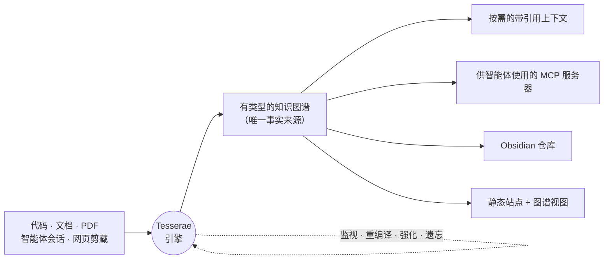

<div align="center">

# Tesserae

**面向编码智能体的上下文引擎。**

把你的项目——代码、文档，以及你的智能体会话——变成一张有类型的、自我改进的
知识图谱，然后按需编译出智能体真正需要的那部分上下文：有依据、带引用、随取随用。

[](https://pypi.org/project/tesserae/)
[](https://www.npmjs.com/package/@jokerized/tesserae)
[](https://pypi.org/project/tesserae/)
[](https://github.com/ca1773130n/Tesserae/actions/workflows/tests.yml)
[](LICENSE)

[在线演示](https://ca1773130n.github.io/Tesserae) ·
[快速开始](#快速开始) ·
[文档](docs/) ·
[智能体记忆](docs/i18n/agent-memory.zh.md) ·
[MCP 配置](docs/i18n/integrations/mcp.zh.md) ·
[调优](docs/i18n/tuning.zh.md) ·
[发布说明](docs/release-notes/)

[English](./README.md) · [한국어](./README.ko.md) · [日本語](./README.ja.md) · [Русский](./README.ru.md) · [Español](./README.es.md) · [Français](./README.fr.md) · [Deutsch](./README.de.md)

</div>

---

## 问题

智能体的水平，取决于你交给它的上下文。于是你不停粘贴文件、把上周已经做过的
决定再解释一遍，然后眼看着它第三次重新踩同一个坑——因为对话一结束，它学到的
一切就蒸发了，而磁盘上没有任何东西知道你的项目实际是怎么拼在一起的。

Tesserae 就是这缺失的一层。它读取你的源文件，**同时**观察你的智能体会话，
重建一张始终保持最新的有类型知识图谱，并且只把需要的那一片喂给智能体——一路
引用回它出自的文件或对话。全部在你自己的机器上运行。它是一个构建步骤加一个
活的引擎，而不是托管服务；常规路径**不需要 API key**。



图谱、仓库和站点都是同一个知识库的**投影**。引擎是让它们保持为真的那个循环。

## 快速开始

需要 **Python 3.10+**。默认路径不需要 API key。

```bash
pipx install tesserae          # 或：pip install tesserae · npx @jokerized/tesserae

cd /path/to/my-project
tesserae init --yes            # 检测项目，写入 .tesserae/
tesserae compile               # 从你的源文件构建知识图谱
```

现在可以基于你真实的代码和文档提问：

```bash
tesserae ask "arXiv ID 解析在哪里实现，又有什么依赖它？"
```

或者编译一份定制的、带引用的上下文文档交给任意智能体：

```bash
tesserae context "解析器如何处理格式错误的 ID？" --budget 32000 -o context.md
```

在浏览器里浏览图谱和维基：

```bash
tesserae serve --port 8765
```

整个循环就是：**指向、编译、提问。** 依赖 LLM 的功能默认通过 OAuth 使用
`codex` 或 `claude` CLI——细节、PATH 修复和供应商选项见
[安装](docs/i18n/installation.zh.md)与[快速开始](docs/i18n/quickstart.zh.md)。

## 它做什么

**从你的源文件编译出有类型的图谱。** 指向 Markdown、源代码，以及可选的
PDF / Office 文档 / 图片。Tesserae 抽取一张涵盖 70 多种节点类型的图谱——概念、
决定、代码符号、论文、综合——带有类型化的边，并按 schema 校验。编译是
**逐字节确定的**：相同输入，每次都得到完全相同的 `graph.json`。

**把智能体对话变成记忆。** 你关于这个项目的 Claude Code 与 Codex 会话会成为
一等节点——洞察、决定、问题、TODO——并链接到它们触及的文件。会话里得到的知识
比会话本身活得更久。

**记住真正发生了什么，而不只是说了什么。** 工具结果也是一个轮次：退出码和错误
标志能挺过摄取，落到 `Event` 节点上，于是图谱知道某条命令**失败了**，而不只是
知道它被运行过。从同一会话中两个**被观测到**的结果——一次失败的调用，以及之后
在同一操作对象上成功的调用——Tesserae 推导出一条 `recovers` 边。它是词汇表里
唯一的因果边，而且是推导出来的，绝不由模型断言：一条实际上是 `happened_near`
的 `caused_by` 会被当成证据来读，那比没有这条边更糟。

**按需提供带引用的上下文。** 上下文编译器从查询的种子节点跑 Personalized
PageRank，在字符预算内打包最相关的子图，返回一份可直接粘贴的带引用文档——或者
通过 MCP 流式送给智能体。

**自己保持新鲜。** 一个受监督的引擎监视源文件和会话，合并突发，重新编译，并
运行一个自我改进流程：强化反复出现的发现，替换掉过时的。就像大脑在休息时整理
记忆一样，当项目空闲下来，它也会**自行整合智能体记忆**——一个周期性的睡眠周期，
无需任何命令：压缩并遗忘嘈杂的近期记忆，**因不用而遗忘**（没人检索的知识会淡去，
而不只是旧知识），并在幸存下来的内容之间**发现新的连接**。一个进程就能让你名下
所有项目保持最新。

**给每个智能体一份不断生长的记忆。** 把每个智能体的经验蒸馏成一个有界的、更高
层的层次；让管理者只读其下属的蒸馏层，沿组织树递归向上。见下方
[分层智能体记忆](#分层智能体记忆)。

## `compile` 之后的样子

```text
.tesserae/
├── graph.json              # 有类型的知识库 —— 节点 + 边
├── sqlite.db               # 可查询的图谱存储
├── markdown_projection/    # 人类可读的维基页面
├── obsidian_vault/         # 直接丢进 Obsidian
├── site/                   # 静态站点：图谱视图 + 维基 + 搜索
├── harness_sessions/       # 导入的 Claude / Codex 会话记忆
├── agents/                 # 每个智能体的蒸馏记忆层（可选）
└── config.json · manifest.json · report.md
```

## 分层智能体记忆

没有人能记住一切，也没有智能体的上下文窗口装得下一切。Tesserae 的答案是
**分层的、按智能体划分的知识库**：每个智能体从自己的会话里长出自己的记忆，这份
记忆会被周期性地**蒸馏**成一个有界的更高层，而管理者只看到下属的蒸馏层——像真实
组织一样递归。

```bash
export TESSERAE_AGENT_DISTILL=1
tesserae compile              # 为每个智能体铸造 Agent 节点 + 归属边
tesserae agents init          # 从谁派生了谁推断组织结构
tesserae agents tree          # 查看层级、会话数、陈旧度
tesserae distill              # 把每个智能体的经验压缩成 L1 层
```

之后每个读图工具——无论 CLI 还是 MCP——都接受 `agent=` 作用域：

```bash
tesserae query "发布检查清单" --agent claude-code:me:reviewer   # 某个工作者自己的记忆
tesserae ask   "我的团队对部署了解什么？" --agent org            # 整个团队，蒸馏后
```

蒸馏会**组织、压缩、遗忘，但从不删除**：衰减的发现会被折叠进引用它的蒸馏物中，
并且仍可通过 `agents drill` 到达，绝不丢弃。时间以语料库为时钟，节点身份从不
依赖 LLM 的措辞，产物保持确定性。完整设计见
[docs/i18n/agent-memory.zh.md](docs/i18n/agent-memory.zh.md)。

你不必手动运行 `distill`：让 `tesserae engine` 常驻，它会在空闲休息时
**自行整合**——一个睡眠周期，包裹着同一个可选的、受内存压力门控的流程。见
[docs/i18n/engine-consolidation.zh.md](docs/i18n/engine-consolidation.zh.md)。

## MCP 服务器

`tesserae projects mcp-config` 会直接打印一份可用于 Claude Code、Codex 或任意
MCP 客户端的服务器条目。每个读图工具都免费接受 `graph_path` / `project` /
`agent`。主要工具：

| 工具 | 用途 |
|---|---|
| `compile_context` | 针对查询或种子节点的定制化带引用上下文文档（确定性；`preview=N` 返回句柄而非完整正文） |
| `get_handle` | 分片翻阅大体积载荷，使智能体不必一次性把全部内容放进上下文 |
| `ask` · `query` · `search_nodes` · `node_context` | 规划式回答、原始检索，以及在已编译知识库上的图谱导航 |
| `graph_map` | Budgeted Descent：按作用域自顶向下导航图谱，而不是猜搜索词——推荐的入口点 |
| `graph_ppr` · `search_facts` · `timeline` | Personalized PageRank 扩展、时序事实与编年。两个可以**叠加**的时钟：`as_of`（依据来源自身的时间戳，回答"那时什么是真的"）与 `observed_as_of`（依据每次编译盖章的账本，回答"到那时我们学到了什么"）。`current_only` 与 `as_of` 同时传入会被拒绝——这两个才是真正的二选一 |
| `verify_claim` | 图谱是否认可这个三元组？给出确定性裁决，而非生成的意见 |
| `find_session_findings` · `fresh_insights` · `activity_summary` · `query_decisions` | 会话衍生的记忆（按衰减排序、去重）、活动摘要与决定记录 |
| `agent_view_explain` · `drill_down` · `read_audit` | 解析智能体作用域视图；把蒸馏笔记升级回原始证据（有审计）；以及经 `TESSERAE_READ_AUDIT` 选择开启后，读回是谁在读这张图谱 |
| `ingest` · `graph_write` | 把原始网页/文本（如浏览器剪藏）并入图谱；让智能体写回带归属的节点——包括用一条 `retracts` 边说"这是错的"，而不必凭空发明一个替代 |
| `doctor_run` · `doctor_report` · `lint_report` | 在智能体循环内做健康检查与图谱 lint |

## 日常命令

分组列表见 `tesserae --help`，各命令参数见 `tesserae <cmd> --help`。

| 命令 | 作用 |
|---|---|
| `tesserae init` | 一步上手：检测项目、选择 LLM 供应商、写入 `.tesserae/config.json`。`--yes` 为非交互式。 |
| `tesserae compile` | 重建图谱和所有投影。`compile <路径>` 临时摄取额外文件。 |
| `tesserae ask "<问题>"` | 由 LLM 规划的、带引用的回答。智能路由挑选目标项目；`--scope federated` 把多个项目合并成一个回答。 |
| `tesserae query "<问题>"` | 原始检索——BM25/语义搜索，不做 LLM 综合。 |
| `tesserae context "<问题>"` | 在 `--budget` 之下通过 PPR 生成按需的带引用上下文文档。当图谱有足够出处支撑时，会为**过程性**记忆——实际运行了什么、结果如何——保留一个槽位。 |
| `tesserae graph-map` | Budgeted Descent：按作用域自顶向下遍历，而非按搜索词。智能体组织树用 `--scope org:root`。 |
| `tesserae verify-claim` | 关于图谱是否认可某个三元组的确定性裁决。输出 JSON。 |
| `tesserae verify-attribution` | 答案中的每个数字是否归属于正确的系统和基准？不需要图谱，输出 JSON。 |
| `tesserae engine [--all]` | 受监督的刷新守护进程——监视、去抖、重编译，并在空闲时整合智能体记忆（睡眠周期；`--no-consolidate` 关闭）。`--all` 用一个进程让所有已注册项目保持新鲜。 |
| `tesserae refresh` | 一次性执行：导入新会话 → 编译 → 同步仓库。 |
| `tesserae agents …` | `init`（推断组织） · `tree` · `show` · `drill` —— 分层记忆的组织工具。 |
| `tesserae distill` | 把每个智能体的会话压缩成其有界的 L1 记忆层。 |
| `tesserae doctor` | 健康检查；`--fix` 应用安全修复。退出码 `0/1/2` = 健康/警告/错误。 |
| `tesserae lint` | 图谱 lint——孤立节点、过期引用、维基漂移、稀薄的区间覆盖、未获出处支撑的过程性池。安全项用 `--fix-trivial`。 |
| `tesserae domains status` | 打印按章程划分的领域树（部门 → 处 → 组）。见[架构](docs/i18n/architecture.zh.md)。 |
| `tesserae federation status` | 查看跨项目联邦——`--scope federated` 实际能触及什么。 |
| `tesserae serve` | 服务所有已注册项目——`/` 为落地页，各项目在 `/<alias>/`，带实时 ask 组件。 |
| `tesserae export site \| okf` | 构建静态站点，或导出可移植的 [Google OKF](https://github.com/GoogleCloudPlatform/knowledge-catalog) 包。 |
| `tesserae projects …` | 多项目注册表：`register`、`list`、`mcp-config`。 |

## 多项目

位于 `~/.tesserae/registry.json` 的注册表在任何地方——CLI、MCP、舰队引擎——解析
项目名。不存在"当前活动"项目：按项目的命令解析你所处的那个，而 `ask` 会在所有
项目之间路由。

```bash
tesserae projects register /path/to/my-project --name myproj
tesserae ask "比较 research 和 notes 里的检索方式"   # → 联邦式、交叉引用
tesserae ask "myproj 是怎么编译的？"                 # → 路由到该项目
tesserae serve                                      # → 所有项目在一个服务器下
```

一个项目里的 Markdown 可以通过 `wiki://<alias>/<kind>/<slug>` 深链到另一个项目的
节点；编译时它们会成为图谱视图中的桥接节点。

## 集成（全部可选）

- **Claude Code 插件** —— 斜杠命令、会话钩子、一个 skill，以及 MCP 自动注册，
  一次 `/plugin install` 全部搞定。[→](docs/i18n/integrations/claude-code-plugin.zh.md)
- **会话图谱** —— Claude Code / Codex 对话变成洞察 / 决定 / 问题 / TODO 节点，
  并链接到它们触及的文档，无需 API key。[→](docs/i18n/integrations/sessions.zh.md)
- **RAG-Anything** —— 多模态摄取（通过 MinerU / Docling 处理 PDF / Office /
  图片）以及一个 LightRAG 问答后端。[→](docs/i18n/integrations/rag-anything.zh.md)
- **Obsidian** —— 带用户编辑叠加层的双向仓库同步。
  [→](docs/i18n/integrations/obsidian.zh.md)
- **Web Clipper** —— 一键把页面或选中内容剪藏进语料库。
  [→](docs/i18n/integrations/chrome-extension.zh.md)

## 对比

<details>
<summary><strong>功能矩阵</strong>：对比 Quartz、Logseq、Cognee、Foam</summary>

<br/>

| | Tesserae | Quartz | Logseq | Cognee | Foam |
|---|:---:|:---:|:---:|:---:|:---:|
| 静态站点 + 图谱视图 | ✅ | ✅ | ✅ | ➖ | ➖ |
| 有类型的节点 schema | ✅ 70+ | ❌ | ➖ | ✅ | ❌ |
| 从源文件抽取概念 | ✅ | ❌ | ❌ | ✅ | ❌ |
| 多模态摄取（PDF/图片） | ✅ | ❌ | ➖ | ✅ | ❌ |
| 代码图谱摄取 | ✅ | ❌ | ❌ | ➖ | ❌ |
| MCP 服务器 | ✅ | ❌ | ❌ | ✅ | ❌ |
| 按需的带引用上下文编译器 | ✅ | ❌ | ❌ | ❌ | ❌ |
| 实时会话 → 图谱记忆 | ✅ | ❌ | ❌ | ❌ | ❌ |
| 按智能体的分层记忆 | ✅ | ❌ | ❌ | ❌ | ❌ |
| 多项目守护进程（舰队） | ✅ | ❌ | ❌ | ❌ | ❌ |
| 无需 API key 即可工作 | ✅ | — | — | ❌ | — |
| 逐字节确定的编译 | ✅ | ✅ | — | ❌ | — |
| 在 UI 中实时编辑 | ❌ | ➖ | ✅ | — | ✅ |

</details>

### 测量得来，而非宣称

下面每个数字都来自本仓库的测试脚本，用的是磁盘上的数据，并说明了与什么相比。日期 2026-08-30。

| 项目 | Tesserae | 比较对象 |
|---|---|---|
| 对 148 篇全文论文回答比较型问题，必答要点覆盖率，57 个问题 × 8 次重复 | **0.373** —— 图选出 3 篇文档，包中携带它们的原文散文 | 同样预算、骨干和评判器下的 BM25 段落：0.290 —— **+28.9%**，8/8 次重复，p=0.0078；本地 7B 评判器看到的是 +7%，不显著 |
| 同一语料的文档召回率，不同文档 @10 / @50 | 训练过的编码器（`TESSERAE_EMBEDDING_PREFER=st`）为 0.791 / 0.962；随包默认为 0.754 / 0.914 | Mem0 OSS 原始分块存储，同一编码器：0.775 / 0.944 —— 持平 |
| 伪造的验证判定，426 条负例 | **0** | —（没有竞争者提供验证器） |
| 每个答案的逐句复核标记 | 免费；级联 **0.935**，对比逐句用模型的 0.928，只用 40% 的调用 | — |
| 查询时的 API 调用 | **0** —— 本地 BM25 与静态嵌入 | Mem0：每次搜索一次嵌入调用 |
| LoCoMo 黄金会话 recall@10，9 段对话 | **0.930** | BM25 0.923 |
| LoCoMo 答案，Mem0 自己的评判器，1 段对话 | 90.5 | Mem0 在 10 段对话上 92.5 —— 持平，在单段对话的噪声之内 |

检索各行 —— 文档召回率和 LoCoMo 两行 —— 是诚实说法，无论是否对话式：持平。给向量库同一个编码器，它就能找到同样的
文档。第一行才是设计的分野 —— 图决定智能体读哪些文档，并交出它们的原文散文而不是摘录 ——
而核验各行则是无需信任就能核对的答案。+28.9% 是在用于打分的同一基准上扫描 k 得到的（k=5 仍有 +12%），而且对评判器敏感：
用本地 qwen2.5:7b 同时作答和评判重跑，同样两条臂的差距是 +7%，处于噪声范围内（57 个问题，1 次重复）；而在第二个更小的语料上 ——
本项目自己的文档，24 个手写问题 —— 它们输给 BM25 达 17–26%。

Tesserae 选择的是**从源文件编译，而非实时编辑**。如果你想在 UI 里编辑笔记，请用
Logseq 或 Obsidian。如果你想要一个构建工具*外加一个活的引擎*，来维护一张有依据的
知识图谱并喂给你的智能体——那就是这个项目。

**适合你**，如果你想要一张对项目源文件持久、可检视的知识图谱，一个扎根于你自己
文件的本地 MCP 服务器，或者一份会复利增长而不是蒸发的按智能体记忆。

**跳过它**，如果你只需要对一个小文件夹做向量搜索，想要带编辑 UI 的托管维基，或者
期待一个开箱即用的"什么都能问"机器人——Tesserae 构建的是底座，接到哪个智能体上
由你决定。

## 供应商与隐私

一切都在本地运行，常规路径**不使用 API key**：

- **Codex CLI**（默认）与 **Claude Code CLI**，通过 OAuth，支持多账号轮换。
- **嵌入**走离线、无需 torch 的通道（`pip install "tesserae[semantic]"`,
  `model2vec`）。`ANTHROPIC_API_KEY` / `OPENAI_API_KEY` 若已设置就会被使用，但
  从不是必需的。

## 现状与限制

当前版本见[发布说明](docs/release-notes/)。说点实话：

- 对数千个文件的首次编译需要几分钟，时间大致线性增长。增量编译
  （`--changed-only`）已经提供，但仍是实验性的。
- 没有 `semantic` extra 时，混合检索会退化为非语义的桩实现（并给出明显警告）。
- 自 0.30.0 起，**代码层改为可选**——在大型仓库里，代码符号会挤掉其他一切，所以
  `compile` 不再默认摄取它们。`tesserae code ingest` 仍可主动接入 CodeGraph。
- **章程**（`tesserae domains status`）已实现并有测试覆盖，但 `compile` 目前还不
  生成它；在那之前该命令会报告 "no charter yet"。
- RAG-Anything 的图像描述尚未端到端接通。
- MCP 工具集是稳定的；图谱 schema 仍在增加节点类型。因果词汇表刻意只有一条边
  ——`recovers`——并且只从被观测到的结果推导，绝不由模型断言。检索侧的
  *`causal` 视图*刻意比它更宽（它也遍历 `resolved_by` 与
  `attributes_improvement_to`，二者服务于同一个"这为什么坏了"的意图）；一条
  别处无人断言的边，会变成一个里面空无一物的视图。
- **提升永远是人的编辑。** `tesserae schema-drift` 会提议节点子类型，`ask` 的
  规划器也可能返回 `proposed_write`，但两者都不写入：一项提议只有在你自己编辑
  `ResearchNodeType`，或带上你自己提供的来源把 payload 提交给 `graph_write`
  时才会被采纳。

## 项目结构

```text
tesserae/     # 包本体 —— CLI、编译器、引擎、MCP 服务器、适配器
docs/         # 英文文档 + 面向其余七种语言的 docs/i18n/
ontology/     # 编译器据以校验的节点/边 schema
prompts/      # 抽取与综合提示词
tests/        # pytest 测试套件（3,700+ 个测试）
evals/        # 图谱质量评测框架
```

## 贡献与文档

- **文档**：[快速开始](docs/i18n/quickstart.zh.md) · [安装](docs/i18n/installation.zh.md) · [智能体记忆](docs/i18n/agent-memory.zh.md) · [架构](docs/i18n/architecture.zh.md)
- **其他语言**：[English](./README.md) · [한국어](./README.ko.md) · [日本語](./README.ja.md) · [Русский](./README.ru.md) · [Español](./README.es.md) · [Français](./README.fr.md) · [Deutsch](./README.de.md) —— 长篇文档镜像在 `docs/i18n/` 下。

## 许可证

[MIT](LICENSE)。
